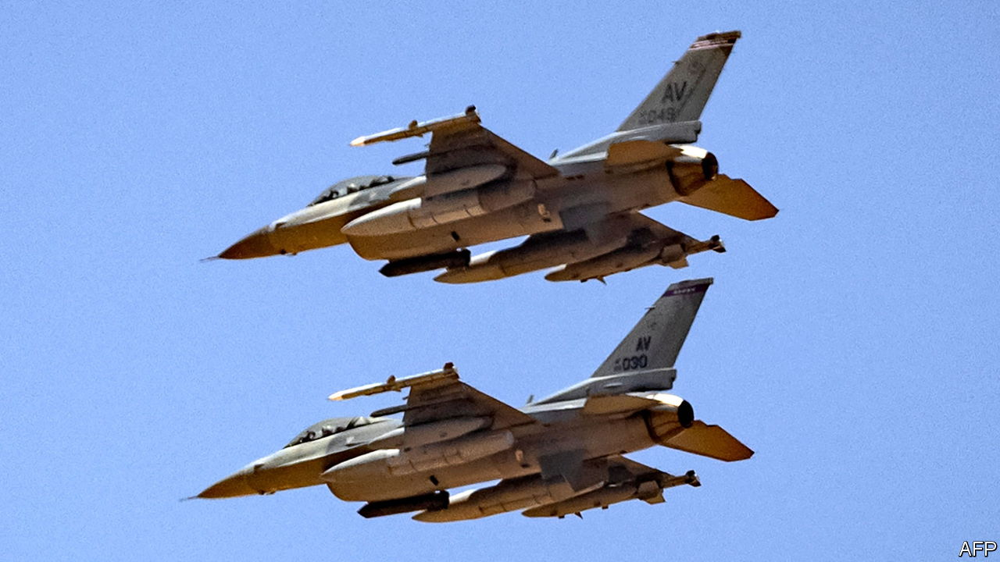

###### The Economist explains

# Why does Ukraine want Western jets—and will it get them? 

##### Russia’s air force has not yet gained the upper hand. That could soon change 

 

> Feb 1st 2023 

UKRAINE HAS been asking for fourth-generation Western combat jets pretty much since Russia invaded it in February 2022. But after January 25th, when the German chancellor, Olaf Scholz, at last agreed to export  to Ukraine (nudged by a matching offer of M1 Abrams tanks from America), the demand has become more insistent. Ukraine wants American F-16s or F-15s, which are both numerous and being phased out by many NATO air forces as deliveries of the stealthy fifth-generation F-35 ramp up. On January 30th President Joe Biden said that America would not supply F-16s. Will Ukraine end up getting them anyway? 

The request has become urgent. Ukraine is preparing to launch a  to regain territory, perhaps before the next wave of Russian mobilisation. The Russian air force has so far  over Ukraine, despite having a big advantage in both numbers and capability over the Ukrainian one, which relies principally on Soviet-era Mig-29s and Su-27s. That is thanks to a well-integrated ground-based air defence derived mainly from 1970s S-300 surface-to-air missiles and the large number of MANPADS (shoulder-launched missiles) supplied by NATO members. These have allowed Ukraine’s air force to contest the skies and provide much-needed support for ground forces. But this may be about to change.

Ukraine does not confirm how many aircraft and pilots it has lost, but it is undoubtedly feeling the effect of a year’s attrition. Worse, the missile and  targeting critical infrastructure and residential areas that the Russians have inflicted over the winter has left Ukraine’s anti-aircraft missile stocks . A particular problem is Russia’s use of the Iranian Shahed-136 drone which can provide precision strikes on poorly defended targets, such as . Most of the munitions needed to take them out are many times more expensive than the Shahed itself (which costs about $20,000). While urgently needing many more MANPADS, the Ukrainians fear that without the F-16s or other Western fast jets their ability to prevent Russia gaining air superiority is eroding.

So why has the West not yet supplied them? One reason is that some leaders, Mr Biden seemingly among them, fear that equipping Ukraine with F-16s would enable it to strike targets deep into Russian territory and would thus be seen by the Kremlin as escalatory, once again sparking threats of . Another reason often cited is that the F-16 is a complex system. Pilots need at least three months’ training and mechanics even more. It also requires considerable logistics support and long, smooth runways to get aloft; Ukraine does not have enough, though its air force says it is upgrading air fields across the country in anticipation of receiving Western jets. But these strips will immediately become targets for the Russians.

The first excuse has been offered almost every time Ukraine has asked the West for new or improved capabilities, especially for anything which can be labelled offensive rather than defensive. The truth is that the F-16, like , can be both depending on how it is used. Also, suggests Justin Bronk, an airpower expert at RUSI, a think-tank, employing the F-16 for deep interdiction in Russia would put it at the mercy of Russian surface-to-air missiles, including the lethal S-400. There are probably better ways to hit remote targets in Russia.

The second rationale for not supplying the planes is more serious, but not insurmountable. Training for pilots and ground crews could begin immediately, before aircraft are sent. Douglas Barrie, of the International Institute for Strategic Studies, another think-tank, says that runways are an issue, but pilots could use dispersed airfields. These could be numerous and would be harder for the Russians to find—but the landing strips would be shorter and rougher, and so put plane and pilot at greater risk. Still, if Ukrainians say they want F-16s, recent form suggests that they have a fairly good idea how they would use them.

Many of Ukraine’s supporters in the West have become convinced that it is not enough for Ukraine to avoid defeat, but that Russia must lose. The Netherlands has already indicated a willingness to send its F-16s. Ukraine says Poland is considering the same. The Pentagon is said to be preparing to give its assent to such exports. As usual, Germany’s Olaf Scholz, is . If the West believes that without better fighter jets, Russia will eventually establish dominance over its airspace, it should provide them: this time sooner rather than later. ■

