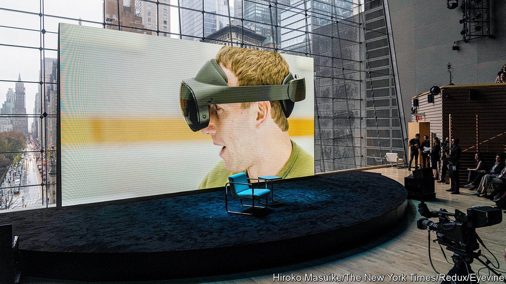
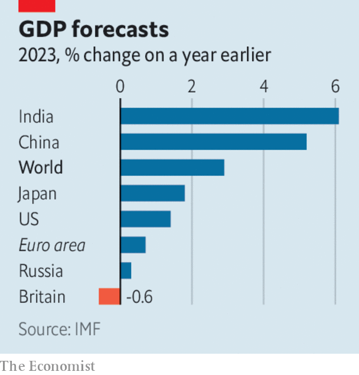

###### The world this week

# Business 

#####  

 

> Feb 2nd 2023 

 quarterly earnings delighted investors, for a change, as it set out a plan to reduce costs in a “year of efficiency” and announced a $40bn share buy-back. Revenue fell in the last three months of 2022, year on year, but is expected to rise in this quarter. Still, Reality Labs, the division tasked with creating the metaverse, ran up another loss, of $4.3bn, taking its total loss for the year to $13.7bn. 

Sharing the driving seat

After months of sometimes troublesome negotiations,  announced a restructuring of their two-decade-old alliance, which has been under strain since the fall from grace in 2018 of Carlos Ghosn, who had run both carmakers. The main feature of the agreement is a reduction in Renault’s stake in Nissan to 15% from 43%, with the remainder of Renault’s shares in Nissan to be put into a French trust and the voting rights “neutralised”. Each company will now own a working 15% stake in the other, which tackles a key concern of Nissan that the partnership had been unequal. 

,  and  reported record annual profits of $56bn, $37bn and $40bn respectively. All three benefited from the higher price of energy amid the war in Ukraine, though prices have been falling in recent months. 

 appointed a new chief executive to replace Alan Jope, who is standing down in July. Hein Schumacher is currently the boss of the world’s largest dairy co-operative, which is based in the Netherlands. He’ll take the reins of the consumer-goods conglomerate amid investor unease about its lagging share price, and criticism from some quarters about its purpose-driven approach to selling mayonnaise. 

, which is also under pressure from investors to improve its stock performance, appointed three independent directors. This came shortly after Elliott Management, an activist hedge fund, took a small stake in the software company.

The amount of money wiped off the value of  companies since Hindenburg Research, an American short-seller, said that their stock was artificially inflated passed $108bn. Adani Group forcefully denies the charges. More than $50bn has been wiped from the Indian billionaire’s fortune. 

The  lifted its key interest rate by a quarter of a percentage point, to a range of between 4.5% and 4.75%, the highest it has been since September 2007. It was the smallest increase since the Fed embarked on a course of tightening monetary policy last March. 

Faced with higher inflation rates than America the  and the  each raised their main rate by half a percentage point. The ECB’s deposit rate is now 2.5%. The Bank of England’s base rate is 4%, its highest level since 2008. 

America’s  had a strong start to 2023. The NASDAQ composite rose by 10.7% in January, its best start to the year since 2001. The S&amp;P 500 was up by 6.2% and the Dow Jones Industrial Average by 2.8%. Britain’s FTSE 100, a star performer amid last year’s dismal market rout, also rose, by 4.3%.

 


The IMF raised its forecast slightly of   this year, which it now thinks will grow by 2.9%. The fund believes that “adverse risks have moderated” since its previous estimate in October, noting that global inflation is expected to fall to 6.6% (from 8.8% last year) and that China’s reopening after covid lockdowns will boost demand. Europe has also proved resilient despite the war in Ukraine and high energy prices. The IMF even reckons that Russia’s economy will grow by 0.3%, a contrast to a recent report from the World Bank, which forecast that it would shrink by 3.3%.

The grew by 1.9% in the final quarter of 2022, year on year, helped by government support on energy bills and mild weather, which dampened fuel demand. The currency bloc’s GDP expanded by 3.5% over the whole year. Annual consumer-price inflation slowed to 8.5% in January, from 9.2% in December.

 reported a trade deficit of $47.5bn in 2022, the largest since records began in 1956. In January of this year the deficit came in at $12.7bn, the highest ever for a month. Exports of Korean chips and other tech have shrivelled while prices for imports of fuel and commodities have surged. This week  reported its worst quarterly performance in eight years. Profit from semiconductors plunged by 97%, year on year. 

 chief executive and other senior managers are to take big pay cuts, after the chipmaker reported a surprise quarterly loss and plunging sales. It expects to make another loss this quarter. 

The original jumbo jet

Boeing delivered its final  to a customer, ending production of a plane that revolutionised air travel through non-stop trans-ocean flights. The aircraft’s inaugural commercial flight, Pan Am from New York to London in January 1970, took just six hours and 14 minutes, though its departure was delayed by seven hours. 

