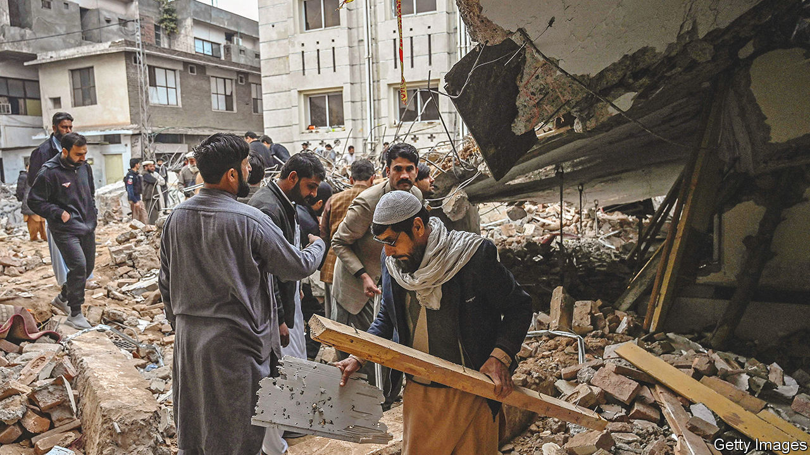
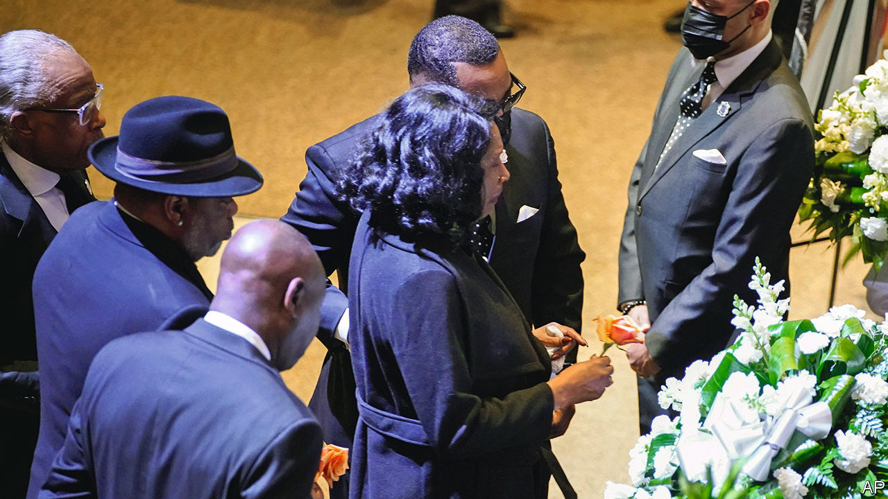

###### The world this week

# Politics 

#####  

 

> Feb 2nd 2023 

More than 100 people were killed by a suicide-bomb at a mosque in Peshawar, a city in north-west . Nearly all the dead were members of the security forces. The mosque was located in a heavily fortified area. The Pakistan Taliban was blamed for the atrocity, though it denied involvement. Last November the militants called off a peace process with the government and said they would carry out attacks across the country. Critics of the process say it allowed the Taliban to regroup. 

Meanwhile,  held another round of talks with the IMF over a possible bail-out. Ahead of the negotiations the government raised fuel prices and loosened foreign-exchange controls, which sent the rupee to a new low. Foreign reserves are dwindling, causing a backlog of imports at ports as buyers scramble to find the necessary dollars to pay for goods. 

Unhappy anniversary

Democracy activists staged a “silent strike” in  to mark two years since the country’s junta seized power. Myanmar has been racked by violence since the coup, a resistance movement having sprung up to fight the army on multiple fronts. This week the junta extended the country’s state of emergency for at least another six months. 

Chinese health officials said the  that has torn through  since December is “coming to an end”. Last month’s lunar new-year holiday appears not to have led to a new spike in cases. Independent experts said the reported decline in infections made sense, but China is believed to be undercounting covid deaths.

Antony Blinken, America’s secretary of state, visited  and the  in an attempt to reduce tensions following an increase in violence. A Palestinian gunman shot dead seven people at a synagogue in Jerusalem, the worst incident of its kind in Israel since 2008. The attack came after Israeli forces stormed a Palestinian refugee camp at Jenin, killing ten people. Israel said its troops went in to foil a terrorist attack and arrest militants. Two Palestinians were killed and two Israelis were wounded in separate shootings. 

A drone attack on a munitions factory in the  city of Isfahan was reportedly carried out by Mossad, Israel’s intelligence service, from inside Iran. 

Just 11% of the electorate in  voted in parliamentary run-off elections that were boycotted by the main parties. Critics of Kais Saied, the president, said the low turnout was a rejection of his reforms, which give the presidency near absolute power. 

The deaths of two journalists heightened concerns about attacks on free speech in Africa. The body of Mbani Zogo Arsène Salomon, a radio journalist in , was found on the outskirts of the capital five days after he was abducted and apparently tortured by unknown people. And human-rights groups have demanded a full investigation into the death of John Williams Ntwali, a journalist in , after authorities said he was killed in a car crash.

UN experts called for a probe into war crimes in  allegedly committed by security forces and Russian mercenaries from the Wagner Group. The experts said they had received “alarming accounts of horrific executions, mass graves, acts of torture, rape and sexual violence”.

 continued to be seized by unrest. At least 58 people have died in protests that began in December against President Dina Boluarte, demanding new elections and the freeing of her predecessor, Pedro Castillo, who was jailed after ordering the closure of Congress. Scores of roads, especially in the southern highlands, remain blocked. Food, petrol and oxygen for hospitals are running short in some towns. 

America’s Justice Department charged four men in connection with the murder in 2021 of Jovenel Moïse, then president of . The four—three Haitian-Americans and a Colombian—were transferred to Miami from Haiti, where the case had become bogged down amid death threats against local judges.

America imposed fresh sanctions on  former president, Horacio Cartes and serving vice-president, Hugo Velázquez, accusing them of “rampant corruption”. It alleges that Mr Cartes, a rich businessman, had used illicitly acquired wealth to expand his political and economic power, and says both men have links with Hizbullah, a militant group backed by Iran. The two deny all the allegations.

 


More emergency workers who were present at or shortly after the beating that led to the death of  in Memphis were either sacked or suspended from their jobs. Mr Nichols, who was black, was stopped by five policemen, all of them also black, for alleged reckless driving. In body-cam video they pull Mr Nichols from his car and repeatedly punch him. All five are charged with second-degree murder. 

The FBI conducted a search at  holiday home in Delaware for sensitive material. No classified documents were found.

Volodymyr Zelensky warned that Russian forces have been stepping up their artillery bombardment in the Donbas region in the east of . Many people fear that Russia, which has mobilised an additional 200,000 men or more, is preparing for a fresh new offensive in the coming days or weeks.

Petr Pavel solidly won the  presidential election. A former head of the Czech armed forces and senior NATO official, Mr Pavel beat Andrej Babis, a billionaire former populist prime minister, by promising to stick with the West and support Ukraine’s fight against Russia. Mr Babis had been lukewarm about defending NATO allies from a potential Russian attack. 

A Russian court sentenced a journalist in absentia to eight years in prison for describing  bombing of a maternity hospital in the Ukrainian city of Mariupol last March as a deliberate act. Alexander Nevzorov was convicted under laws purporting to crack down on “fake news”. 

Anything you can do…

The EU unveiled a , which proposes relaxing the rules on state aid in the single market in order to boost investments in renewable energies and technology to achieve net-zero emissions. The plan is a direct response to the huge subsidies doled out to green industry in America’s Inflation Reduction Act, which Europeans fear will drive green investment to the US. 

Unions in  held a second day of nationwide industrial action to protest against Emmanuel Macron’s proposal to raise the state retirement age to 64. Schools, public transport and fuel deliveries were all hit by strikes. In  teachers, train drivers, university staff and civil servants walked out in the biggest day of union action so far in a months-long wave of public-sector unrest over pay. 

Nadhim Zahawi was sacked as chairman of Britain’s  following revelations of unpaid tax and a significant penalty from the tax authorities. In his letter dismissing Mr Zahawi, Rishi Sunak, the prime minister, said that he had promised to uphold “integrity, professionalism and accountability at every level”. The decision came after a swift inquiry concluded that Mr Zahawi had broken the ministerial code.

