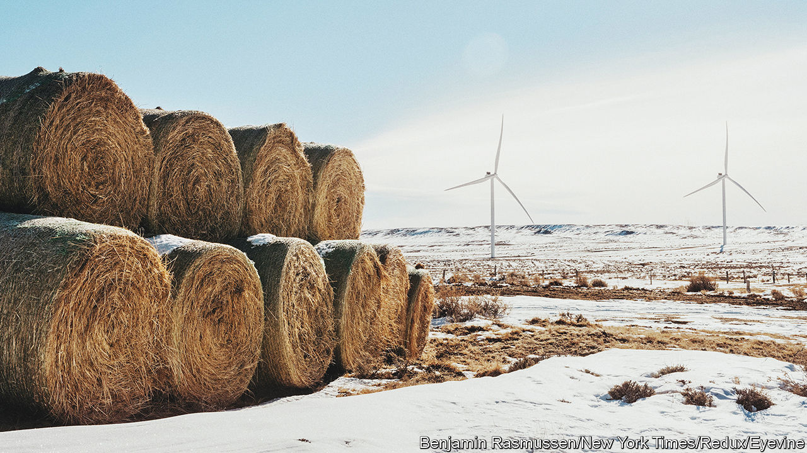
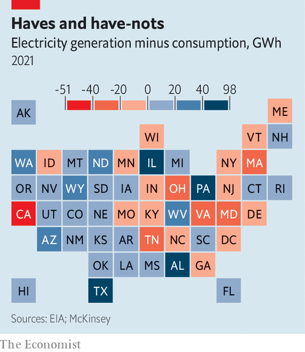

###### Green v green

# America needs a new environmentalism 

##### Preventing clean-energy infrastructure from being built is no way to save the planet 

 

> Jan 29th 2023 

WINTER IS windy season in Wyoming. On a particularly gusty day, those brave enough to travel on the I-80 highway will find that their fingers curl in a death grip around the steering wheel as winds buffet the car. The side of the road becomes a graveyard for lorries that have been blown over. Yet the same terrifying gusts make Carbon County, of all places, an ideal site for a wind farm. PacifiCorp, the biggest utility in the American West and a subsidiary of  energy arm, operates a suite of wind farms in the county. Philip Anschutz, a billionaire who made his fortune from fossil fuels, wants to turn his Wyoming ranch into a sea of turbines. 

Wyoming (population: 580,000) cannot possibly use all of the energy it can produce. In order to meet President Joe Biden’s goal of  the economy by 2050, America needs to move energy from the windiest and sunniest places to those with the most demand. That means using the megawatts generated by Wyoming’s winds to charge a Tesla in Los Angeles. But a bureaucratic thicket stands in the way. Both PacifiCorp and Mr Anschutz have spent more than a decade trying to get high-voltage transmission lines that cross multiple states approved. TransWest Express, Anschutz Corporation’s proposed line from Wyoming to the Nevada-California border, has yet to break ground. 

The Inflation Reduction Act (IRA), Mr Biden’s signature legislation and the most ambitious climate law America has ever passed, includes all manner of tax credits for clean-energy projects. But the process to get them approved can be long, onerous and litigious. McKinsey, a consultancy, reckons it can take up to five years to get a permit for a solar farm and seven for an onshore wind farm. An ambitious timeline to build a high-voltage transmission line is at least ten years, says Scott Bolton, vice-president of transmission development at PacifiCorp. The Rhodium Group, a consultancy, estimates that the investments in the IRA have the potential to cut emissions by 32-42% below 2005 levels by 2030. But a recent study from Princeton University’s ZERO Lab suggests that America would need to more than double its average pace of transmission expansion over the last decade to realise that goal. 

The rush to green the grid has created rare bipartisan consensus that it takes too long to build things in America. Permit reform, a hot topic among energy nerds and few others, has become one of the most important issues the 118th Congress could tackle. Without it, America risks allowing the investment boom the IRA unleashes to be for naught. But the debate over whether and where to build green infrastructure has pitted climate hawks against their erstwhile allies: environmentalists. 

By the 1960s, Americans were realising the threats from pollution. Rachel Carson’s “Silent Spring” exposed the dangers of toxic chemicals. California’s central coast was blackened by an oil spill. Ohio’s Cuyahoga river caught on fire. In response, America passed several world-leading laws aimed at reducing pollution and protecting the country’s natural resources. During his presidency, Richard Nixon created the Environmental Protection Agency. He signed the National Environmental Policy Act (NEPA), the Clean Air Act and the Endangered Species Act. Earth Day was born. 

These laws and agencies laid the foundation for modern American environmentalism, which has focused on preserving nature. Conservation is by definition conservative (which perhaps helps explain Nixon’s support for it). NEPA ensures that the federal government has to consider the environmental consequences of a project before permitting its development. Completing an “environmental impact statement” can take years. If someone feels that the government failed to study something, they can sue, elongating the process further. Environmentalism became a crusade of stopping things being built. 

Fast forward a few decades and the only way to mitigate climate change is to forsake fossil fuels in favour of green energy, which will require building massive amounts of new infrastructure—often on undeveloped land. A recent report from the Brookings Institution, a think-tank, suggests that wind and solar farms require at least ten times more land per unit of power produced than gas- or coal-fired power plants. Stand next to a turbine and it is clear why. The 100-metre blades typical of modern turbines need to be spaced out across prairie or atop mountain ridges. In a scenario where America relies entirely on renewables by 2050, Princeton’s modelling suggests that solar farms would take up an area the size of West Virginia. If America  and carbon capture, the amount of land needed for renewables would shrink. 

Climate-change hawks and conservationists used to fighting on the same side on behalf of the environment now find themselves weighing the benefits of utility-scale renewables against the protection of ecosystems.  has its own important role to play in fighting climate change. Safeguarding forests that act as carbon sinks will be crucial, for example. But land-use trade-offs are inevitable.

The permitting process has become the favoured vehicle by which people can try to block projects they don’t like. Legal challenges often revolve around threats to endangered species. In Wyoming, environmentalists worry that wind farms and transmission lines will harm sage-grouse habitat. Native American tribes sue to stop officials from approving energy projects on . A recent study by researchers at the Massachusetts Institute of Technology (MIT) identified 53 big wind, solar and geothermal projects that were delayed or blocked between 2008 and 2021. A third of them faced permitting difficulties. NEPA challenges make up the largest proportion of federal climate-change litigation in America, according to a database kept by Columbia University. 

A permitting delay will not necessarily kill a project, but it can make it more expensive. PacifiCorp originally budgeted about $1.3bn for a transmission line from Wyoming to Utah. Some 15 years later, the cost has climbed to $1.9bn. For new nuclear plants, which are extremely capital-intensive, delay can mean death. 

Bureaucratic spaghetti

Government is part of the problem. Many federal agencies work across environmental policy, and sometimes one doesn’t know what another is up to. The dysfunction is not always accidental. The Department of the Interior, which manages America’s vast public lands, and the Department of Energy are sometimes at loggerheads. Steven Chu, Barack Obama’s first energy secretary, says he initially had the support of Ken Salazar, his counterpart at Interior, when he tried to speed up permitting for transmission lines. “And then Ken calls me up,” he recalls, “and says, ‘Steve, I have to take back my support for this…my people at Interior are against it.’” According to Mr Chu, bureaucrats at the Fish and Wildlife Service, an agency within Interior, were worried about how more power lines would affect hunters and anglers. 

 


The Biden administration seems similarly confused about what to prioritise. The IRA is Mr Biden’s biggest accomplishment, and he has pushed for permit reform in Congress. But the White House is also pursuing the “America the Beautiful” initiative, which aims to conserve 30% of the country’s lands and waters by 2030. Each goal is admirable, but which wins when the best place to put a solar farm is pristine desert, home to endangered tortoises? And can that decision be made quickly?

Not all opposition to clean-energy projects stems from earnest concerns for ecosystems or tribal sovereignty. NIMBY (not in my backyard) activists are expert at using NEPA to thwart infrastructure that will obstruct their view. Laine Anderson, the director of PacifiCorp’s wind farms, says the most common complaint he hears from locals is that the turbines mar the desolate beauty of the sagebrush sea. The Sabin Centre for Climate Change Law at Columbia University found that local governments in nearly every state have enacted laws restricting renewable-energy development. In 2021 Ohio’s legislature passed a law allowing counties to declare parts of their domain off-limits to renewables; at least ten have done so. 

Permitting is not just a headache for the federal government. Nearly a third of states have their own versions of NEPA. The California Environmental Quality Act, known as CEQA, has been weaponised by the state’s tenacious NIMBYs to block development. California’s stasis is particularly painful given the housing shortage that has contributed to cost-of-living and . Last year Woodside, an affluent Bay Area suburb, tried to declare the town exempt from development because it was mountain lion habitat. (It did not succeed.) One study suggests that 60% of CEQA petitions filed in 2018 targeted proposed housing developments.

California exemplifies the worst excesses of the NIMBY movement, but it is also the place making the most progress. Gavin Newsom, the Democratic governor, declared that “NIMBYism is destroying the state”. The state’s attorney-general launched a “housing strike force” to limit the abuse of environmental laws. YIMBY (yes in my backyard) politicians are winning office and passing laws to streamline permitting and , which govern what can be built where. 

YIMBYism will be a harder sell in Washington, DC. Democrats and Republicans agree, in theory, that the planning process is broken. But progressives are wary of weakening environmental laws. Several Democrats torpedoed a permitting-reform bill proposed by Joe Manchin, the Democratic senator for West Virginia, last year because it would have approved a natural-gas pipeline in his state. Republicans are usually happy to slash environmental regulations, and have called for permitting reform for years. But they would like to make it easier to build fossil-fuel infrastructure, too. John Curtis, a Republican congressman from Utah who founded the Conservative Climate Caucus, thinks frustrations from both parties will force compromise. “I believe you can name any goal in either energy or in climate, and it’s being blocked by permitting right now,” he says. 

There are a few reforms that could attract bipartisan support. Standard timelines for environmental reviews could help speed decisions. Rather than studying how projects will affect endangered species on a case-by-case basis, the Interior Department could create regional maps of areas fit, and unfit, for development. They might like what they find. An optimistic new study published in , a journal, found that the 11 western states could reach net-zero emissions by 2050 while protecting sensitive habitats, with little extra cost. The Biden administration could empower an obscure permitting council, which has existed since 2015, to co-ordinate the alphabet soup of agencies involved. The Federal Energy Regulatory Commission could be given the power to approve big transmission lines, as it does for natural-gas pipelines, a fact that green groups are quick to point out. 

Local opposition is inevitable. Holly Bender, the senior director for energy campaigns at the Sierra Club, a conservation group, argues that involving people affected by a project at the start can ease tensions. Research from MIT suggests that early collaboration may deter litigation later. 

America needs to undertake one of the biggest building booms in its history. Permitting energy infrastructure pits hyperlocal concerns against the public good. There is no perfect place to build a wind farm or transmission line. Progress of any kind will require trade-offs. Wyoming’s high plains look different where they are overrun with turbines: slightly less wild, though no less imposing. But the spinning blades, propelled by the state’s ferocious winds, are evidence of America’s great green hopes. And that is beautiful in its own way.■


