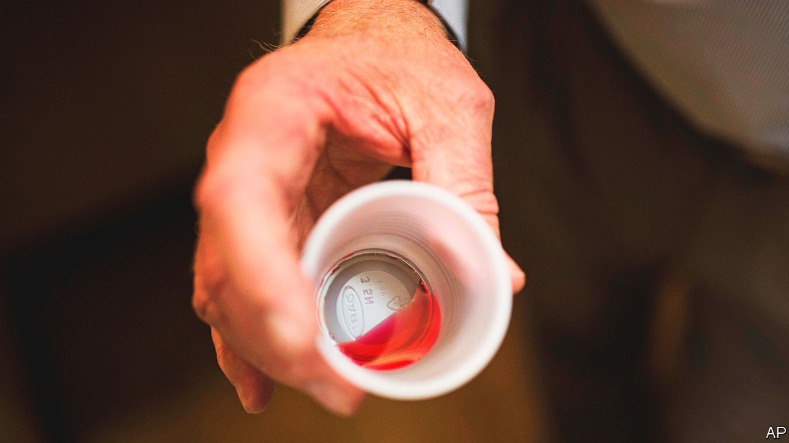

###### Preventing overdoses

# Medication for opioid addiction is getting easier to access 

##### A pandemic experiment in America is about to be made permanent 

 

> Feb 2nd 2023 

TAKING DELICATE sips, as if it were hot tea, it takes the elderly patient three goes to finish her shot glass of bright liquid. The cherry flavour is the best, her nurse explains, but it is still pretty bad. Nevertheless, she rinses the cup and drink the remains, so as not to waste a drop. The methadone will prevent opioid withdrawal and stave off her cravings. The vast majority of the 500 patients at the methadone clinic at St Barnabas Hospital in the Bronx have to visit six days a week. Staff try to make it welcoming, with birthday celebrations and snowglobes and bobbleheads on desks, but the daily visits are still a hassle, Elena, the nurse explains. She has worked in the clinic for a dozen years: some patients have been coming in even longer. 

Medications for opioid addiction have been used in one form or another for half a century in lots of countries and they are effective. Studies find that they reduce the risk of a fatal overdose by 80% and help addicts avoid relapse, HIV and hepatitis. But just 22% of Americans with an opioid problem got medication for the condition in 2021. Opioid overdose deaths have spiked, from around 50,000 a year before the pandemic to 80,000 in 2021.

It is currently annoying to get methadone, as the Bronx residents fighting a bitter wind to get to St Barnabas can attest. Clinicians fear misuse. Methadone is still an opioid and has a street value. Too much can cause an overdose. So treatment has been tightly controlled, at clinics with observed dosing (which is why patients sip, rather than take a pill which could be hidden under a tongue). But in March 2020, as people stayed home and tried to avoid medical facilities, federal regulations were relaxed to allow stable patients to take home enough to last 28 days. Those changes might now be made permanent, as part of what SAMHSA, the federal regulator, calls the biggest shift in 20 years. 

Doctors in Britain, Canada and Australia have been prescribing take-home methadone since the 1960s. As its use expanded in America during the pandemic, methadone overdose deaths did not spike and addicts were more likely to stay in treatment. “We did as many of those as we could,” explains Luis Rosario, a counsellor at St Barnabas. Despite fearing some “sneaky behaviour” of stashing or reselling bottles, he says “it went surprisingly well”. Now seeing some patients only having to come in once a month is motivating for others. 

The federal government is also proposing changes to regulations covering buprenorphine, another drug used for opioid addiction. Unlike methadone, buprenorphine is less liable to abuse and can be prescribed by a range of clinicians and doled out in pharmacies. The new rules would make online prescriptions, another pandemic-era liberalisation, permanent. “This is a really big deal,” says Keith Humphreys, of Stanford University. “We don’t have enough providers–we have huge gaps in the country where there just isn’t anybody for hundreds of miles around.”

More providers will be available soon: for years, clinicians have needed extra training and a specific waiver to use buprenorphine to treat addiction (prescribing it for pain needed no such additional bureaucracy). But, folded into the Omnibus Spending Bill, passed by Congress at the end of 2022, was a provision scrapping that waiver. Now anyone with a general Drug Enforcement Agency licence will be able to prescribe it–from family doctors more used to doling out sleep aids to psychiatrists giving out ADHD medications.

For take-home doses of methadone to work, and prevent more deaths, federal changes will not be enough. State laws will need to change too: 20 states currently have more stringent regulations than federal law requires. “The idea that loosening the rules around methadone take-homes will automatically translate” into doses being actually taken home is “naive”, explains Erin Madden, a professor at Wayne State University. Many states also needlessly regulate the number of methadone clinics with strict zoning laws. West Virginia has blocked any new clinics since 2007. Increasing access to treatment is urgent. These medications “need to be easier to access than illicit drugs and they’re not,” explains Dr Madden. That is a problem. ■


