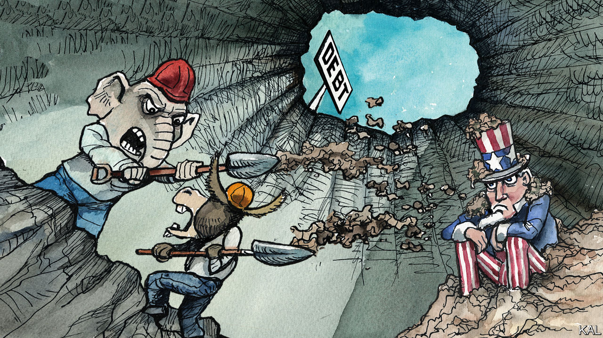

###### Lexington

# Republicans are right that federal budgeting is a joke 

##### But threatening America’s credit is even dumber 

 

> Feb 2nd 2023 

Although no other two-word combination may so prompt eyes to glaze and minds to wander, the history of America can be understood as a struggle over its budget process. After colonial legislatures restricted governors’ powers to tax and spend, parliament struck back by passing the Stamp Act to tax the colonies—and everyone knows the trouble that led to. 

After the Declaration of Independence, the articles of confederation gave each state a veto over federal borrowing, dooming America’s credit and stunting its growth. Even Thomas Jefferson, that scourge of big government, saw the problem. While serving as minister to France he wrote to James Madison in 1788 that America had to prove it could be trusted to pay its debts. “The existence of a nation, having no credit, is always precarious,” he wrote. Jefferson supported the Constitution, with its enhanced federal powers, partly to boost America’s reputation as a borrower. 

Alexander Hamilton then persuaded him to go further. As the first Treasury secretary, Hamilton urged consolidating the debts of individual states and imposing new tariffs to pay them off. America’s debt “was the price of liberty,” he told Congress in 1790, and sound national credit would swell “the individual and aggregate prosperity of the citizens”. Or, as his avatar would exhort “Jefferson” on stage more than two centuries later, good credit was “a financial diuretic/How do you not get it?”

It was in that grand tradition, though with less evident grandeur of vision, that Kevin McCarthy, the House speaker, visited the White House on February 1st to square off with President Joe Biden over the budget. Even an imagination as rich as Lin-Manuel Miranda’s might struggle to conjure an epic rap battle from this matchup. (Sampling from their public remarks—Biden: The last guy who was president/increased the debt by 25 percent. McCarthy: () When do you want to play/I’m not going to just move on the same way!)

And yet, as Mr Miranda might put it, history has its eyes on them: America’s credit teeters in the balance. Pressured by his berserker caucus, Mr McCarthy is demanding cuts in exchange for raising the debt ceiling, the limit to federal borrowing. The standoff has Washington’s jaded federal class rolling its eyes, as it has learned to do from past confrontations, while—it also does this every time—mumbling, as a warding spell, that this time may be different. It may be, given Mr McCarthy’s weak hold on a majority.

These debt-ceiling fights are American governance at its most stupid. As achievements in hypocrisy and self-defeat, they cannot be beat. When Republicans had unified control of government under Donald Trump, they freely raised the ceiling and, with it, the debt, while Democrats, for all their piety now, have also used the debt ceiling for leverage. As for self-defeat: the last time a Republican House pursued such brinkmanship the president was, of course, a Democrat (Barack Obama), and the result was a jump in rates that may have added half a billion dollars to the debt. 

These episodic standoffs are revelatory also because they expose an underlying erosion of governance. The Republicans who are stamping their feet have a point. The budget process, if called to account for the meaning of either word, makes a mockery of both. While over the years the branches of government traded authority over budgeting, someone was always taking it seriously. This century, that has changed, as the debt-to-GDP ratio has almost tripled, to 98%. Debt held by the public stands at $24trn, and 7% of federal spending—some $400bn a year—goes to service it. After decades of low inflation, rising rates have reminded Americans how debt can become dangerous.

By law, Mr Biden is supposed to submit his budget on the first Monday in February, but he is going to miss the deadline for the third year, this time, reportedly, by a month. That is not good government. Congress also ignores its legal obligations to account for the public’s money. In 2022, when Democrats controlled the House and the Senate, neither budget committee bothered to draft a budget resolution, meant to frame Congress’s vision of revenue and spending. In the end, a few legislators vanished into the room where these things happen and emerged with a 4,155-page, $1.7trn “omnibus” bill. Congress slammed it through and President Biden signed it just in time to avert another government shutdown. 

It may be cause for hope that the two periods of seriousness about budgeting in the past 30 years occurred when a Democratic president faced a Republican House: under Mr Obama and under Bill Clinton. Lexington, dewy-eyed, was at the White House in 1998 when Mr Clinton announced the budget would soon balance, for the first time since 1969. His aides forecast “surpluses as far as the eye can see”.

Throwing away their shot

It is hard not to mourn the America that might have been, had George W. Bush chosen to raise taxes amid the solidarity after the attacks of 9/11 rather than cut taxes while going to war in Iraq. Then came the global financial crisis and the even more feckless Trump tax cuts, followed by the covid crisis.

Both parties have learned that, by luxuriating in polarisation, they can ignore that governing requires trust and compromise. Republicans can have their tax cuts, Democrats can have their spending, and they can blame each other for the debt. “We have all lost the view that the budget is the starting point of what government does,” says Maya MacGuineas, who wages a lonely fight from the Committee for a Responsible Federal Budget, a non-profit. “It’s about confronting trade-offs.”

As Hamilton told Congress, “States, like individuals, who observe their engagements, are respected and trusted: while the reverse is the fate of those, who pursue an opposite conduct.” Whether or not extremists or bumblers breach the debt ceiling this time, America’s lawmakers are not heeding his warning. ■


