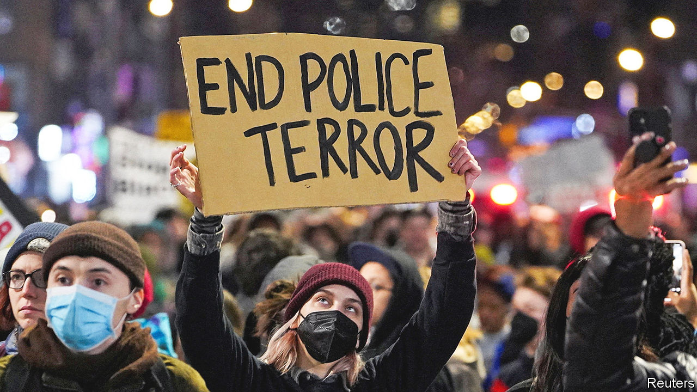

###### Black and blue

# Why holding bad police officers to account is so difficult 

##### The killing of Tyre Nichols has put police reform back on the agenda 

 

> Feb 1st 2023 

On the street corner in south-eastern Memphis where Tyre Nichols, a 29-year-old black man, was beaten almost to death by at least five police officers on January 7th, well-wishers have left flowers, teddy bears and a miniature skateboard. It is a relatively modest memorial for a man whose killing has shaken up all of America. On January 27th the Memphis police released four videos showing how Mr Nichols was dragged from his car and, while offering no resistance and trying to comply with shouted demands, was pepper sprayed, kicked and threatened with a taser until he ran away. He was then apparently chased down and caught and beaten more, with the kicks continuing even as he cried out for his mother. Once subdued, cops stood around joking, offering no medical support. He died three days later in hospital. The morning before the video was released, five police officers were charged with second-degree murder; the day after, the “elite” unit to which they belonged, called the “Scorpion unit” (for “Street Crimes Operation to Restore Peace in Our Neighbourhoods”), which had been launched only in late 2021, was disbanded.

The speed and certainty with which the authorities in Memphis acted stands in contrast to previous high-profile police killings. That charges were brought before the video was released may have helped to mute protests, by delivering the beginnings of justice. That is owed at least in part to Steve Mulroy, the Shelby county district attorney, a progressive Democrat who was elected last year, defeating a hardline Republican incumbent. “If the previous district attorney were still in office, I believe Memphis would be on fire right now because I don’t think she would have charged anybody,” says Earle Fisher, a Baptist pastor and activist for .

In fact a more traditional response—evasion, lies and inaction—was perhaps only just avoided. A police statement issued while Mr Nichols was still in hospital referred to a “confrontation”, and omitted the details. In an internal police report on the incident, leaked and posted on social media, one officer accused Mr Nichols of starting to “fight with detectives” and trying to grab one’s gun—claims the videos reveal as pure invention. Had the case been slightly more ambiguous, or the video less clear, it is hardly guaranteed that the wheels of justice would have turned so fast. So why is it so difficult to hold police accountable in America?

According to Craig Futterman, a University of Chicago law professor who has led several lawsuits against police departments, even in the most troubled police departments, the vast majority of officers are never accused of being violent. A minority—perhaps 5% to 10%—account for almost all complaints, and indeed for a huge share of money paid to victims of police misconduct by cities after lawsuits. But the entire system often protects the minority of bad cops from any consequences for their actions. “For some reason they thought that they could get away with it,” says Sharon Fairley, also of the University of Chicago, about the officers in Memphis. “There’s something about that system that made them feel that way.”

At the level of political leadership, it is costly to hold a bad officer to account. If a police officer is fired, or worse, convicted of brutality, then the risk is that hundreds of previous arrests will suddenly be questioned. In the short run, that means huge negative publicity, as well as potential lawsuits. Real criminals who were in fact rightly arrested may go free. “It takes a lot of courage” to face that, says Mr Futterman, and few mayors have it—especially when violent crime rises, as it has in recent years. And so cover-ups are tempting.

That culture in turn filters down to beat officers. Many police officers believe that violence is necessary to prevent crime. But even if cops are disgusted by their colleagues’ actions, they fear personal consequences if they blow the whistle. Instead, cops who want to avoid brutality tend to choose to stay away from those units which have to use force most often. Indeed, Mr Fisher says that he knows police officers personally in Memphis whom he trusts to behave decently and who refused to join the Scorpion team. “I know how infectious that culture can be,” he says.

A sad irony is that cities with the most ingrained culture of bad policing tend to suffer the most crime. In Memphis, according to data from the Tennessee Bureau of Investigation, though police arrest tens of thousands of people, just 39% of murders in 2021 were cleared. In 2020, according to FBI data, the Memphis metropolitan area (including the suburbs) had the highest murder rate of any large city in America. Just as a lack of accountability leads bad cops to commit violence, a  eventually leads to more murders. When people cannot trust the justice system to punish lawlessness, disputes escalate into killings. All too often, that in turn deepens the reliance on thuggish policing like Memphis’s Scorpion unit. Mr Nichols’s death, in all of its sheer awfulness, may be a step towards breaking the cycle. ■


