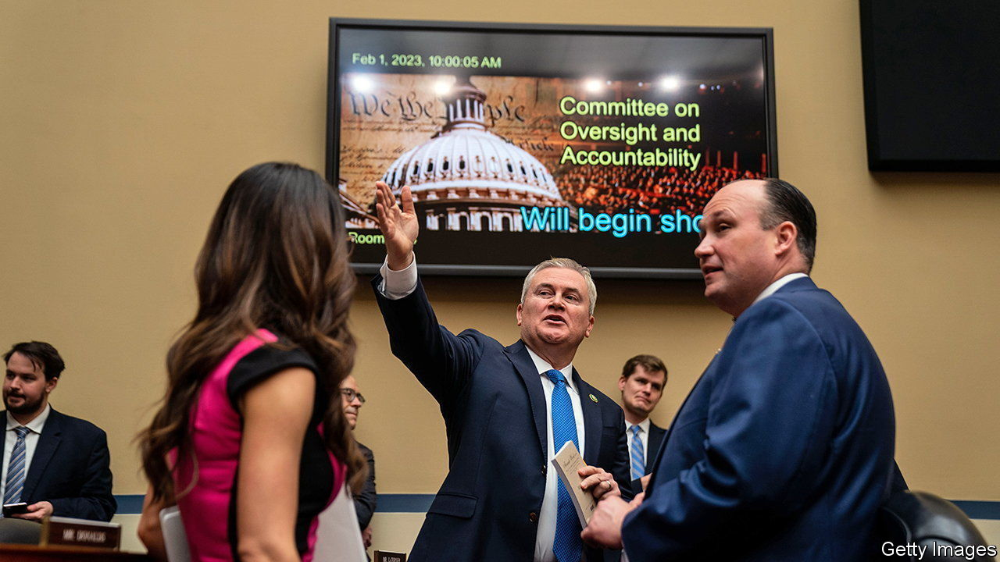

###### Height of heists

# Why it was so easy for crooks to steal money meant for pandemic relief 

##### America’s fragmented and antiquated state systems were an open door to fraud 

 

> Feb 2nd 2023 

In “Goldfinger”, the seventh novel in Ian Fleming’s James Bond series, Auric Goldfinger plans to steal $15bn from the federal government with the help of nerve gas, a stolen atomic bomb and operatives from a clutch of different criminal groups. With the emergence of covid-19 in 2020, an evil genius wanting to steal that much had a far easier option than breaking into Fort Knox. Armed only with stolen social security numbers, made-up company names and a large dose of sheer gall, he could simply have got the government to give him the money.

According to estimates from the Secret Service, as much as $100bn of money intended to help people get through the disruption of the pandemic was stolen. On February 1st, the newly Republican controlled House Oversight Committee held its first hearing on “waste, fraud and abuse” in the administration of America’s covid relief plans. The hearings promise to turn the issue into a political one. 

The bulk of the money stolen uncovered so far came from two programmes in particular—the federal expansion of unemployment insurance (ui) and small business loans distributed through the Paycheque Protection Programme (ppp). Both were the result of two laws signed by Donald Trump: the Families First Coronavirus Response Act and the Coronavirus Aid, Relief and Economic Security Act in March 2020. Criminal indictments of some of those accused of stealing so far suggest that extracting money from these schemes was not especially difficult. By using stolen social security numbers, together with made up or borrowed employer names, in many states fraudsters simply applied for benefits and had debit cards posted to addresses where they could pick them up and cash them. 

Easier to steal from still was the ppp scheme. This gave loans through commercial banks to firms to cover payroll costs. But in the aid of speed, due diligence was limited. By inventing hundreds of fictitious employees, some fraudsters succeeded in stealing millions of dollars. Much was probably taken by opportunistic crooks; but according to Joseph Gillespie of the FBI, well-established organised crime groups also quickly saw the opportunity. “They were distinctive in knowing that when there are public benefit programmes, they are rife to take advantage of,” he says. In December, the Secret Service reported that hacking groups associated with the Chinese government were among the groups stealing from state uninsurance relief schemes. 

Why was fraud so easy? Some was probably inevitable, says Michele Evermore, a fellow at the Century Foundation, a think-tank, who worked in the department of labour from late 2021 to December 2022. “There was this tremendous public pressure on state ui systems to get money out of the door,” she notes. Countries all over the world suffered fraud as speed was prioritised over stringency. But Ms Evermore reckons that America may have been especially vulnerable because of its fragmented, federal systems. Including the District of Columbia, Puerto Rico and the us Virgin Islands, there are 53 different unemployment insurance systems. Even before the pandemic hit, many schemes had long been underfunded; administrative spending had fallen consistently for 20 years. In some states, the systems still use a mainframe programming language from the 1950s and 1960s. But even states with “modernised” systems struggled, sometimes more, because newly-purchased off-the-shelf it systems had more holes in them than well-understood ancient ones.

In launching its hearings, the House Oversight Committee’s chairman, James Comer, argued that “with massive government spending comes opportunity for waste, fraud and abuse”, and that Joe Biden’s administration had let this happen. In fact, much of the theft probably happened in the earliest stages of the pandemic, when Donald Trump was still in the White House and authorised the spending splurge. And at least in terms of preventing people from falling into penury, the schemes were a success. As more and more trials uncover the extent of the theft however, the public may well forget that. ■


