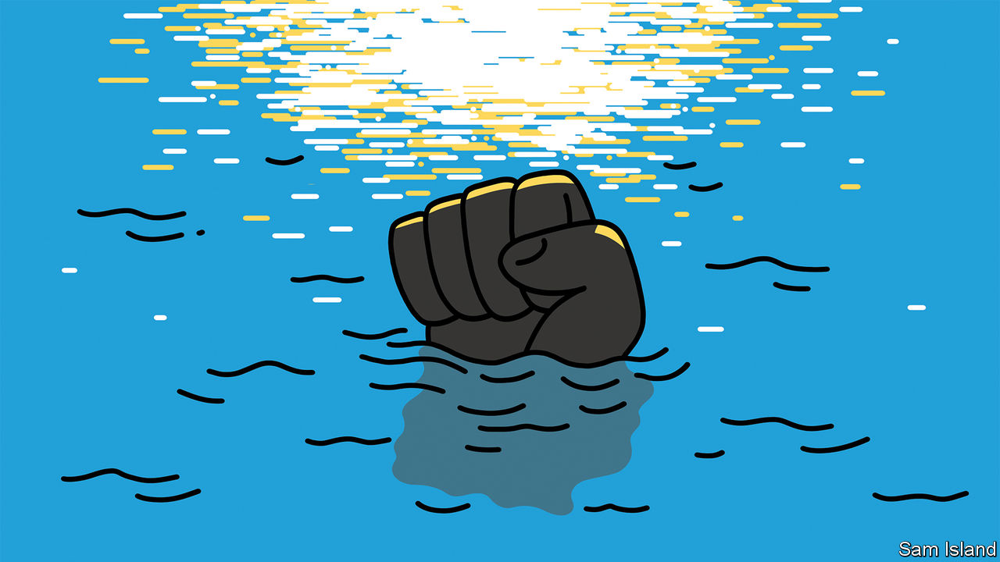

###### Banyan

# Democracy is reviving in Asia 

##### Being a corrupt Asian strongman is not what it used to be 

 

> Feb 9th 2023 

THE CHAGRIN of the dozen-odd years of this column’s existence is that fair, free and open societies in Asia have for most of that time been on the retreat. The golden advances in Asian democracy were in the 1980s and 1990s, when dictatorships in the Philippines, South Korea and Taiwan fell spectacularly. In recent years freedom has been on the back foot.

Think of the assaults on the judiciary and the press by Rodrigo Duterte, president of the Philippines until last year. Or attempts in Cambodia by its strongman, Hun Sen, to destroy the opposition. Or Narendra Modi, India’s prime minister, stoking sectarian tensions and intimidating his critics in the media. Or Indonesia’s move to criminalise insulting the president. The main exception to this recent trend, tragically, has ended up conforming to it. In 2015 joyful elections in Myanmar brought half a century of military rule to an end. But in 2021, the generals took back power in a violent coup and threw Aung San Suu Kyi and her government in jail. They have ruled the country through terror ever since.

But, tentatively if hopefully, points of democratic light are re-emerging in Asia. Many expected the rule of Mr Duterte’s successor to be just as louche and threatening. Ferdinand “Bongbong” Marcos is, after all, the son of the late kleptocrat whom Filipinos threw out in 1986. Yet Mr Marcos, who became president last June, emphasises good governance. Senior members of his cabinet are capable and pragmatic. He asks to be judged by his administrative performance and, so far, it is not discouraging.

Until July Sri Lanka was descending into a dystopia presided over by the Rajapaksa family, led by Gotabaya, its drill-sergeant president, and his grasping brothers. Then, to Mr Rajapaksa’s astonishment, popular protests last year forced him to flee the country and his clan from power. It is early days for Sri Lanka’s recovery; but the Rajapaksas’ ousting was its essential precondition.

Power changed hands last December in Fiji, bumpily but without anything like the turmoil feared. Its former prime minister, Frank Bainimarama, in power for 16 years following a coup, failed to win re-election and, after thinking about it a bit, agreed to step aside. Malaysia had seen a largely peaceful transfer of power the previous month—one that made Anwar Ibrahim, that oft-foiled reformist, prime minister.

In Thailand, another coup leader, Prayuth Chan-ocha, and his underwhelming cronies from army days now run an ostensibly civilian government and promise elections this year. Their grip is less sure than they would like; a focused, almost joyful opposition is emerging against the “old uncles”, as its members mockingly call Mr Prayuth and his team. And though there is little to smile about in wartorn Myanmar, the ruthless General Min Aung Hlaing has inspired a powerful struggle for democracy. Just as in Iran, a generation of young citizens, less traditional and more demanding than their elders, are proving willing to die for their freedoms. Democracy will surely return to Myanmar, eventually.

Points of light are not necessarily a pattern. And, it must be said, vast swathes of Asia are yet to know democracy at all. China, Laos and Vietnam are three of the world’s four surviving Leninist dictatorships—and then there is North Korea. Yet the political mood in Asia appears to have changed.

Authoritarianism is on the wane because it has not been delivering the goods. Asian admiration for China’s model of governance has been diminished by President Xi Jinping’s blunders handling the economy, covid-19 and relations with America. Vladimir Putin’s disastrous progress in Ukraine has made the Russian president’s fans in Asia squirm. In Sri Lanka, the Rajapaksas were chased out because they had run the economy into the ground.

What is more, many Asian countries have long had the means to get back on track. Westminster-style systems in Fiji, Malaysia and Sri Lanka, though much abused at times, underpinned their return to more accountable habits. For all the backsliding in India and Indonesia, their traditions of free elections offer a route to democratic revival. Elsewhere, corrupt autocrats who hold rigged elections to enhance their legitimacy may sometimes lose control of the process. With elections due in Cambodia in July, even Mr Hun Sen is demonstrating that political opposition, once rashly permitted, is frustratingly hard to quell. His ruling party is not guaranteed to make all the running. The seeds of democratic renewal in Asia lie all around.


