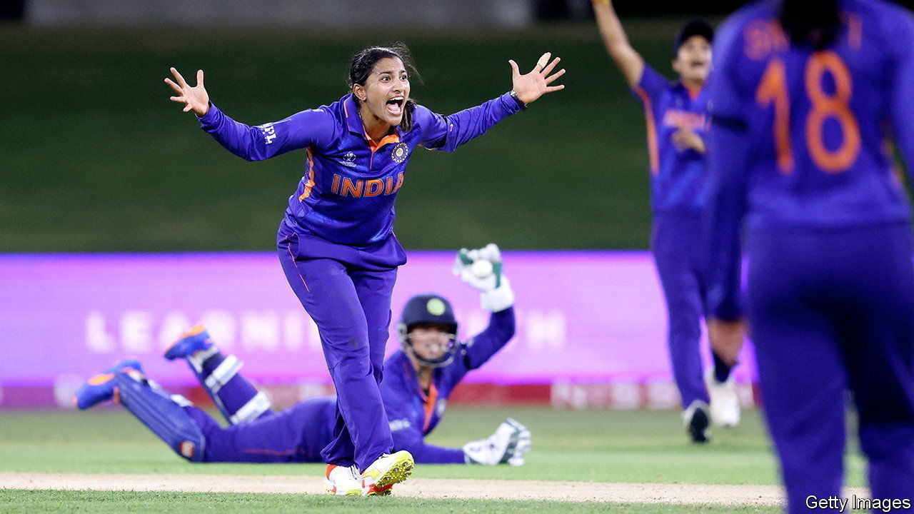

###### Cricket

# Indian investors pile in to women’s cricket 

##### Will the Women’s Premier League take off? 

 

> Feb 9th 2023 

On February 12th India’s women’s cricket team will play their Pakistani arch rival in the Women’s T20 World Cup in South Africa. It will be a big sporting occasion. It will also be a potentially lucrative opportunity for the players to show off their skills ahead of an enthralling cricket-business event back home in Mumbai the next day.

India’s cricket administrators will hold a player auction for the inaugural Women’s Premier League (wpl), a domestic contest to be played in Mumbai from March 4th to 26th. If the men’s version of the tournament, the Indian Premier League (ipl), is a guide, the televised auction will be almost as popular as cricket itself is in India. And the bidding, to allocate players and determine their wages, will be fierce. Top Indian players can expect to earn as much from a three-week wpl stint as they do in a year with the national team. Foreign players will also be up for grabs. It would be “naive to think that it’s not going to be a distraction,” said Sophie Devine, New Zealand’s cricket captain, ahead of the World Cup.

The ipl, launched In 2008, has had a seismic effect on cricket. A made-for-tv tournament, it has been a huge commercial hit. Five-year television and streaming rights to the ipl sold last year for a combined $6.2bn, making it the second-most valuable sports franchise by media rights. The league has, among much else, greatly increased the sums top cricketers earn. There are hopes—and some concerns—that the wpl will have a similar effect on the women’s game. 

The numbers involved in the wpl are already impressive. Broadcast rights for its first five annual seasons sold last month for 9.5bn rupees ($115m). A few days later, investors paid a combined 46.7bn rupees—over half a billion dollars—to own five franchise-based teams. Before a ball has been bowled, this suggests the wpl may be the second-most valuable women’s sports franchise behind America’s biggest women’s basketball league, the wnba. 

The concerns, again fuelled by the ipl’s example, relate to the possible effect of the wpl on the women’s game at large. The lure of fat contracts might incentivise players to quit their national teams in favour of the wpl. This is an especially sensitive issue in cricket, which has been largely organised around international contests ever since the first (between America and Canada) was held in 1844. The ipl has significantly eroded their primacy in men’s cricket; little international cricket is played during it.

Yet this may be a lesser worry in women’s cricket, given that its contests attract far few viewers than their male equivalent. And merely to see a women’s enterprise drawing such attention in India is positive. Just 19% of Indian women aged 15 or older are in work, a lower portion than in Pakistan or Bangladesh. If the wpl encourages Indian parents to be more ambitious for their daughters, it will in one important way be a success.

