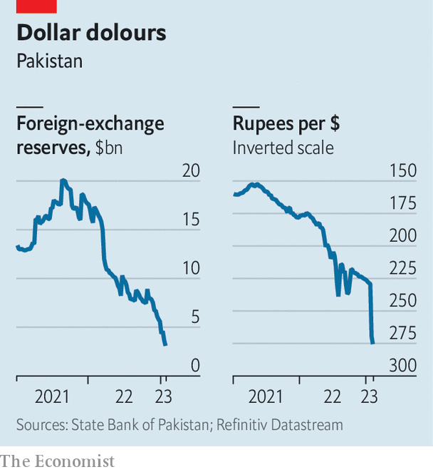

###### Broken and broke

# Pakistan is at risk of default 

##### A balance of payments crisis is tipping a fragile economy over the edge 

 

> Feb 7th 2023 

Pakistanis are accustomed to unreliable utilities. Even in affluent neighbourhoods of Karachi and Lahore, residents install diesel generators for power cuts and spare water tanks for when the taps run dry. Yet the events of January 23rd were still shocking. A surge in voltage at a power station in southern Sindh province led to almost the entire country of 230m people losing power for most of the day. Factories, hospitals and mobile-phone networks shut down in many areas. In Lahore, the evening’s trading and promenading—a time when Pakistan’s second-largest city feels most exhilaratingly alive—was conducted in darkness and a pale glow of mobile phones. Only at midnight did some streetlights come on.

The blackout is indicative of an economic crisis severe even by the standards of a country well-known for them. Pakistan is still suffering the devastating effects of  last summer that displaced 8m people and cost the country an estimated $30bn in damage and lost output. Tens of thousands remain homeless. Rocketing inflation, fuelled by global factors and economic mismanagement, is making their situation harder. Annual inflation reached 27.6% in January, the highest level since 1975. The rupee is crashing. It traded at an all-time low of 275 to the dollar this week, down from 230 in mid-January and 175 a year ago. With foreign exchange reserves dwindling, the country faces its worst balance of payments crisis in peacetime.

Many heavily-indebted emerging markets have faced similar problems over the past year, related to post-pandemic supply glitches and the war in Ukraine. Pakistan, which imports much of its food and fuel, looks a lot like Sri Lanka last spring, before it defaulted on its debt and its president was chased from the country by protesters. Yet Pakistan is uniquely troubling. It is the world’s fifth biggest country by population, perennially unstable, beset by extremists and nuclear-armed. 

 


The Taliban’s return to power in neighbouring Afghanistan in 2021 has launched a third terrible blight—of terrorism and insurgency, mainly in the north-west of the country. Last week a suicide-bomber killed 84 people, mostly members of the security forces, in a mosque in Peshawar, a north-western city. Political dysfunction, which is as ubiquitous as corruption in Pakistan, is inevitably stymying the government’s response to these disasters.

Imran Khan, a charismatic narcissist who was  last April, has spent the past year agitating to bring down the government of Shehbaz Sharif, who replaced him. Even if he fails (and the army, which often stage-manages Pakistan’s political dramas, is not with him) Mr Khan remains popular and well-placed for an election due by October. Mr Sharif’s administration is meanwhile squabbling, including over negotiations for an imf bail-out. With foreign currency reserves down to just over $3bn in early February, enough to cover three weeks of imports, Pakistan needs access to $1.1bn in a  agreed with the imf in 2019 and suspended due to a lack of progress on promised reforms. If the fund’s negotiators, who returned to Islamabad on January 31st, leave this week without a deal (which looked possible as  went to press), Pakistan could default on its sovereign debt.

The forex shortage, in part caused by efforts to prop up the rupee, is causing additional damage. Import restrictions imposed to save dollars for essential items like food and fuel have hit industries reliant on imported inputs. Output in large-scale manufacturing, including cars, chemicals and textiles, fell by 5.5% in November 2022 compared with the year before. The World Bank predicts gdp will grow by 2% this year, half what it forecast last June. “There used to be this conviction that we’ll always come out of it somehow,” says a businessman in Karachi. “Now there’s deep pessimism, almost hysteria.”

The almost total loss of the cotton crop to the floods has ravaged the textile industry, a major source of exports. Some 7m textile workers may have lost their jobs since last summer, according to industry sources. The blackout is estimated to have cost the industry an additional $70m.

The floods and job losses are thought to have pitched between 8.4m and 9.1m more people into poverty, mostly in the countryside. In Dadu, an especially inundated district of Sindh, thousands are still languishing in tents. “Only those who had savings or outside help can afford to fix their houses”, says Rasheed Jamali, an aid worker. Foreign donors pledged $9bn in relief in January; less than $800m of a previous set of pledges had at that time arrived. With only half of Pakistan’s soggy fields sufficiently recovered to sow with winter wheat, much of the country is facing another lost harvest.

These political, economic and environmental crises are mutually reinforcing. Payments from the bail-out programme agreed in 2019 were suspended a year ago after Mr Khan, facing a growing prospect of parliamentary defeat and ejection from office, reintroduced fuel subsidies. Mr Sharif’s government vowed to fulfil the fund’s conditions but backtracked in September when, panicked by the floods, it sacked Miftah Ismail, its pragmatic finance minister. His successor reversed some of his policies, prompting another suspension of payouts. “If the floods hadn’t happened I might have kept the job and we might have been OK,” Mr Ismail says.

Mr Sharif’s government seems to be bowing to the inevitable. In late January it stopped trying to prop up the rupee and raised fuel prices, as the imf had requested. If the current negotiations in Islamabad unlock the bail-out funds, it might encourage other external creditors to extend credit lines or defer payments on existing loans. Unlike Sri Lanka, which owed a higher percentage of its debt to foreign creditors, Pakistan may be able to stabilise its position without its creditors being forced to accept a “haircut”.

Yet any relief is likely to be temporary. The current imf programme expires in June; Mr Sharif’s term will expire in August. A caretaker administration will then preside over what promises to be a two-month political vacuum before the scheduled elections. They will be messy. It is hard to think of Pakistan in such circumstances carrying out the additional reforms, including raising taxes and electricity tariffs, required to secure more imf funding. They would inflict more short-term pain on the country’s suffering people than even an astute Pakistani government might dare to. And especially if Mr Khan, currently nursing his wounds after a failed assassination attempt, has his way, the next government may be even worse than the current one. ■

