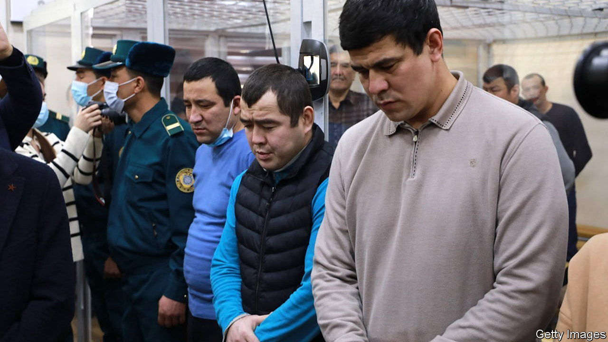

###### A strongman on the Silk Road

# Squashing dissidents in Uzbekistan 

##### The country’s president may be preparing to extend his rule 

 

> Feb 9th 2023 

It was a performance straight from Uzbekistan’s dark Soviet past. In a courtroom in Bukhara in December, a group of alleged agitators against the government of President Shavkat Mirziyoyev leapt to their feet and, with heads bowed and hands on hearts, issued a synchronised plea for mercy. “We ask for forgiveness,” they intoned in unison. 

They were in the first of at least two batches of dissidents due to be tried over a spasm of violence last July in Karakalpakstan, an autonomous province in the northwest of Uzbekistan. It started after word spread that Mr Mirziyoyev planned, as part of a package of constitutional changes, to scrap the province’s right to self-determination. That sparked peaceful protests which, for reasons that are contested, spiralled into clashes between the security forces and demonstrators that left 21 dead, including 17 civilians, mostly from gunshots and grenades. Mr Mirziyoyev, previously feted as a liberal reformer, promptly abandoned the attempt to curb the province’s autonomy. Nonetheless, the violence in Karakalpakstan, for which the government has accepted no responsibility, has left a stain on his presidency.

The trial in Bukhara looked at first like an effort to expunge it. Uzbekistan’s criminal justice system was until recently synonymous with corruption, torture and other abuses; in 2002, two prisoners were allegedly boiled to death. Yet, though politically sensitive, the trial was open to journalists. A live video feed of its proceedings, which were carried out in the defendants’ Karakalpak language, was initially shared on the internet. A government-appointed commission, including human-rights campaigners, was charged with monitoring the accused’s treatment.

Yet the trial looked increasingly for show. The main defendant, a 44-year-old lawyer and blogger called Dauletmurat Tazhimuratov, was the only one to plead innocent; the others all testified against him. Cross-examining one of his accusers, Mr Tazhimuratov forced her to concede that she was, in fact, lying. He was convicted on January 31st of trying to overthrow the state in Karakalpakstan, among other crimes, and sentenced to 16 years in prison. The 21 other accused received lesser punishments; 15 of them received prison sentences of three to eight years. Some were then paraded, weeping, before reporters to express their gratitude to Mr Mirziyoyev. Another 39 alleged ringleaders of the violence went on trial this week.

The Karakalpakstan incident suggests the limits to Mr Mirziyoyev’s reform agenda. Since becoming president in 2016 (after his long-ruling predecessor, Islam Karimov, died) he has in many ways improved Uzbekistan. It no longer routinely locks up and tortures political dissidents. It no longer runs, in the country’s steppe-land cotton-fields, what was perhaps the biggest forced labour regime outside North Korea. Uzbekistan has become fairer, more open—and also more prosperous. Mr Mirziyoyev has lifted currency controls, launched a privatisation drive and dismantled barriers to regional trade. The country’s economy grew by around 6% last year. Yet after the fashion of enlightened despots, he has shown no interest in political reform; except, it increasingly seems, to extend his rule.

Mr Mirziyoyev’s second presidential term is due to end in 2026, and is all that the constitution permits him. That appears to be why he is trying to change it. If the 65-year-old president can also pull off a plan to extend presidential terms from five to seven years, he could remain in office until 2040. The violence in Karakalpakstan appears to have been an unforeseen by-product of his effort to do so. And the ensuing crackdown should help enforce it. Mr Mirziyoyev is expected to put all his mooted constitutional changes except the Karakalpakstan one to a referendum this year. They will almost certainly pass; criticising the president is a red line few Uzbeks dare cross. The long sentences being meted out to the dissident Karakalpaks might well appear as a warning to those few. ■

