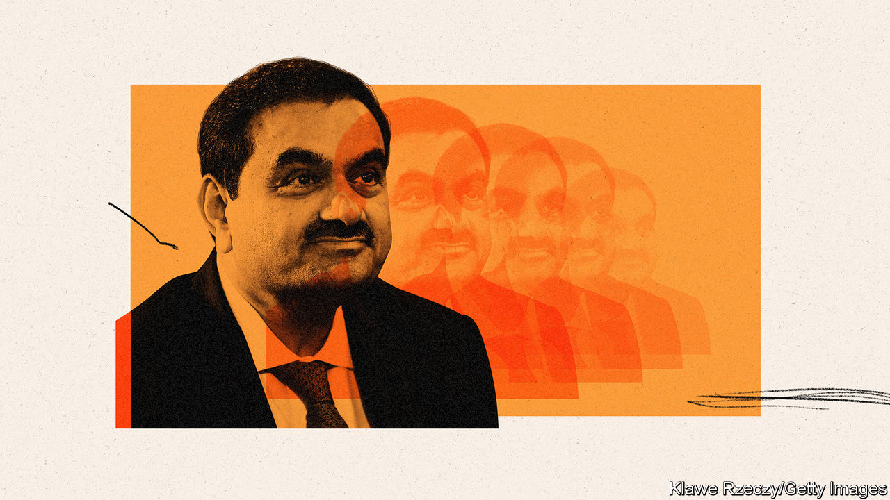
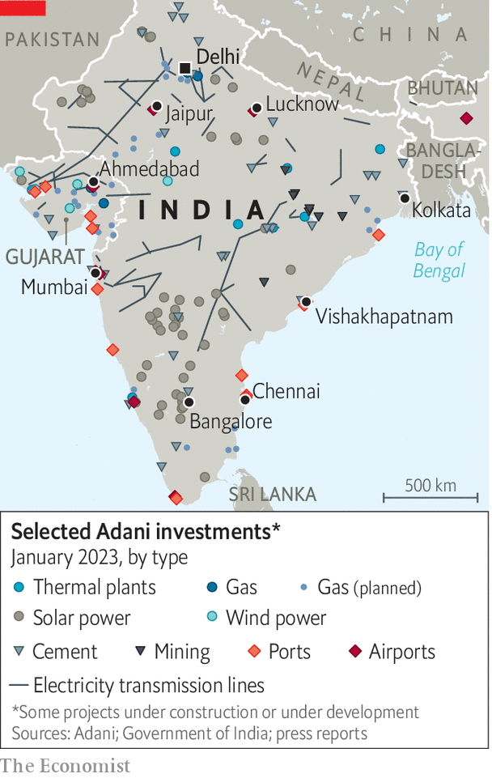
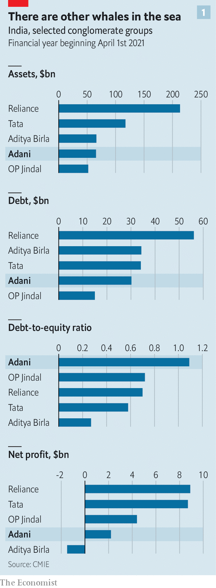
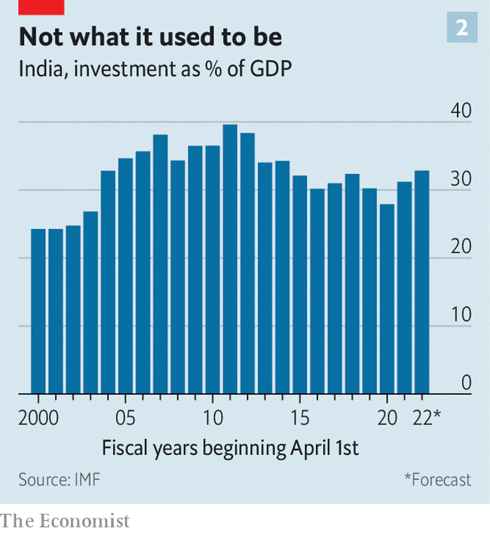

###### A tycoon at bay

# Why Adani Group’s troubles will reverberate across India 

##### The conglomerate is not just big; it also embodies the tensions in the country’s growth model 

 

> Feb 9th 2023 

“I like challenges where you feel you are part of nation-building. I could have created many different businesses but I feel more satisfied when I create something that can be part of the India journey,” Gautam Adani told , a weekly news magazine, in 2011. The journey of Mr Adani’s conglomerate, Adani Group, took an unexpected turn in late January, when an investment firm’s critique of its finances caused the share prices of its various listed businesses to plunge. Given how closely Adani Group is associated with the government of Narendra Modi, and his ambitions for the economy, many observers are asking whether policymakers, too, could be steering in the wrong direction.

It is over two weeks since the publication of Hindenburg Research’s report on the Adani Group, on January 24th, yet the alarm it created has still not dissipated. The American firm, which makes financial bets against companies it considers overvalued, argued that Adani Group had manipulated the prices of shares in its constituent companies. The group insists the claims are baseless; it has published a 413-page rebuttal.

Adani has also tried to reassure twitchy investors with displays of financial sobriety. On February 6th the Adani family said it would repay 18 months ahead of schedule a $1.1bn loan taken out using shares in the group’s companies as collateral. The following day Adani Ports said it would pay down its debt by $605m this year and halve spending on new investments. 

Yet the shares continue to gyrate: on February 6th, for example, shares in Adani Transmission fell by 10%, prompting trading to be suspended. That same evening it reported strong results; the following day its shares rose by 10%, prompting another suspension. The value of the Adani Group as a whole remains roughly half what it was before Hindenburg weighed in. 

Indian media report that the main stockmarket regulator, the Securities and Exchange Board of India, has requested information about the ownership of the offshore firms that Hindenburg accused of acting on Adani’s behalf. But the reports also claim that SEBI has given Adani six months to respond. Hindenburg’s allegations, in other words, will not be categorically proven or dispelled any time soon.

Meanwhile, fresh criticisms and setbacks continue to surface. This week the Indian press pored over an analysis by Aswath Damodaran, a professor of finance at New York University. It argued that, despite their tumbling share prices, companies in Adani Group are still overvalued, given that the bulk of their assets are in staid, low-growth industries and infrastructure. On February 8th TotalEnergies, a giant French oil company, said it was delaying a $4bn investment in a scheme to make green hydrogen with Adani. 

Spigots under scrutiny

Few imagine that the Adani Group is anywhere near collapse. It does, after all, own lots of real, revenue-generating assets, however overvalued they may be. In the same breath as he postponed the hydrogen scheme, Patrick Pouyanné, Total’s boss, insisted that his firm’s joint venture with Adani to sell natural gas remained sound. But Adani clearly feels pressure to trim its spending and reduce its debt.

The group says that it has the funds to complete all projects that are already under construction. But its straitened circumstances are likely to delay some of its more extravagant investment plans at the very least, and perhaps derail a few. Moody’s, a rating agency, while affirming Adani’s investment-grade status, has pointed out that much of its planned capital expenditure is “deferrable”.

 


In some ways, that is a worrying thought. Adani’s investments pepper India (see map). It accounts for 7% of the capital spending of India’s 500 biggest listed firms. The group has promised to spend $70bn by 2030 on green investments—part of a cherished government plan to make India a green superpower. The Centre for Monitoring Indian Economy (CMIE), a research firm, keeps a database of big current and planned capital expenditures in India, both public and private. Adani accounts for 3% of the full pipeline of projects by value, but almost 10% of the newer projects, announced in the fiscal year that ended in March 2022. A curbing of Adani’s investments, in short, could hardly be considered insignificant, even in the grand scheme of the Indian economy. 

What is more, Adani is an especially big presence in certain industries. Its seven airports handle 23% of India’s passenger traffic; its dozen ports receive or dispatch around 30% of India’s international freight; its recently acquired cement business churns out 14-20% of India’s total; its warehouses hold 30% of Indian grain; it is the country’s biggest private generator of electricity from fossil-fuel plants (and a big one from renewables) and so on. Any scaling back of its investments would definitely be felt in these businesses.

Adani also has a reputation for being able to get things done. Take Mumbai’s new airport, which an Adani subsidiary is building. The city’s planners first mooted the construction of an airport to the east of the city in 1997. The plans were revised, argued over with residents, put out to tender, delayed, revised again and so on. In 2021 Adani took over the project after it was put out to tender yet again. From that point on, the $2.1bn project made rapid progress. 

Today workers can be seen at the site, behind a blue steel barrier, transforming reclaimed land into a stone foundation for runways. Although planned completion dates for big infrastructure projects are typically the subject of derision, construction is expected to be finished next year and the airport to be operational by 2025. That is a meteoric pace, by any standard.

It is this ability to charge through the morass of regulation, legal wrangling and bureaucratic inertia that really distinguishes firms like Adani. India has always been a difficult place to do business. And that difficulty has always given sprawling family-owned conglomerates an edge over leaner, smaller rivals. Companies with clout and collateral find it easier to raise money and bend the bureaucracy to their will. And since clout and collateral are useful in any line of business, these groups naturally expand in scope, so as to make the most of their strengths.

The capacity to get things done is especially dear to Mr Modi, who prides himself on his ability to foster economic growth. He wants to drum up more investment, in manufacturing in particular. “If you’re India and you are struggling to find a way to invest at the levels you need then it’s sort of these guys or bust,” says James Crabtree, whose book, “The Billionaire Raj” examines the rise of India’s tycoons. “Adani might have…a taste for debt but with that comes genuine investment. Ports get built, rail lines get built, and that’s sort of what India needs.” 

The growth model that Mr Modi honed first as chief minister of the state of Gujarat from 2001 to 2014 and then as prime minister “was premised on the state giving a set of favoured corporations concessions on land, on capital, on tax, on environmental and building clearance in exchange for setting up shop,” says Milan Vaishnav of the Carnegie Endowment for International Peace, an American think-tank. “What we’re seeing today is a scaling up of that model. So it’s become pretty clear that this government believes in identifying and backing national champions.”

Mr Modi is especially close to Mr Adani, whom he has known since the late 1980s. Mr Adani was one of the few business figures to stand by Mr Modi after sectarian riots in Gujarat in 2002 killed at least 1,000 people, mostly Muslims. In 2003 he helped set up an event called “Vibrant Gujarat”, part of an effort to recast Mr Modi, tainted by association with the riots, as a pro-business leader. Mr Modi was a guest at the wedding of Mr Adani’s son in 2013.

During the national election campaign the following year Mr Modi relied on a fleet of Adani aircraft to ferry him around; one even brought him to his swearing-in in Delhi. (Mr Adani said at the time that the flights had been fully paid for.) In Mr Modi’s first year as prime minister alone, Mr Adani accompanied him on trips to America, Brazil, Canada, France and Japan. “Everywhere that Prime Minister Narendra Modi goes, it seems, Gautam Adani is sure to go,” the , a national daily, remarked in 2015.

Friends without benefits

Mr Adani has long denied that his close friendship with Mr Modi has had anything to do with Adani Group’s success. “You can never get any personal help from Modi. You can speak to him about policies in the national interest, but when a policy is framed, it is for all,” he said in an interview with an Indian television news channel in January. By the same token, the government has been careful to avoid leaping to Adani’s defence. It has limited its public comments on the group’s difficulties to anodyne assertions of faith in India’s financial regulators. 

All the same, the upheaval is embarrassing for Mr Modi. A state-controlled insurer has investments in the group; state-owned banks have lent to it. All have had to deny publicly that their exposure constitutes a serious risk. The government has repeatedly blocked the efforts of opposition parties to initiate a parliamentary debate or a formal public inquiry on the subject. The opposition, in protest, has resorted to theatrical disruptions of parliamentary proceedings.

But the palaver is unlikely to cause Mr Modi serious political harm. Few Indians believe that he has profited personally from his links to Mr Adani. Congress, the main opposition party, is on shaky ground when it comes to accusations of corruption. Its most recent term in office, from 2009 to 2014, was paralysed by constant allegations of bribery and embezzlement. Some Indians seem to accept Adani’s contention that the accusations against it are part of “a calculated attack on India”. “The whites can’t bear to see India’s progress,” tweeted Virender Sehwag, a retired cricketer. “The hitjob on India’s market looks like a well-planned conspiracy.”

Moreover the exposure of Indian retail investors and mutual funds to Adani is tiny. The technical nature of Hindenburg’s accusations render the report incomprehensible to most people. It helps that the media, much of which is owned by industrial conglomerates, rarely challenge the government or its allies in business. The last television news channel to air frequent criticisms of those in power, NDTV, was bought last year by Adani. 

 


Mr Modi will still need capable firms to fulfil his ambitions for India’s economy. But Adani is not the only company in India that can pull off big, complex investments. In 2016 Reliance debuted Jio, its low-cost 4G network that vaulted India’s telecoms forward by a generation. Tata last year bought the beleaguered and debt-laden flag carrier, Air India, which the government had long struggled to privatise (and which Tata had originally owned before it was nationalised in 1953). Several of India’s other conglomerates, although still enthusiastic borrowers, are bigger, less indebted and more profitable than Adani (see chart 1). 

The continued strength of India’s conglomerates is a double-edged sword, however. They tend to sideline smaller firms that could grow into tomorrow’s giants. Medium-sized businesses complain that they struggle to secure government contracts. The mere participation of a well-connected firm in an industry or a tender can discourage others from entering the fray, reducing competition and curtailing investment. “What is clear is you need to broaden opportunities to other private investors,” says Trinh Nguyen, an economist at Natixis, an investment bank.

Capital crimes

India does not have an especially impressive record when it comes to deploying capital. In the 2000s groups like Reliance, GVK and GMR took the lead in an epic investment boom. Total capital spending reached 39% of GDP in 2011, up from less than 25% in 2002. Yet many of the projects concerned were over-optimistic. Lots of them wilted in the face of the global financial crisis, high oil prices and India’s struggle to get a grip on rising inflation and a falling rupee. Banks were left saddled with copious bad debts. Investment fell back to about 30% of GDP (see chart 2). The country has been waiting for a revival ever since. 

 


In recent years Mr Modi has done much to improve India’s business climate. His government has cut the corporate tax rate, rationalised subsidies and streamlined labour laws (although the states have been slow to revise their own labour codes in response to the national legislation). Infrastructure and logistics is improving, thanks to the construction of roads and railway lines dedicated to freight. 

India has also benefited from not being China, a country to which many Western multinationals want to limit their exposure. The size of India’s domestic economy only adds to its appeal. In contrast to China, India has a young and growing population. Mr Modi’s adoption of a countrywide goods-and-services tax (GST), in 2017, did away with an array of state and local levies that had acted as a barrier to internal trade. The GST, despite its complexity, created a vast single market of 1.4bn.

Mr Modi has tried to spur investment by offering “production-linked incentives”, which bestow public money on firms in certain industries, such as electronics and pharmaceuticals, that meet output targets. At the back of policymakers’ minds is the awareness that their country relies on foreign capital to finance its current-account deficit, which was 3.5% of GDP last year, according to the IMF. 

But a decisive revival in private investment remains “elusive”, points out Mahesh Vyas of CMIE. India’s rules and regulations are still mercurial and subject to reversals, as foreign multinationals have discovered to their cost. One way to shield a business is to forge close political ties with powerful insiders. But those ties make it harder for other companies to prosper. Thus, as Arvind Subramanian of Brown University and Josh Felman of JH Consulting have argued, firms must worry about both changing rules and tilted playing fields. 

Adani’s woes could further delay a revival of investment. Accusations of share-price manipulation and unconvincing auditing cast an unfavourable light on India’s stockmarket, corporate governance and regulatory practices. And the affair could pose an ongoing test to India’s broader institutions—its political checks and balances, its press and civil society—a test they are not guaranteed to pass.

“Let me tell you what I have always heard from people. That Gujaratis can live anywhere, but cannot live without their own food,” Mr Adani, who is himself Gujarati, declared in a speech during the “Vibrant Gujarat” conference in 2011. “But let me tell you, in my experience, I think a Gujarati can live without his ,  or . But one thing he cannot live without is success.” 

Mr Modi’s recipe for economic growth has brought Mr Adani enormous success over the years. It has also helped Mr Modi come to dominate Indian politics. But the dish does not seem appetising enough to attract the desired level of investment. If the Gujarati urge to succeed is as strong as Mr Adani suggests, then Mr Modi, another Gujarati, should surely be cooking with greater care. ■

