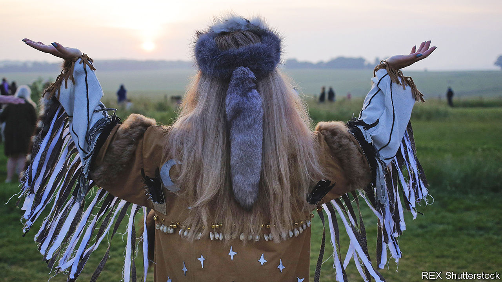

###### Trance advance

# Shamanism is Britain’s fastest-growing religion 

##### Climate anxiety helps to explain its rising popularity 

 

> Feb 9th 2023 

In a garden studio in north London, Steve Altman holds a monthly shamanic drumming circle. Participants stand with arms outstretched as Mr Altman traces their shape in the air with burning copal, a Mexican incense, in a purifying ritual known as “smudging”. 

Ground snake skin, feathers, candles and bowls of water, each representing the four elements of Inca cosmology, sit in the centre of the room. The ceremony culminates in a “soul journey”, in which rhythmic drumming is believed to facilitate an ascent to the spirit realm. One woman describes climbing vines to the heavens. From Colindale.

Shamanism is rooted in animism, the idea that every entity in nature, whether plant, animal or rock, is alive. Trance is the core shared practice. Shamans (who are traditionally trained by other shamans) learn to enter trances—aided by drumming, singing, dancing or, occasionally, psychotropic drugs—to commune with spirits. Such beliefs date back to hunter-gatherer societies. “We talk about [prostitution being] the oldest profession but really, it’s shamanism,” says Simon Buxton of the Sacred Trust, a shamanic training centre.

If shamanism has a long history, it was barely practised in Britain until recently. In the English and Welsh census of 2011 just 650 people said it was their religion. But its popularity is increasing. In the census of 2021, the results of which were released in November, that figure had increased to 8,000. Partly because the numbers are small, that makes shamanism Britain’s fastest-growing faith. 

Alexander Alich, who researches the subject at Birmingham University, says its appeal cuts across age, race and class. One reason is climate change. Almost one in 20 Britons said they experienced climate anxiety in 2022: shamanism places all things in nature on an equal footing. Paganism, another religion rooted in nature, is also on the rise. “It gives people a spiritual outlet for their political beliefs [about climate change],” says Mr Buxton.

A small but growing number of therapists integrate shamanism into their work. They might guide a lonely client to embody the energy of a tree and reconnect with nature, says Paul Francis, a psychotherapist who teaches shamanic counselling at The Three Ravens College of Therapeutic Shamanism, in Wales. They might also help patients with “soul loss”—what others would call post-traumatic stress disorder—by searching for a lost part of them in the spirit realm. Even the corporate world is interested: Sarah Negus, a shamanic business coach, has ministered to everyone from Microsoft executives to TEDx speakers. 

But popularity can attract opportunists. The title “shaman” is unregulated, so anyone can claim it. “It’s become a buzzword in marketing,” says Mr Alich. “A lot of people don’t understand what it means: they just slap it on anything.”


