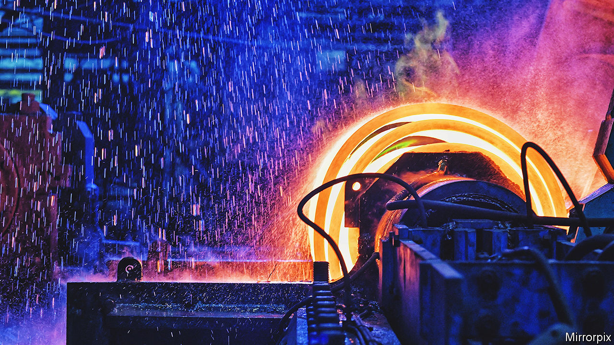

###### Test of metal

# Steelmaking in Britain has to get greener. But who’ll pay? 

##### Producers want subsidies and cheaper power 

 

> Feb 9th 2023 

DATES ASSIGNED to environmental targets often seem reassuringly—or complacently—distant. By 2050, the British government has promised, the country’s net emissions of greenhouse gases will be zero. Its advisers on the Climate Change Committee have recommended that steelmaking, which belches about one-tenth of Britain’s industrial emissions, should be “near-zero” by 2035. If that sounds leisurely, it is anything but. Both steelmakers and ministers must make uncomfortable decisions, involving billions of pounds and thousands of jobs, uncomfortably soon. 

Britain’s two biggest industrial emitters are steelworks: Tata Steel UK’s at Port Talbot in south Wales and British Steel’s at Scunthorpe in Lincolnshire. Both make iron and then steel in blast and basic oxygen furnaces, using iron ore, coke—made from coal—and other materials. A first step to greener steel would be to switch to electric arc furnaces (EAFs), in which the main inputs are scrap steel and electricity. (The total cut in carbon emissions depends on how the electricity is generated.) British Steel is also looking at carbon capture. A further green goal for the  is to use hydrogen in “direct reduction”, a process that reduces iron ore to metallic iron for feeding into EAFs.

The clock is ticking: one blast furnace at Port Talbot will need replacing, refurbishing or decommissioning in perhaps three years. The cost of switching Port Talbot to EAFs has been put at up to £3bn ($3.6bn). Upgrading Scunthorpe will also cost a ten-figure sum. These would be gulpworthy amounts even in a thriving industry. But steel in Britain is struggling.

 


Last year output slid by 16% to 6.1m tonnes, the lowest amount since 1932 (see chart). British Steel, bought out of insolvency by Jingye, a Chinese company, in 2020, is reportedly contemplating 800 job cuts at Scunthorpe. Last month Liberty Steel said it would reduce production at its EAF in Rotherham, in Yorkshire, and idle other facilities; as many as 400 jobs may go. Indian-owned Tata Steel UK did make a profit before tax in 2021-22, but that was the first for 13 years.

Many in the steel industry think the future could yet be brighter as well as greener. Demand is expected to grow: building wind turbines, for example, will require lots of steel. Britain exports around 8m tonnes of scrap a year, much of which could be fed to EAFs. Steel companies will nevertheless be loth to invest without two sorts of government help. One looks more likely than the other.

The first is a hefty subsidy for the switch to greener steelmaking. Canada, France, Germany, Spain and others are already doling out plenty for both EAFs and hydrogen-powered direct reduction. Cash is on offer in Britain too: £300m each, it is said, for Tata and British Steel, coupled with a carbon border tariff, similar to one being concocted in the European Union, to keep out dirtier imports. But that is less than the companies were asking for a few months ago, looks less generous than elsewhere—the French are putting €1.7bn ($1.8bn) into two sites—and may depend on job guarantees.

The second is much cheaper electricity. UK Steel, the industry’s trade body, calculates that steelmakers in Britain pay far more than those in France and Germany, which face much lower power-grid charges and “policy” costs such as environmental levies. Switching to EAFs, which use a lot more electricity than old-fashioned furnaces, will make this hurt all the more. Although the government is providing discounts to businesses to dampen the steep rise in wholesale energy prices, UK Steel complains that British steelmakers can still expect to pay around 60% more in 2023-24 than the Germans, who have been guaranteed a lower price.

Would it matter if the steel industry faded away? Perhaps not. Britain is a small steelmaker these days, 27th in the world, below Austria and Belgium. It imports more than half of its steel already. But decommissioning and redundancy are also far from costless.  would lose jobs that pay better than the national norm. And steel, like energy, is something for which few governments like to rely wholly on foreigners. Steelmaking in Britain has muddled through for years. It may end up doing so again. ■


