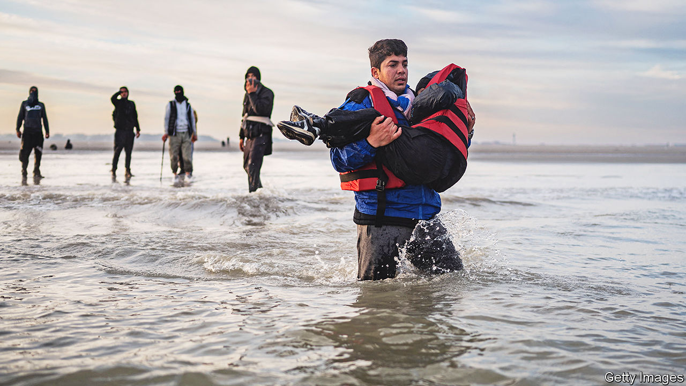
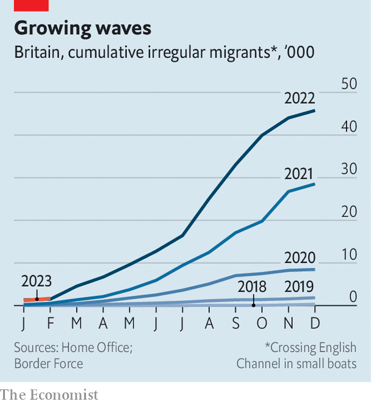

###### Definition of insanity

# The British government is planning another crackdown on asylum-seekers 

##### There are better ways to stop small boats crossing the English Channel 

 

> Feb 8th 2023 

Ali’s first experience of Britain was of kindness. A few miles from  the fishing boat he had taken from Dunkirk sprang a leak; along with several dozen fellow migrants he was rescued by the . On the shore, people were waiting with blankets. Nine months on, things are now looking pretty bleak for the 21-year-old Iranian. Living in an overcrowded hotel in Carlisle, he is unable to work or continue his education (beyond a brief weekly English class). He has no idea how his asylum application—made on the grounds that as a Christian in Iran he was threatened with persecution—is progressing.

That is nothing compared with the anxiety he feels about his father, who arrived on another small boat two weeks later. Within days the Home Office had chosen him for the first plane of asylum-seekers bound for, as part of a government plan not just to process claims in the African country but to keep successful applicants there. That flight was cancelled on June 14th after the European Court of Human Rights intervened; Ali’s father has since been waiting in a hotel near Gatwick to learn his fate. Ali fears that, if asylum flights to Kigali ever go ahead, he will never see his father again.

 


The plan to fly people to Rwanda was cooked up last year in order to deter migrants taking small fishing vessels and flimsy inflatable boats across the English Channel. Tighter security on ferry and tunnel routes helps explain why such crossings have risen every year since 2018 (see chart). In 2022 some 45,755 people came to Britain in this way. They made up the largest proportion of over 70,000 asylum claims—itself the highest number in 20 years.

That is still lower than the number of claims lodged in either France or Germany. It represents only a fraction of the overall number of immigrants that entered Britain in 2022. But  are a bigger problem than the numbers suggest. This is partly because of humanitarian concerns: in recent years dozens of migrants have died in the channel. But it is also because such a visible manifestation of the government’s inability to control its borders has become a big political headache. 

Nothing the government has so far tried has worked. In the past four years Britain has made four deals with France to beef up security in Calais, where migrants (and traffickers) congregate. The latest, struck in November, had the same limits as the others: it does not let British authorities patrol in France nor return those whose asylum claims fail. 

Britain has also tried to make itself a less alluring destination. But there is no shortage of young migrants from poor countries who are willing to endure a frosty reception and long waits in overcrowded hotels for the prospect of a better life. That is why the solution promoted by many of the charities that work with asylum-seekers—providing temporary “safe passage” visas, which would allow migrants to travel by ferry and lodge claims on arrival—is no such thing. Britain would be overwhelmed by applicants, many of them entirely deserving of protection.

The government has promised a fresh push to solve the problem. Rishi Sunak has made “stopping the small boats” one of his five pledges for 2023. On February 2nd he said a “stop the boats bill” would be published “in the coming weeks”. He suggested it would consist of laws making it easier to detain and remove illegal migrants. 

Being able to deport those whose claim is rejected is a crucial part of an asylum system. There is little point in assessing people’s claims for asylum and granting some, if those who are turned down are also allowed to stick around. Britain is thought to have at least 800,000 unauthorised immigrants. The fact that no one has to have an identity card makes it easier for those who have failed in their applications, or never made one, to melt into the crowd.

But Mr Sunak’s legislation is likely to end in disappointment. The new laws will probably be designed to make it easier to send asylum-seekers, perhaps before their claims have been processed, back to their home countries or to a third country like Rwanda. The first option would in many cases be illegal; a recent agreement with  to return migrants there could not be replicated with countries that are considered unsafe without breaching international law. (There is talk of taking Britain out of the European Convention of Human Rights if the courts did intervene.) As for the Rwanda policy, it may be impractical as well as morally dubious. The government in Kigali has suggested it only has capacity to accept a few hundred people. Attempts to find other third countries have failed. 

Far better would be a more comprehensive deal with France. Setting up a processing centre for asylum claims in northern France would stop some people from making the crossing by boat. (Britain should also consider allowing asylum-seekers to apply from British consulates elsewhere.) This would lead to more claims and more approvals, but since they would be a lot less visible and chaotic than dinghies at sea, it might well be more popular.

A comprehensive returns agreement with France would also help. Post-Brexit Britain has no formal agreement allowing it to return asylum-seekers to any EU country. The European Stability Initiative, a think-tank, believes that if almost all irregular migrants were returned swiftly to France—which would be legal, because France is a safe country—boat crossings would quickly cease. Since France has repeatedly insisted that return agreements are a matter for the EU, this would need to be part of a wider deal with the bloc in which Britain would have to play its part, by itself accepting a given number of asylum-seekers from the EU (and beyond). 

Such a deal, with either France or the EU, is hard to imagine right now. Improving the existing system for processing claims is a more feasible goal. By September 2022 68% of applicants had been waiting more than six months for a decision on their claim, compared with 49% in 2017. In that time the number of people waiting for a decision has increased threefold, to around 98,000. If migrants know there is likely to be a long wait in Britain before there is any prospect of being deported, they are more likely to try to get there.

The government’s previous crackdowns seem to have slowed things down even more. Since January 2021 it has issued “notices of intent” to some asylum-seekers while it decides whether their claim can be treated as inadmissible. These have made no appreciable difference to the way asylum claims are processed, says Colin Yeo, an immigration barrister, except to add a further six-month delay to proceedings. 

This backlog imposes heavy costs. The government spends £7m ($8.4m) a day to feed and house asylum-seekers. They are not allowed to work until they have waited at least 12 months, at which point they can apply for jobs on the shortage occupation list; they should be able to do so earlier. Claire Moseley, the founder of Care for Calais, which works with asylum-seekers on both sides of the channel, says the long wait is especially damaging for those who have experienced trauma and ill health.

Immigration lawyers say part of the problem appears to be a shortage of experienced Home Office staff able to make difficult decisions. Britain grants asylum at a much higher rate than France or Germany. That may be because a big proportion of those who travel to Britain by boat are from countries, like Syria, that genuinely command a high approval rate. Yet it may also be because of sloppy decision-making. 

Ultimately, however, only a comprehensive arrangement with France and the EU offers the realistic prospect of quickly resolving the small-boats problem. Instead the government’s focus seems likely to be elsewhere—on draconian laws that risk performative rows, damage to Britain’s reputation and more uncertainty for Ali, his father and others like them. ■


