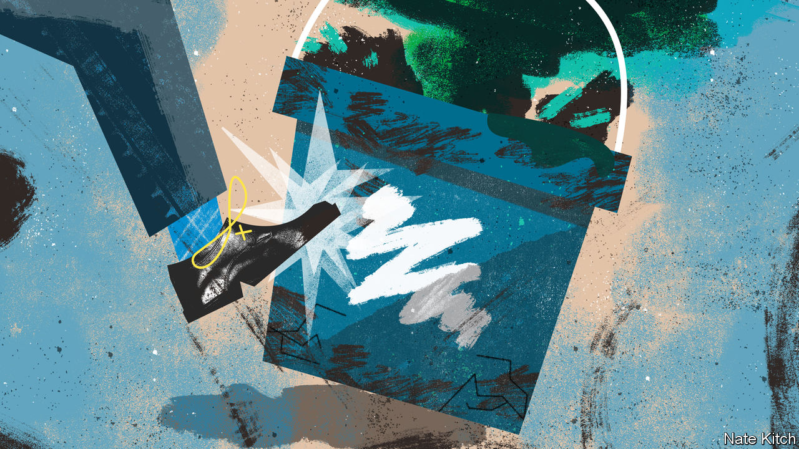

###### Bagehot

# The Conservative Party’s morbid symptoms 

##### Alan Clark’s final set of diaries provide a guide to the party’s ailing state 

 

> Feb 7th 2023 

Alan Clark knew he was dying. The Tory politician and diarist was “completely desexualated”—a disturbing condition for a philanderer—and whiled away the afternoons “listlessly plucking at  or an Audi catalogue”. Eye-blurring headaches had bugged him for years, but he ignored the optician’s injunction to have them checked out until a sudden hospitalisation in May 1999 uncovered a vast tumour lodged in the whirring brain of the MP for Kensington and Chelsea. Four months later, he would be dead.

Massaging his temples at the kitchen table, he could still see some things clearly. As the general election of May 1997 that would grant Tony Blair a landslide drew near, his colleagues predicted a hung parliament or a small Labour majority at worst. John Major, the prime minister, was on chipper form; the cabinet trundled along. “We will win, Alan. We-are-going-to-win!’” Nicholas Soames, an MP, bellowed one evening in April 1997. Clark knew better. “The gap is intractable, widening indeed,” he wrote. “Not so far distant T34s were again at the fortifications on the Oder.”

Clark harboured darkness beneath the wit. He kept a signed portrait of Hitler, whom he called “Wolf”, in his safe. The BBC called him “the UK’s favourite cad”; modern accounts of his conduct would be much harsher. But he is worth reading still. The final volume of the diaries that he kept for nearly five decades holds a mirror up to the frailty of the current Conservative Party. 

That is partly because of the parallels between the 1990s and now. Conservative MPs endlessly chew over those years. Optimists insist the next election can be a repeat of the result in 1992, in which an innately conservative electorate backed a diligent Tory leader over a semi-reformed Labour Party. But in their bones, they know a fate like 1997 is more likely. Psephologists, like doctors, are fallible, but the prognosis is in and it is not promising: polls indicate a consistent Labour lead of around 20 points. Rishi Sunak’s personal ratings are weak and weakening. “The people think they no longer have the answer to their needs, and the general cry of the voter will be ‘Kindly, fuck off’,” says an old friend of Clark’s. 

It is partly because sleaze is again crippling the party. Today’s version is less salacious than that of the 1990s—Clark would be exposed by the , a newspaper, for having an affair with a judge’s wife and also her two daughters. But it is just as damaging. On February 7th Mr Sunak reshuffled his cabinet to replace Nadhim Zahawi, the party chairman he had fired over his tax affairs. That same day MPs questioned Richard Sharp, the chairman of the BBC, over reports that he was involved in brokering an undisclosed loan for Boris Johnson, shortly before Mr Johnson recommended his appointment to the broadcaster. (Mr Sharp has denied arranging any financing.) 

But Clark is also an unmatched guide to the Tories today because the diarist and the party share so many morbid symptoms. A dying man wishes to put his affairs in order. Clark worried about clearing his debts. Mr Sunak’s agenda for government—fixing the public finances, massaging down health-service backlogs—can sound like a tidying-up exercise after years of hard living. It is immoral to leave debts to the children, he often intones. Clark wanted to fix the plumbing at Saltwood, his castle in Kent, before he died. As part of his reshuffle Mr Sunak embarked on yet another rewiring of Whitehall by creating new departments for energy, science and business. It may prove successful, but Mr Sunak is unlikely to be around to enjoy the fruits of his labours. 

What have I done with my life, the dying man asks? Clark raced to finish the “Big Book”, his history of the Tories, and hoped to be remembered for the diaries. The same question dogs the Conservatives after 13 years in office and five prime ministers, each of whom has undone their predecessor’s work. They can say they spared Britain from Jeremy Corbyn, Labour’s far-left ex-leader, and got it through the pandemic. But in gloomier moments they see a country in which the tax burden has rarely been so high, the public services so creaky or the culture so unconservative. As for Brexit, the best its backers can claim is that it is a work in progress.

The twilight of a life is a time to fulfil long-held dreams. Clark himself pined mainly for Eriboll, his Scottish estate. For some Conservative backbenchers, there is a much longer list of ambitions: leaving the European Convention on Human Rights, say, or scrubbing the statute book of EU law. Individuals still dream of carrying a minister’s red box while there is still time. The most generous interpretation of Mr Sunak’s elevation of the boorish Lee Anderson to the deputy chairmanship of the Conservative Party is to indulge a bucket-list wish. 

Westminster echoes with the chiselling of Tory epitaphs. Liz Truss hopes that history will eventually smile on the 49-day premiership that wrecked the party’s reputation for economic management. In a rambling and conspiracy-theorising essay published in the on February 5th, the former prime minister blamed shadowy forces for derailing her dash for growth. Mr Johnson wishes to be remembered for helping Ukraine. On February 3rd he granted a television interview to Nadine Dorries, the most adoring of his erstwhile cabinet ministers (imagine the Watergate burglars interrogating Richard Nixon). But history does not let you choose. Clark wanted his gravestone to read: “Happily married to Jane for 41 years.” Jane left it blank.

The afterlife 

Parties, unlike people, can be reborn. An electoral doomsday has certain attractions: the clear-out of the elders, a leadership election and a fresh debate about the future of conservatism. “What I hope quite firmly now,” Clark wrote in 1995, “is that the Tory Party is smashed to pieces and a huge number of people lose their seats. Then at last perhaps my particular brand of radicalism can grow.” Clark was not keen on dying. But he could see the bright side in his colleagues’ demise. ■


