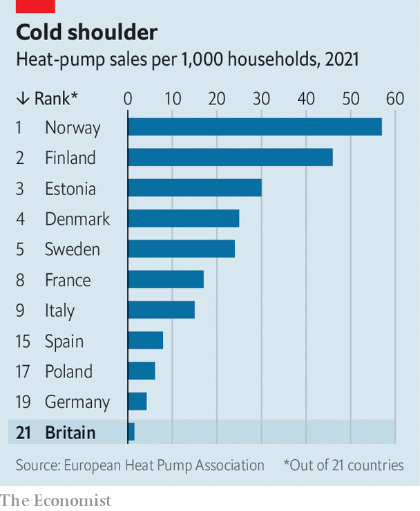

###### Pump unprimed

# The heat-pump challenge in Britain 

##### A big piece of the net-zero jigsaw puzzle is missing 

 

> Feb 6th 2023 

“The wife was a little bit disgruntled,” Gareth Edwards, an IT engineer in Cirencester, says of his heat-pump installation. The device, which provides a low-carbon way of heating (and cooling) homes, required a hot-water tank, meaning there was less room in the airing cupboard for towels. But Mr Edwards is delighted with his gadget. It’s cheap, easy to use and very efficient. He has even bought a second for his home office, providing air-conditioning in summer as well as heat in winter. 

 


Mr Edwards is still a rarity. Thousands of enthusiasts have adopted the devices, which work something like a refrigerator in reverse, capturing the ambient heat in the ground or air outside the house and transferring it inside. But Britain as a whole languishes at the bottom of Europe’s installation league table (see chart). That is a problem for  as well as to . Of Britain’s 24.7m homes, 74% are exclusively . Home heating accounts for 14% of Britain’s total carbon emissions. The 43,000 heat-pump sales in 2021, the latest year for which full figures are available, falls far short of the rate of 600,000 per year by 2028 which the government has targeted. 

Part of the problem is the history of Britain’s . The coal burnt in Victorian-era fireplaces was replaced by “town gas”, a potentially lethal combination of carbon monoxide and hydrogen. As a result the priority was usually to build new homes that could get pollutants out rather than keep heat in. Draughts were a feature, not a bug. Heating systems were in turn designed to run hot to compensate for such poor insulation. 

Heat pumps, however, typically provide less heat and work most efficiently in . They often require water-storage tanks, too, which have over the past few decades been replaced by combination boilers. As a result, putting in a heat pump can often require expensive refitting. “There’s no doubt that installing heat pumps in the UK is a bit more challenging,” says Andrew Sissons, an economist at Nesta, an innovation foundation. 

But houses are not perfect in places like France or Scandinavia, which have installed many more of the devices. The lacklustre take-up also reflects some familiar problems in British public policy, from perverse tax incentives and skills shortages to restrictive planning laws and government indecisiveness. 

Start with the tax system. According to an analysis by the Institute for Fiscal Studies (IFS), a think-tank, Britain has in effect had a negative carbon tax on gas for home heating—even before the current subsidies brought in after Russia’s invasion of Ukraine. Most of the taxes designed to subsidise the installation of renewable energy are levied on electricity. (Residential energy also comes with a lower level of value-added tax than other goods.) The IFS calculates that these things together amounted to an implicit carbon subsidy of £24 ($29) per tonne of carbon dioxide for natural gas in 2021 compared with a carbon price of £137 per tonne for electricity.

Although heat pumps are more efficient than boilers, they run on electricity: that makes the pay-off from upfront investment in heat pumps less of a sure thing. The devices can cost £7,000-13,000, compared with £3,000-5,000 for a boiler. Government grants of around £5,000 can reduce this gap, as can favourable financial deals from mortgage lenders. The installation costs “should be paid off within 15 years”, says Adam Chapman, founder of Heat Geek, an advisory firm. “That’s not including the value it has added to the property.” But navigating this landscape of grants and competing cost estimates can be difficult for would-be buyers. 

Finding an installer is even tougher. According to Nesta there are roughly 3,000 trained heat-pump engineers in Britain; the industry needs to add another 27,000 by the end of this decade. That will be very difficult. The average British boiler engineer is 56 years old, and unlikely to learn new tricks. The typical outfit is either a sole trader or a small business, often relying on manufacturers for training. Apprenticeships, one of the main routes into the industry, can take years to complete. They are also constrained by the limited number of existing heat-pump installers who are around to train up new ones.

Planning law, too, can make things difficult. Heat pumps resemble an air-conditioning unit and must be outside the property, to draw in ambient heat. Although the installation of a single device is presumed to have permission in England—so long as it meets a government certification scheme—it must be no bigger than 0.6 cubic metres and placed at least one metre from the property boundaries. That can be a challenge in densely packed urban areas. Getting local-authority permission to install heat pumps in houses which are “listed” (roughly 2% of the housing stock) or in conservation areas (5% at the last estimate) can be even harder.

Pipe dreams

It does not help that the government has not made up its mind about heat pumps. From 2025 all new buildings will have to include a low-carbon heating system, but that could also mean boilers fuelled by hydrogen.  would be a no-brainer, says Mike Foster, chief executive of the Energy and Utilities Alliance, a lobby group: it would use the existing natural-gas infrastructure and there would be little need to retrain engineers. “An engineer would come into the home, convert the boiler in situ and away you go.” 

Others are more sceptical. A parliamentary committee on science and technology has concluded that hydrogen will have only a “limited” role in home heating. Production of the gas is far more energy-intensive than a heat pump, raising the cost. There are concerns about its safety, too, and questions over whether its use will be prioritised in other, harder-to-decarbonise sectors like steelmaking. The uncertainty means that boiler engineers are more likely to put off retraining and homeowners to defer heat-pump installations.

The longer Britain takes to resolve these questions, the further it will fall behind other European countries and its . A recent government-commissioned review by Chris Skidmore, a former energy minister, concluded that Britain should ban all new and replacement gas boilers by 2033, if it wants to provide clarity for investment in heat pumps and to galvanise firms and homeowners into action. There are worse things to lose than a space to keep your towels. A big piece of the low-carbon jigsaw puzzle is one. ■


