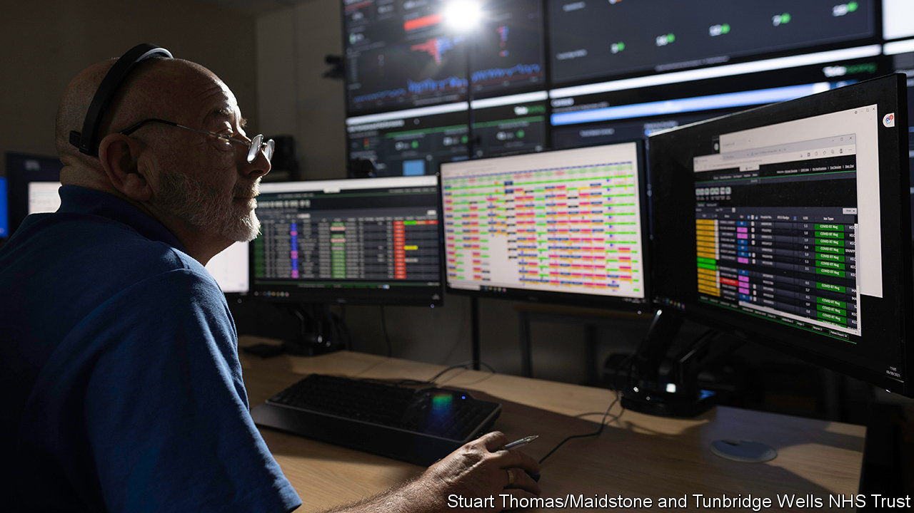

###### Track records

# The technology that can help British hospitals work better 

##### How IT is helping to ease strains in A&E departments in Kent 

 

> Feb 9th 2023 

Five years ago Maidstone and Tunbridge Wells NHS Trust in Kent performed averagely among 137 trusts with major accident &amp; emergency (A&amp;E) departments, when measured by wait times. Recently, even as other trusts have been , it has rarely left the top ten. 

Two things in particular have helped to turn things around, says Miles Scott, the trust’s chief executive. One is its “same-day emergency-care centres”, places where patients who have had things like chest pains or falls can be assessed, diagnosed and treated without being admitted. The other is its “mission control”, the base from which the flow of patients is tracked through the trust’s two hospitals. 

Managing this patient flow well is essential. Every day the National Health Service makes over 16,000 emergency admissions to its hospitals. Each patient must be slotted into a  in a limited amount of time. That makes A&amp;E, a hospital’s main entry point, “a bit like Tetris”, says Nick Bagley, a consultant and clinical director of operations of the Maidstone Emergency Department. But in this life-and-death arcade game, when the patients start arriving quicker, things can quickly spin out of control.

Until the covid-19 pandemic struck, Maidstone’s managers conducted this operation using “pencils and rubbers”, says Sam Roberts, one of their number. Nurses determined which of the trust’s more than 700 beds were available by running up and down several flights of stairs to check on them for themselves. 

Now they use TeleTracking, a tracking system made by an American firm of the same name. Electronic wristbands are fitted as patients enter hospital, providing real-time data on where they are and on how long they have been waiting for admission or discharge. At mission control (actually a back room in the hospital, with jaunty pop music playing in the background) operators then match ailing patients to available beds. Aggregated data flash up on eight giant dashboards, turning red if the metrics do not meet predefined targets. By historical comparisons, at least, they are flying: the wait times for those admitted from A&amp;E onto a ward are almost three times shorter than they were before the pandemic. 

Such efficiencies have also sped up discharge, freeing up beds—and their occupants. In 2022 Maidstone expanded the system to include 80 beds in a local community trust, enabling speedier transfers from hospital into “step-down” care. Pharmacists are informed of patients with complex needs, giving them more time to prepare their prescriptions before they are discharged. When a patient is ready to be moved, porters and cleaners are automatically alerted on a hand-held device, with all of their response times tracked. The average bed turnaround time—the time between one patient leaving and another being admitted—has fallen from two hours and 40 minutes to under an hour, a saving equivalent to 130 extra bed days per month. 

Implementing such a system sounds like a no-brainer for trusts that offer acute care. Maidstone says the efficiency savings meant it paid for itself, and more, in the first year of operation. Data-driven learning, such as the relocation of porters to where their services are most needed, promise even greater returns. Yet for all the obvious benefits, most trusts have not yet adopted such technology; one in eight do not even use electronic patient records. It is often hard to get the buy-in of clinicians, who can be (not unreasonably) sceptical that innovations will work or too busy to invest time learning something new. 

Nor is the system a silver bullet. For all the improvements at Maidstone, performance is constrained by huge patient demand, which was rising even before the pandemic. Bed-occupancy rates remain high, at 91%. Staff shortages and  still contribute to delays in discharge. In A&amp;E, the proportion of patients admitted, transferred or discharged within four hours stood at 77% in December, well below the NHS target of 95%. Tracking software will not solve everything, then. But it is nonetheless a very useful building-block. ■


