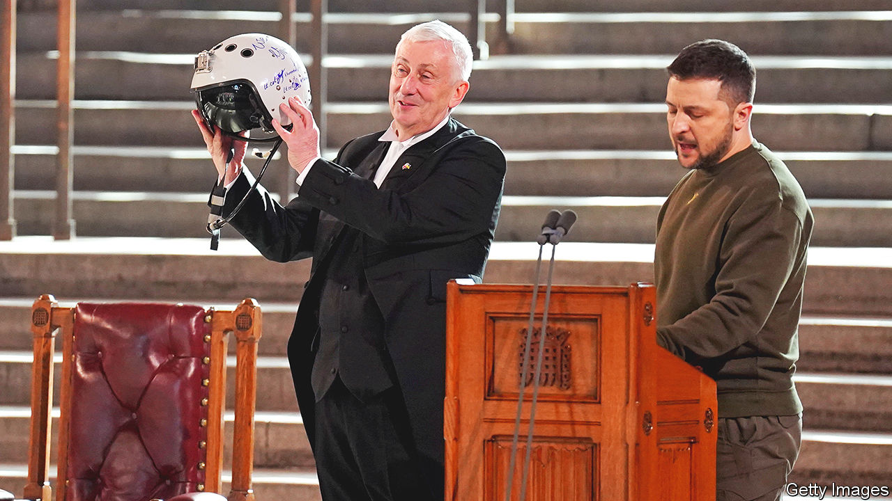

###### Plane speaking

# Volodymyr Zelensky visits Britain 

##### The Ukrainian president gives thanks and requests more support 

 

> Feb 9th 2023 

Volodymyr Zelensky, the Ukrainian president, pressed parliamentarians for “powerful English planes” on a visit to London on February 8th. In an address in Westminster Hall, the president gave the Speaker of the Commons a pilot’s helmet with the inscription: “We have freedom, give us the wings to protect it.” Of his meeting with King Charles, Mr Zelensky said: “In Britain the king is an air-force pilot. In Ukraine today every air-force pilot is a king.” Rishi Sunak, the prime minister, has offered training for Ukrainian pilots; the government said only that it would investigate giving planes, too. ■


