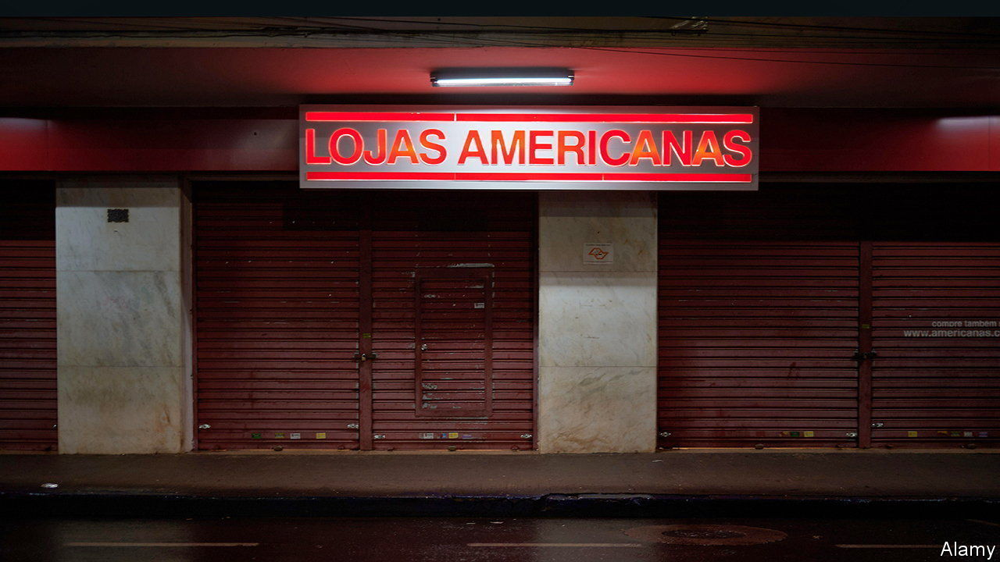

###### Three is a cloud

# Alleged fraud at a Brazilian retailer sparks a corporate reckoning 

##### The scandal puts three low-key billionaires in the spotlight 

 

> Feb 9th 2023 

Brazilian businesspeople are not easily shocked. In the past decade they have seen two business empires collapse in ignominy. Eike Batista, for a time Brazil’s richest man, lost his ports-to-mines group amid charges of bribery and market manipulation (for which he was briefly jailed). Marcelo Odebrecht, the scion of a construction dynasty, went to prison over the “Big Oily” graft scheme centred on Petrobras, the state oil giant. 

The latest scandal erupted on January 11th, when the new boss of Americanas, Sergio Rial, reported “accounting inconsistencies” that had allowed the 94-year old retail giant to hide 20bn reais ($4bn) of debt over a decade. Correcting the error swelled the firm’s debt to 43bn reais. Its shares lost 94% of their value. On January 19th it filed for bankruptcy. Mr Rial quit; his predecessor, who had run the firm for 20 years, is apparently nowhere to be found. Several creditors cried fraud. 

Though modest next to the Odebrecht and Batista imbroglios, the episode struck a nerve. That is because 31% of Americanas is owned by three heroes of Brazil Inc. Jorge Paulo Lemann, Carlos Alberto Sicupira and Marcel Telles gained fame after 3G Capital, the private-equity firm they founded in 2004, sealed deals to win control of global behemoths including AB InBev, the world’s biggest brewer; Kraft Heinz, one of its biggest food producers; and Restaurant Brands International, owner of, among other chains, Burger King. Their “3G way”, which combined Walmart-like ruthless cost-cutting, GE’s “rank and yank” approach to personnel and Goldman Sachs-style performance-based pay, was admired and aped the world over. Their preference for quiet philanthropy over Batista-like flamboyance added to the mythos.

Now aggrieved Americanas lenders, including BTG Pactual, an investment bank, are asking how much the trio, who invested in the firm in a personal capacity, knew. (3G owns no stake in Americanas and has not commented.) Brazil’s president, Luiz Inácio Lula da Silva, has likened Mr Lemann to the disgraced Mr Batista. Many others quietly wonder how the scheme could have gone unnoticed for so long. 

On January 22nd the trio issued a statement categorically denying any knowledge of “accounting tricks or dissimulation” and pointing out that the share-price drop meant they, too, were victims. Americanas is a small part of their portfolios and they had not been involved in its day-to-day operations in years. In their role as investors, they have put in three times as much equity into the business as they have taken out in dividends over the past ten years. 

That may be so. Still, the case casts a shadow on the 3G way, which some see as incentivising corner-cutting or worse. A few 3G companies have faced allegations of accounting irregularities, some of which resulted in settlements. After 3G sold América Latina Logística, a logistics firm, the buyer republished the previous two years’ balance-sheets to correct the exclusion of some debts to suppliers and other costs. Such revisions are not unheard of given Brazil’s Byzantine accounting rules, but not a good look. In 2021 Kraft-Heinz, in which 3G then owned a 17.6% stake, paid $62m to settle a case in which America’s Securities and Exchange Commission accused it of inflating profits. Miguel Patrício, CEO of Kraft-Heinz, says this was a “minor mistake” and not part of any pattern with 3G businesses; Kraft Heinz, he says, has increased controls. 3G did not respond to ’s requests for comment. 

The fate of the trio’s reputation may now hinge on what exactly happened at Americanas. The company’s interim management and its shareholders are on the case. So is Brazil’s markets regulator. PwC, which had signed off on the company’s last full set of accounts in 2021, declined to comment on any aspect of the case. Until the air is cleared, Messrs Lemann, Sicupira and Telles may, fairly or not, face frustration and anger from those who fear the scandal tarnishes Brazilian business’s global reputation—and disappointment from their remaining fans. ■


