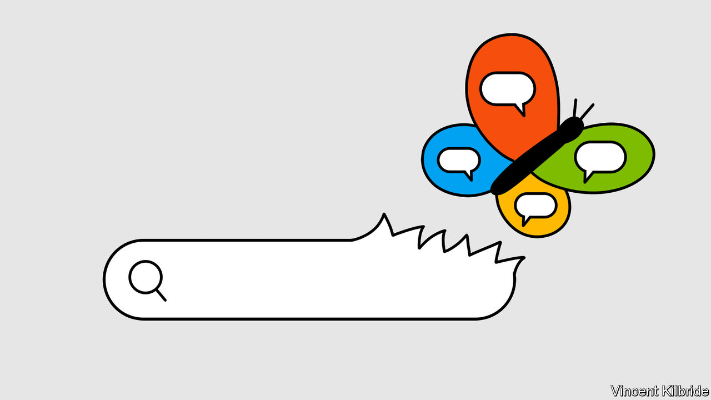
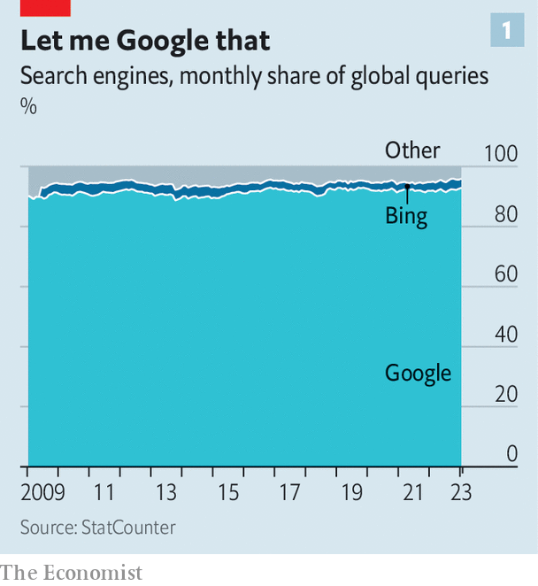
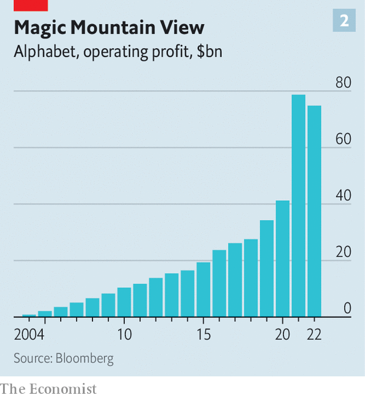
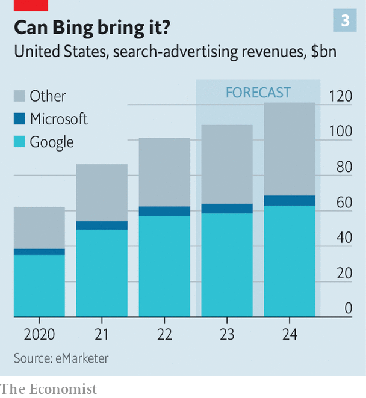

###### Seeking change

# Is Google’s 20-year dominance of search in peril? 

##### ChatGPT-like tools could disrupt a lucrative business 

 

> Feb 8th 2023 

Near the bay in Mountain View, California, sits one of the biggest profit pools in business history. The site is the home of Google, whose search engine has for two decades been humanity’s preferred front door to the internet—and  preferred front door to humanity. Every second of every day, Google processes perhaps 100,000 web searches—and, thanks to its clever algorithm, serves up uncannily relevant answers. That power has turned Google into a verb. It also opens up billions of daily opportunities to sell ads alongside the answers to searchers’ queries. The results’ accuracy keeps users coming back, and rivals at bay: all other search engines combined account for barely a tenth of daily searchers. 

 


Advertisers pay handsomely for access to Google’s users, and are typically charged only when someone visits their website. The revenue of Google’s parent company, now called , has grown at an average annual rate of over 20% since 2011. In that period it has generated more than $300bn in cash after operating expenses (see chart 2), the bulk of it from search. Its market value has more than trebled, to $1.3trn. It is the world’s fourth-most valuable firm. Unlike Apple and Microsoft, its bigger middle-aged tech rivals, it has felt no real need to reinvent itself. Until now.

 


The reason for the soul-searching in Mountain View is ChatGPT, an artificially intelligent chatbot designed by a startup called OpenAI. Besides being able to have a human-like conversation,  and others like it can draft equally human-seeming poems, history essays, computer code and just about anything else that people write down. UBS, a bank, reckons that since its launch in November ChatGPT has gained around 100m monthly active users, a feat that had taken TikTok, the world’s fastest-growing social-media sensation, nine months. Other “generative” AIs can . Bill Gates, co-founder of Microsoft, has called the technology “as important as the PC, as the internet”. 

To Eric Schmidt, who used to run Google, ChatGPT is the “first broadly visible example” of what a human being’s AI friend might look like. To his former employer, it is the first broadly visible threat to Google’s search dominance. For ChatGPT can also answer the sorts of questions that people might have asked Google. And ChatGPT’s creator, OpenAI, has teamed up with Microsoft, which is covetously eyeing Google’s gleaming pool of profits. 

On February 7th Microsoft, which recently announced an investment of $10bn in OpenAI, showed off how it plans to go after those profits. Results from the software giant’s search engine, Bing, will now be accompanied by an AI-generated side box summarising pertinent information. Bing will also get its own chatbot based on OpenAI’s models. Microsoft showed off neat tricks, such as making a shopping list based on a week of planned meals. “It is a new day in search,” declared Microsoft’s CEO, Satya Nadella. Baidu, the top search engine in China, where Google is banned, will launch its own AI-boosted service in March. In a pre-emptive counterattack, and to steal some of Mr Nadella’s thunder, Alphabet this week unveiled its own chatbot, Bard, and has reportedly invested $300m in Anthropic, a generative-AI startup. On February 8th, while presenting some non-chatty AI search features, it confirmed that Bard will be integrated into search within weeks. Investors were unimpressed; Alphabet’s share price tumbled by 8% after the announcement.

The battle of the bots is, then, brewing. It will transform the way people find things on the internet. In doing so, it may upend the lucrative business of search. 

Online search was last disrupted in its early days, at the dawn of the consumer internet in the late 1990s. As the number of webpages exploded, useful information became harder to find. A number of search engines, such as AltaVista and Yahoo!, made things a bit easier. But it was Google, founded in 1998, that revolutionised the industry. Its algorithm ranked webpages based on the number of other websites linking to them, which turned out to be a good proxy for relevance. Then Google worked out it could display ads related to a search’s keywords alongside the results. 

In the past few years challengers have emerged. Some are startups offering ad-free subscription search, such as Neeva. Others include Alphabet’s big-tech rivals. Amazon, whose e-emporium has become the place where many shoppers start looking for products, has seen its share of the American search-ad market jump from 3% in 2016 to 23% today. Apple’s search-ads business, consisting of searches for apps on iPhones, now has 7% of that market, up from nothing a few years. Google’s own research shows that two-fifths of 18-to-24-year-olds favour Instagram, Meta’s photo-sharing app, or TikTok over Google Maps when searching for a nearby restaurant. 

As a result of this ferment, Google’s share of revenue from search advertising in America will fall to 54% this year, down from 67% in 2016, according to eMarketer, a research firm. But these challengers never presented an existential threat to Google. The same cannot be said of chatbot-assisted conversational search. After ChatGPT’s launch Alphabet’s CEO, Sundar Pichai, reportedly declared a “code red”. 

To understand why Google fears chatbots, first consider the technology behind them. ChatGPT works by predicting the next word in a sentence that is a response to some query. These predictions are based on a “large language model”, the result of prior analysis of millions of texts harvested from the internet. Once trained on all this natural language, the chatbot can, when prompted by users’ instructions, produce a fluently written answer rather than merely serving up a list of links.

Applied to search queries, this means that responses could in principle contain many more variables. Want to go on a day trip somewhere off the beaten track that is cheap, child-friendly and educational? Unless you chance upon a travel blogpost, today finding a precise answer on Google (or Bing or Baidu) requires comparing dozens of websites and skim-reading tonnes of text. By contrast, ChatGPT spits out a list of decent options in moments. Users can then add extra considerations or ask for more information with follow-up queries.

Changing how people search will, in turn, change what they search for. As well as seeking existing information, users can use conversational search to generate original content. ChatGPT writes poetry and essays—in the style of your favourite author, if you wish. On January 26th Google published a paper describing MusicLM, a new large language model that can make music from text. GitHub, a Microsoft-owned platform which hosts open-source programs, has a chatbot called Copilot that can churn out lines of code. That opens up all-new search-adjacent markets, says Mark Shmulik of Bernstein, a broker, most immediately in productivity tools for businesses (like helping desk jockeys write presentations).

A little more conversation

As a new area, conversational search is attracting hopeful newcomers, buoyed by the prospect of an expanding market for search and generative content. “When I started two years ago, people said I was crazy. Now the sentiment has massively shifted,” says Richard Socher, founder of You.com, a startup which offers an AI-powered search chatbot. Neeva has also added a chatbot to its subscription search. Sridhar Ramaswamy, its co-founder, hopes this will help it reach 5m-10m subscribers, up from almost 2m today (not all of them paying customers), and become financially self-sustaining. C3.ai, a business-software firm, has brought out a chatbot to help companies search their in-house data. Travel firms, including Booking.com, are toying with chatbots, too. 

The most serious threat to Google comes from Microsoft. Mr Nadella’s firm already has the infrastructure, including oodles of computing power, storage systems and armies of web-crawling programs that constantly scrape information from the internet. Setting all this up from scratch to compete with Google would, according to one estimate by the Competition Markets Authority, a British trustbusting agency, cost between $10bn and $30bn. 

 


At present Bing’s share of America’s search-advertising market is a measly 5% (see chart 3). Microsoft hopes that its new bag of tricks will change that. The company seems to have fixed some of ChatGPT’s shortcomings. One was keeping the bot up to date. ChatGPT’s underlying AI, called GPT-3.5, has been trained on data from 2021 and has no inkling of anything on the internet after that point. Ask it about recent news or today’s weather forecast and you get an apology. Bing’s AI, by contrast, decides how to gather the most relevant information and then uses search tools to find it. The data are then fed back into the model, which uses them to compose a fluent answer. Other firms, including Neeva, are using this method, too.

This in turn has helped Microsoft tackle a bigger problem: large language models’ tendency to make stuff up. Chatbots have no sense of what is true or false; they reflect what is on the internet, warts and all. These authorititive-sounding “hallucinations”, in computer-science speak, are innocuous when the chatbot is used for fun and games. When it is meant to give real answers to serious questions, they are a fatal flaw. Last year Meta had to take down its science chatbot, Galactica, after it was found to be spouting scientific nonsense.

Giving the model access to up-to-date data has reduced, though not eliminated, the hallucinations rate for Bing’s chat feature. “A lot of the hallucinations were [the model] trying to fill in the blanks on things that had happened since the end of its training data,” explains Kevin Scott, Microsoft’s chief technology officer. His firm is using other techniques to lower the rate further. These include having humans tell the models which answers are better and what information is reliable; adding memory to the systems, so that the algorithms learn from the conversations, which they currently do not; and posting links to sources in the AI-generated responses. Mr Schmidt similarly expects chatbots to have fully sobered up within a year or two.

Solving the technological problems is only the first step to dislodging Google from the search pedestal. No less knotty is working out how conversational search will make money. Start with the costs, which for chatbots remain high compared with conventional search. Brian Nowak of Morgan Stanley, a bank, estimates that serving up an answer to a ChatGPT query costs roughly two cents, about seven times more than a Google search, because of the extra computing power required. He reckons every 10% of Google searches that shift to AI by 2025 will, depending on the number of words in an average response, add between $700m and $11.6bn to Google’s operating costs, equivalent to between 1% and 14% of such spending in 2022. 

To complicate matters further, many costly conversational-search queries will generate little ad revenue. Google has said that 80% of its search results do not contain lucrative ads at the top of the search results. Many of these ad-light searches are almost certainly “informational” (“what is the capital of Spain?”), precisely the sort of query where chatbots are most useful—and precisely the sort that advertisers are least interested in (it is hard to know what ad to place next to the word “Madrid”). For generative AI to make real money, it must find uses in “navigational” searches (looking for a site’s internet address by its name) and especially “commercial” ones (“Best new ski boots this season”). 

Some companies, like Neeva, earn revenue from subscriptions. On February 1st OpenAI began signing up subscribers to the current version of ChatGPT. For $20 a month users get faster responses and access at peak times. OpenAI also plans to license the technology to other firms. But the big bucks are likely to lie in advertising. 

Embedding ads in what is meant to feel to a user like a normal conversation will require deftness. One possibility is to display fewer adverts but charge advertisers more for each, says Mr Nowak. A chatbot is likely to offer up only a few suggestions in response to a search query about, say, blissful Hawaiian hotels. Hoteliers may be happy to pay more to ensure that theirs are among those suggestions, or displayed next to them. Microsoft says that it plans to test such a model in the new-look Bing.

Microsoft may be betting that its chatbot-assisted informational search will lure new users, who will then use Bing for the more lucrative queries as well. This could mean sacrificing margins, at least until costs can be brought down. It would only be worth it if they can wrest sizeable market share from Google. Microsoft expects that for every percentage point of market share they gain in search, its annual advertising revenue will grow by $2bn.

That is possible—but not guaranteed. Alphabet retains formidable strengths. One is technology. Although Google has yet to integrate generative AI into its search engine, it has deployed other AIs in its search business for years. When it highlights a web-page snippet at the top of the search results, that is courtesy of models such as Bert and Mum. All this is “only possible because of the foundational research we’ve done in AI for more than a decade”, says Liz Reid, Google’s head of search. Despite a launch-day gaffe, when it misidentified the first telescope to photograph a planet outside the solar system, Bard is likely to be no less impressive than ChatGPT. The stumble vindicated, in an ironic way, the company’s stated reason for its foot-dragging: a fear about unleashing a chatbot that spewed inaccurate content.

Google’s other advantage is incumbency. It is the default search engine in Chrome, Alphabet’s browser, which is used by two in three people on the internet, according to StatCounter, a research firm. It is also the go-to search on more than 95% of smartphones in America. And the firm pays Apple $15bn or so a year to make its search the default on Apple’s devices and Safari, which accounts for 19% of browsers installed on desktops and devices. 

Yet this position of strength also brings weaknesses. It is hard for Alphabet to move fast with regulators breathing down its neck over alleged monopolies and misinformation on its various platforms. It may be even harder for the company to let go of a technology and business model that has pumped out profits consistently for 20 years. Mr Pichai may yet work out how best to resolve this “innovator’s dilemma”. Mr Nadella must be hoping that before he does, Bing, too, will have become a verb. ■


