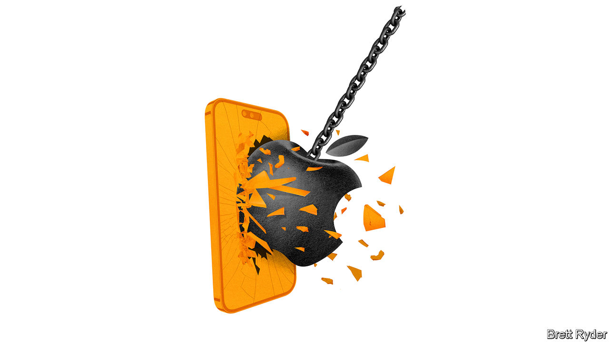

###### Schumpeter

# What would Joseph Schumpeter have made of Apple? 

##### The iPhone maker shows the many sides of creative destruction 

 

> Feb 9th 2023 

There is an inconvenient truth about Joseph Schumpeter, patron saint of this column. As an economist, his biggest contribution was to single out entrepreneurs as core to the business cycle. Early in his career he made champions of them, describing them as swashbuckling iconoclasts who overthrow the existing order motivated by sheer chutzpah. Yet later in life, when he coined his famous term “creative destruction”, he applied it not to such individuals but to industrial behemoths, even monopolies. They were compelled to innovate in order to “keep on their feet, on ground that is slipping away from under them”, he wrote. A far cry from the entrepreneurial heroes of his youth. 

In his new book, “The Entrepreneurs”, Derek Lidow puts this into historical context. When the young Schumpeter wrote “The Theory of Economic Development” in 1911, it was at the end of a long period of unfettered enterprise during the first century of the Industrial Revolution. But in the run-up to the second world war, when Schumpeter wrote his most famous work, “Capitalism, Socialism and Democracy”, the buccaneers of yore had morphed into large conglomerates with vast research-and-development (R&amp;D) labs in which they invested fortunes to remain competitive. 

That is a useful way to understand Apple, maker of the iPhone. What was once a scrappy startup with visionary co-founders keen to change the world has become the world’s largest corporation, worth $2.4trn, with 2bn devices in active use and a line of high-margin services to support them. Some worry that its size has sapped its inventive mojo, made it too big for its boots, and left it overexposed to China. On February 2nd it reported its first decline in year-on-year earnings in three and a half years. Yet it is still a profit-making juggernaut and continues to pour money into innovation: R&amp;D in the quarter jumped to 6.5% of sales, up from 5% a year earlier. What would Schumpeter have made of the company that so neatly encapsulates both sides of his thinking? 

No doubt the young Schumpeter would have been fascinated by the late Steve Jobs, Apple’s co-founder. Jobs was uniquely gifted, or as Schumpeter would have put it, a “Caruso” (after a great Italian tenor of his time). Schumpeter drew up a checklist of ways to create new “combinations”, as he called entrepreneurial firms; Jobs used many of them. He created new goods (Macs, iPods, etc), a new method of production (the Cupertino-to-China supply chain) and new markets (the app economy). To start with, he also met huge resistance, as Schumpeter’s theory predicted he would.

Fast forward to today and Schumpeter would probably acknowledge Tim Cook, Jobs’s successor, as a top-notch manager, if not quite a Carusoesque entrepreneur. Some critics complain that under Mr Cook, Apple has not created a product as original as the iPhone. But, as Horace Dediu, an expert on Apple, points out, it relentlessly improves, refines and shrinks its components, which has given rise to new gadgets like the Apple Watch and AirPods. 

This year, such micro-innovations, combined with lasers, better cameras and increased energy efficiency, are expected to come together in the launch of a new Apple device, a mixed-reality headset. Such developments, says Mr Dediu, are not about “eureka moments”. They are about turning new technologies into products that eventually will be accessible to millions. In pursuing them, Apple has become just the sort of big-business innovation engine that late-in-life Schumpeter admired and perceived as best-placed to produce revolutionary change. 

To be sure, Apple might flinch at the comparison. After all, when Schumpeter talked about the large companies he looked up to, he explicitly referred to monopolies—a loaded term, especially in big-tech circles. Antitrust is a fetish of Joe Biden’s administration. It has recently brought a big case against Google, lost one to Facebook’s owner, Meta, and is reportedly preparing one against Amazon. Mr Cook’s rivals, including Meta’s Mark Zuckerberg, complain of Apple’s dominance, including restrictions on the use of its App Store, as well as on tracking technologies used by digital-ad companies. Apple remains in an appeals-court battle with Epic, a games developer, in a competition case over App Store charges. Though Facebook and Google get most of the antitrust attention, so much of their content depends on Apple’s platforms that some describe it as the 800-pound gorilla in the background.

To Apple, this is all nonsense. Its App Store policies protect its users from fraudsters, hackers and the like, it has said. Its ad-tracking restrictions protect privacy. Yet Schumpeter, were he alive today, might offer a more high-level defence. For one, he ridiculed the notion of perfect competition altogether. More significantly, he believed that creative destruction blew through the economy like a perennial gale, destroying old structures and building new ones. That left no one safe from disruption. As he put it, even a monopoly was “no cushion to sleep on”. 

Apple may look invincible. But does it, too, feel the risk that the rug could be pulled from under its feet? It doesn’t need to look far to see how the chatbot battle between Microsoft and Google has swiftly raised questions about the future of Google’s search business. Even ChatGPT, Microsoft’s weapon in the fight, could not describe creative destruction with more Schumpeterian eloquence. 

Capitalism, Socialism and Chinese Communism

Advanced artificial intelligence poses a challenge to Siri, Apple’s voice assistant, but not a direct threat to Apple itself. More serious is something that goes beyond creative destruction. It is Apple’s vast, and vitally important, supply chains in China, from which it will struggle to extricate itself as Sino-American relations deteriorate. Apple is playing it carefully; Mr Cook balances his firm’s exposure to China with grand investment promises in America. But Apple’s big Chinese presence is a danger nonetheless. Schumpeter, who spent the last years of his life musing, erratically, about the dark future of capitalism, would have sympathised. ■


