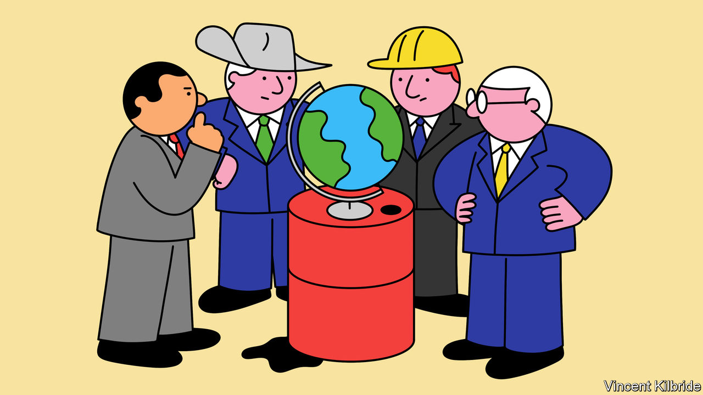
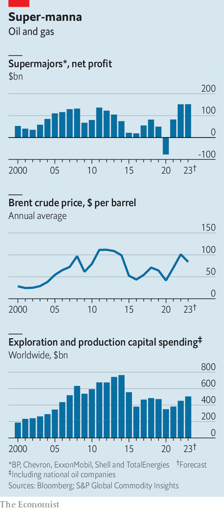
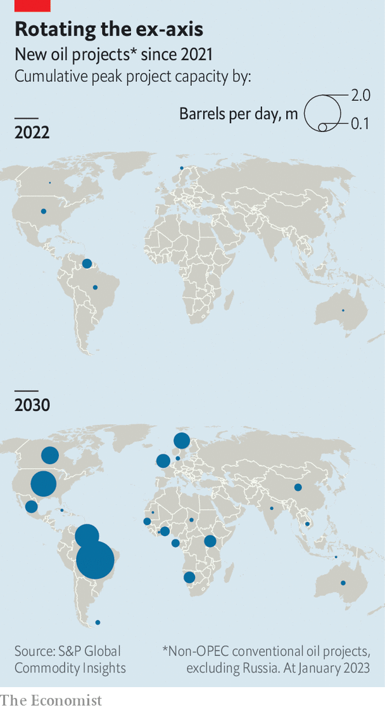

###### The energy majors’ new map

# Where on Earth is big oil spending its $150bn profit bonanza? 

##### BP, Chevron, ExxonMobil, Shell and TotalEnergies are increasingly looking to their backyards 

 

> Feb 6th 2023 

TOWARDS THE end of the second world war Franklin D. Roosevelt attended a fateful gathering of world leaders that helped determine the course of geopolitics for decades. No, not the Yalta summit. Immediately after FDR, Churchill and Stalin had carved up the world into spheres of influence, the American president slipped away onto an US Navy vessel to meet quietly with Abdel Aziz ibn Saud, king of Saudi Arabia. In return for protection of the Sauds’ sovereignty in the Holy Land, the monarch agreed to grant American oil firms access to his country’s petroleum. 

Building on the long-standing exploitation of Persian reserves by the Anglo-Persian Oil Company (now BP), the Saudi-American alliance formed the axis of oil that led Western majors to look longingly first to the Persian Gulf, then to other distant longitudes. For decades the world’s five biggest private-sector oil companies—America’s ExxonMobil and Chevron, Britain’s BP and Shell, and France’s TotalEnergies—have drilled from South America to Siberia. Now a swirl of geopolitical, economic and environmental factors is leading these “supermajors” to increasingly look not east and west but north and south.

 


This realignment comes as big oil’s coffers are overflowing after two years of sky-high energy prices (see chart). On February 2nd Shell unveiled annual net profits for 2022 of $42bn, more than double the figure a year earlier and its highest in over a century as a public company. That came on the heels of ExxonMobil’s announcement of a record annual net profit of $56bn. Its main domestic rival, Chevron, reported that its own net profit more than doubled, to $37bn. BP and TotalEnergies added to the haul on February 7th and 8th, respectively. 

All told, those five supermajors raked in around $150bn in profits last year and could make as much again in 2023. A slug of this bounty will flow to shareholders; in January ExxonMobil said it would fork over a cool $35bn in total to its owners this year and next. Some of the proceeds will go to paying down debt. Much of the rest will, though, be reinvested.

After several years of repressed investment in oil and gas, the result of pandemic-induced demand destruction and climate-related policy hostility, big oil is once again spending to find oil and dig it out of the ground. S&amp;P Global, a research firm, estimates that worldwide upstream capital expenditure for the industry as a whole, including private-sector majors and national oil companies, was around $450bn last year, up from a 15-year low of $350bn or so in 2020. This year it may be higher still. 

Latitude shift

All this new money is not flowing to the same old places. The West’s oil titans are experiencing “a fundamental shift in thinking”, says Edward Morse of Citigroup, a bank. American companies are beating a retreat from faraway “frontier” areas that are rich in political risk, lack the infrastructure to get hydrocarbons to market as cleanly as possible, or both. Their less risk-averse European rivals are shunning some of their own American projects in favour of Africa, with potential for climate-friendlier new developments. In both cases, the upshot is a realignment of the oil business along lines of longitude.

For the American supermajors, this means less interest outside the Americas. ExxonMobil has, like most Western firms, left Russia after its invasion of Ukraine. It has also offloaded—or wants to offload—assets in countries such as Cameroon, Chad, Equatorial Guinea and Nigeria. Chevron has sold projects in Britain and Denmark (as well as Brazil) and has not renewed expiring concessions in Indonesia and Thailand. 

James West of Evercore, an investment bank, sees Chevron and ExxonMobil shifting a huge amount of capital spending to South America and the United States itself. ExxonMobil is investing heavily in. Chevron intends to funnel more than a third of its capital expenditure this year to American shale, and another 20% to the Gulf of Mexico. Last month it also, with President Joe Biden’s blessing, restarted , a dictatorship that had long been on America’s naughty list.

The European oil giants are also reducing their eastern and western exposure. BP and Shell are, like ExxonMobil, quitting Russia, leading to write-downs of as much as $25bn and $5bn, respectively. Shell has also got rid of its shale assets in Texas and reportedly put a few in the Gulf of Mexico up for sale. BP is divesting its Mexican oil assets, and is expected to get out of Angola, Azerbaijan, Iraq, Oman and the United Arab Emirates. TotalEnergies is pulling out of Canada’s oil sands.

Instead, the Europeans’ gaze is, as with their American rivals, turning south. In January Claudio Descalzi, boss of Eni, an Italian non-super major, called for Europe to look to Africa as it seeks to replace Russian energy. Such a “south-north axis”, he argued, would boost Europe’s access to traditional fossil fuels, as well as to cleaner alternatives like renewable energy and hydrogen (which could be shipped or piped north). On January 28th Eni announced it had signed an $8bn natural-gas deal with Libya’s state-owned National Oil Corporation (which includes a bit of money for carbon capture and storage). Shell and Equinor, Norway’s state oil firm, signed an agreement with Tanzania to build a $30bn liquefied natural gas (LNG) terminal in the east African country. TotalEnergies is investing in gas projects in Mozambique and South Africa.

There are two main reasons for this realignment. The first, a chief preoccupation of the Americans, has to do with risks and returns. In previous eras of high oil prices oil bosses spent, in the words of one, “like drunken sailors”. Too much investment and not enough cost control in the go-go years led to huge waste and overproduction. In the years before the covid-19 pandemic, oil projects from the Caspian Sea to the Permian basin lost billions of dollars. Tens of billions more in shareholder value went up in smoke. 

These days investors are demanding much greater capital discipline from oil bosses. And the bosses are listening. The industry’s combined capital spending, though up from its recent trough, is still down from a peak of nearly $800bn in 2014. As for the money that the supermajors are spending, it is being deployed more judiciously. Most of it is going into “short-cycle” investments, which generate a return within five years rather than ten or more. “I’ve been in this industry since the 1990s and I’ve never seen this much focus on efficiency,” marvels Julie Wilson of Wood Mackenzie, a consultancy. This quest for efficiency means fewer risky bets in inhospitable places like the Arctic or the deep ocean floor and more projects in familiar jurisdictions with less daunting politics and geology. 

For the American firms, of course, nowhere is more familiar than the United States. They also understand South America. And parts of their backyard they know less well, like Guyana, whose long-rumoured oil riches were only confirmed in 2015, may also be, counter-intuitively, less politically risky in important ways. Unlike their peers in many resource-cursed autocracies, who cannot imagine a future without oil, politicians in places with newly discovered resources are more cautious about their prospects. As a result, they tend to offer more favourable terms to oil companies in order to get hydrocarbons to market faster; in Guyana, ExxonMobil moved from first deepwater oil discovery to production in just a couple of years. 

 


For the Europeans, African countries, which often maintain reasonable relations with their former colonial powers, look appealing for a similar reason. As for their retreat from America, European firms are becoming uneasy about their association with America’s oil industry, with its unapologetically brown reputation. In 2021 TotalEnergies withdrew from the American Petroleum Institute because of the lobby group’s opposition to electric-vehicle subsidies, carbon pricing and tougher rules on emissions of methane, a potent greenhouse gas.

In doing so, the European firms are responding to growing pressure from consumers, policymakers and investors to start decarbonising their portfolios—the Europeans’ big reason for the geographical sorting. They are looking for new places to invest because such investments, which use the latest technology, tend to be more efficient and less carbon-intensive than legacy assets that rely on leakier, ageing infrastructure. Moreover, oil companies, especially in Europe, are looking beyond fossil fuels. James Thompson of JPMorgan Chase, a bank, has found that the historical correlation between high oil prices and high capital spending on oil and gas has broken down for 11 big private-sector energy giants—a phenomenon he puts down in part to the majors pouring more money into low-carbon projects. 

Such projects are indeed mushrooming, particularly among the European firms—and in many of the same places as their new hydrocarbon ventures. Last May Eni struck a deal with Sonatrach, Algeria’s state oil firm, to develop green hydrogen from renewable sources. BP is doing the same in Mauritania and TotalEnergies has backed renewable-energy production in South Africa. Looking north, last year Shell paid nearly $2bn for Nature Energy, a Danish producer of “renewable” natural gas (RNG) made from things like agricultural waste. Oswald Clint of Bernstein, a broker, predicts “an era of giga-mergers” in green energy led by the European giants. Last year alone the oil majors signed 22 renewables deals, the five biggest of which added up to $12bn. Mr Clint reckons that in 2030 the European majors could, all told, be spending roughly half their capital expenditure on low-carbon initiatives. 

Vertical integration

The supermajors’ north-south realignment is far from complete. bp is still making some investments in the Gulf of Mexico and in December completed its $4.1bn purchase of Archaea, an American maker of RNG. Shell and TotalEnergies are betting on Qatari LNG. ExxonMobil is doubling down on a gas project in Mozambique. Chevron is expanding an oil project in Kazakhstan and, reportedly, reviving talks with Algeria’s government about the country’s vast shale reserves. But these ventures increasingly look like exceptions rather than the rule. The future of energy exploration looks much leaner, a bit greener—and a lot more longitudinal. ■


