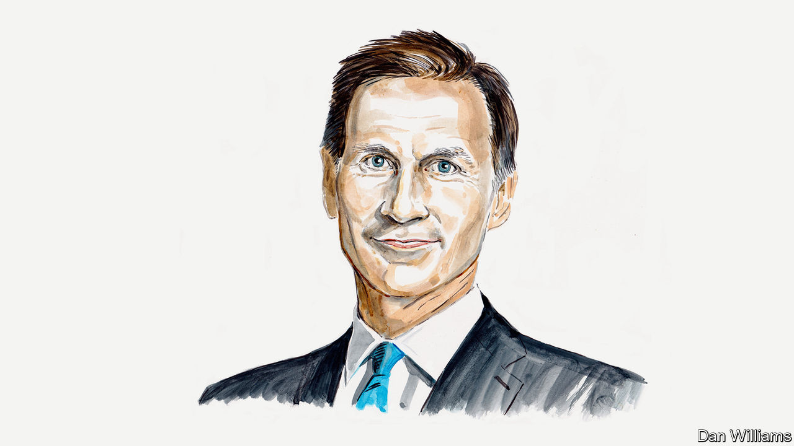

###### Economic growth

# Jeremy Hunt’s four-pillar plan to boost productivity 

##### Britain’s chancellor on enterprise, education and employment everywhere 

 

> Feb 9th 2023 

LIKE OTHER major economies, the UK’s economy has been tested with a series of “black swan” events in recent years.

Countries around the globe have been shaken by the consequences of Russia’s invasion of Ukraine and the energy-price shock it triggered. Those blows came just as the global economy was emerging from the devastating impacts of the covid-19 pandemic.

Despite these global trends–and partly thanks to the successful vaccine rollout which allowed Britain to exit lockdown ahead of others–we have remained one of the best countries in which to invest. Since 2010 Britain’s economic growth has been in the middle of the G7 pack. But at Davos last month, the consultancy PwC released a survey concluding that Britain was ranked third globally (alongside Germany) by CEOs as the most attractive place to grow a business. Since the referendum in 2016, Britain has grown at about the same rate as Germany. Brexit is now an opportunity for this country to shape regulations. 

For all these reasons I reject the case for ‘declinism’ about Britain’s prospects, and I am most optimistic about our strength in the growth industries that will shape the 21st century.

Last year Britain became only the third country to have a trillion-dollar tech economy. Its life-sciences industry gave the world one of the top two most commonly used covid vaccines and Dexamethasone, the antiviral treatment which saved 1m lives globally. It is second only to China for installed offshore wind capacity, which contributed to the fact that last year 40% of our electricity came from renewable sources. We have the opportunity, with our top-class universities and world-leading financial services sector, to harness these strengths and turn Britain into the world’s next Silicon Valley. But it will take a lot of determination and reform to get there.

Despite these strengths Britain has structural weaknesses too, and if they were to be summarised in two words it would be “poor productivity”. There are numerous reasons for this, but they include skills gaps, low levels of business investment and the accumulation of wealth in the South-East of England. In addition, firms are struggling to hire. Some 300,000 people have left the labour market since the pandemic.

The most important way to boost investment and restore consumer confidence is to get inflation down from its current 10.5% which is why we have promised to halve it this year. It’s one of five priorities set out by the prime minister, alongside growing the economy, getting national debt falling, reducing NHS waiting lists and stopping small-boat crossings by asylum seekers trying to cross the English channel. And it is through these priorities–the people’s priorities–that we will build a better, more secure, more prosperous future for the UK.

As Chancellor I am focused on the first three of those priorities, with a four-pillar plan to tackle Britain’s productivity gap.

Let’s start with the first pillar: enterprise. By being a dynamic economy that sees benefit in taking risks, we can build on our reputation for being a place where people want to do business. Research on start-ups by John Haltiwanger, an American economist, shows that the rapid turnover of these businesses is one of the most important sources of productivity. Although a difficult experience for those who, like me, put their heart and soul into their businesses, the young firms that survive grow rapidly with high productivity.

Such entrepreneurs understand the importance of risk-taking and, when it goes wrong, the calculated embrace of failure. That in turn offers important lessons which can feed into higher-productivity start-ups in the market. I started life as an entrepreneur and my first three businesses failed, but each time I learned things that contributed to my eventual success. We should remember that every big business was a start-up once, so Britain needs to nurture battalions of dynamic new firms. They will follow in the wake of the 1m new businesses that have started here since 2010.

The second “e” is education. A highly skilled workforce is the life blood of innovative companies and gives them the confidence to invest. A one-year increase in the amount of time the average person spends in education leads to a 3-6% increase in the level of output per capita. And the quality of education a person receives while in school, college or university is vastly important, too.

We are making progress, rising nine places in the global league tables for reading and maths since 2015. But good skills are still not valued as much as a good degree. An adaptive economy in which people are likely to have to train for not one, but several jobs in their working lives, needs better-skilled workers as well as Nobel-prize winners. In my Autumn statement, for example, the core school budget for England was awarded an additional £2.3bn for the 2023-24 school year, and another £2.3bn for the following year.

The third “e”, employment, is a straightforward one. If companies cannot employ the staff they need, they cannot grow. Worse still, they won’t think of the UK as a place to start their businesses. Since 2010 the country has seen unemployment rates at their lowest in nearly fifty years and labour-market participation at an all-time high. But the pandemic has exposed weaknesses, and around one fifth of working-age adults are economically inactive.

This inactivity is one of the single biggest economic challenges we face, it is weighing on growth and pushing up inflation and could do so into the future, according to the Office for Budget Responsibility and think-tanks such as the Institute for Fiscal Studies and the Health Foundation. We will never harness the full potential of our country unless we unlock it for every one of our citizens, which means getting earlier treatment for those with long term sickness, removing the disincentives for work in later years and tackling barriers to low-cost childcare.

The final “e” is about ensuring the benefits of economic development are felt everywhere and opening up investment opportunities beyond our capital. The Centre for Cities argues that the UK’s regional economic inequalities represent £83bn of lost output–more than 4% of GDP. We’ve already committed billions to tackle this, from improving transport connections in our city regions outside London to paying for more than 200 projects with money from our £4.8bn Levelling Up Fund. But true levelling up must be about local wealth creation and empowered local decision-making. So this year we will announce investment zones, mini-Canary Wharfs, to support each one of our growth industries. Each one will be built in underperforming areas that nevertheless have a lot of potential and a university nearby.

These are my guiding principles to help make the UK one of Europe’s most prosperous countries. I don’t pretend it will be an easy path. But if we are to support our health service to look after an ageing population and live up to our historic responsibility for European security, it is a path we must follow. ■


