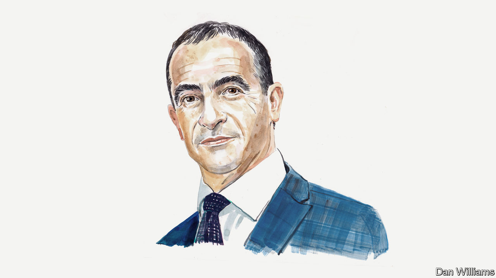

###### Climate technology

# Michael Liebreich wants existing low-carbon technologies to be scaled up much faster 

##### The energy analyst says we can’t wait for more innovative energy sources to become viable 

 

> Feb 7th 2023 

IN A RECENT piece for By Invitation, , a venture capitalist, argued against efforts to maximise carbon reductions by 2030, on the basis that “hoping to deploy today’s innovations globally is unrealistic”. At the heart of his argument lies the claim that  “can only be a minority share of our electric-power generation…because they are not reliable enough to comprise so-called ‘baseload power’”. 

Back in the 20th century, in order to reconcile the need for affordability and reliability, electricity operators ran big, inflexible plants flat out to cover the minimum demand level, or “baseload”. This they supplemented with smaller, flexible “peaking” plants to match demand at all times. 

It worked well as long as those big baseload plants delivered the cheapest power. Three things have changed, however, and the concept of baseload is in effect dead. 

The first is that wind and solar are now the cheapest way of generating electricity almost everywhere—whatever Mr Khosla thinks. The second is that, just as variable renewables are loosening operators’ iron grip on the supply side, digital technologies are giving them ways to influence the demand side (for instance, by encouraging consumers to use hot water or charge their vehicles at off-peak times). The third is that the cost of short-term storage has plummeted. So while wind and solar now produce electricity more cheaply than “baseload” plants, batteries can fill most supply gaps more cheaply than “peaking” plants. 

The only real challenge that remains, as generation from wind and solar soars, is how to cover multi-day outages. Batteries will probably never be cheap enough, but they are far from being the most promising solution. 

In some places conventional technologies, such as pumped-storage hydropower, can be deployed. In others, as we electrify heating and transportation, there will be substantial new sources of demand that can be turned up or down. There will be many more interconnections between regions—which will be required in any future beyond fossil fuels. 

Projects such as XLinks, which will bring cheap solar power from Morocco to Britain via a sub-sea cable, will allow clean power to be imported over very long distances.

A further solution for long-duration storage is hydrogen. Hydrogen may never make sense as a fuel for transport or heating—it is too inefficient to produce, too hard to handle and too expensive to transport—but it can be stored either as a gas in salt caverns and depleted natural gas fields, or in liquid form as ammonia or methanol. 

Even if we can’t entirely solve the long-term storage challenge, we can keep using fossil fuels a few weeks a year as long as we capture from the air the equivalent amount of the carbon dioxide they emit. This will cost an expensive (but not unaffordable) $200 per tonne and still allow us to get to net zero. 

Wind and solar power, in fact, provide the perfect illustration of why we need to start rolling out existing clean technologies even before they are fully competitive. First, what we learn from building wind and solar facilities at scale is at least as important as lab research in driving down costs. Second, the decades it takes for new energy and transport technologies to get to global scale means we cannot afford to wait.

Consider the superconducting transmission lines that Mr Khosla talks about. Globally there are 4.7m kilometres of transmission lines, built over 140 years. Even when a new and improved technology becomes commercial, it will take many decades to upgrade them—and that is in the developed world. Poor countries will no doubt have to wait even longer. 

Small modular nuclear reactors are also of huge interest, and certainly worthy of investment. But we will be lucky to see one built by 2030. You would need to build 5,400 100MW plants to reach just 15% of the world’s current electricity supply—the contribution of wind and solar power today. These reactors could eventually be built in series like airliners or locomotives, but it will take decades to create the supply chain, obtain planning permission for thousands of sites, secure finance and fuel, and arrange for waste disposal.

Late last year saw news of a breakthrough in nuclear fusion. For the first time, more energy was produced than consumed—a scientific tour de force. Except it wasn’t: it took 300MJ of electricity to power a 2MJ laser, which in turn generated just 3MJ of fusion power. Mr Khosla hopes one of six promising fusion start-ups will deliver a design for a commercial fusion power station by the early 2030s. Even if it does, it would probably take another decade to build the first commercial plant, and further decades until fusion can match the output of wind and solar. Again we’re well past 2050, and still nowhere near net zero.

It turns out there is a commercially available technology that already beats that fusion breakthrough—by a factor of around 400. If you were to put the same 300MJ of electricity into a modern domestic heat pump, you would get around 1,200MJ worth of heat. Heat pumps are not a nascent technology (they already have a modest but rapidly growing market share) so Mr Khosla would say they shouldn’t receive any additional support. But this is precisely the kind of technology we should be rolling out as fast as we can.

The point is not that we should stop investing in potential breakthrough technologies, far from it. There will be more than enough demand for additional sources of cheap, clean energy in the second half of the century. The point is that we need to be realistic about how long new energy technologies take to reach a scale relevant to the problem of climate change. We have no choice but to deploy the technologies we have today if we are to stay on track. 

A final thought: for our planet to remain recognisable, the technology behind every sector of our economy must change. Perhaps we should spend less time indulging the saviour complexes of a few billionaires, and more time encouraging innovation across all spheres of human activity—our only real chance of reaching net zero by mid-century. ■

_______________


