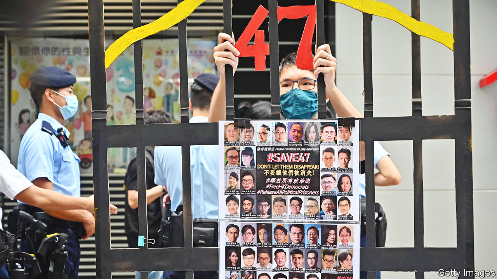

###### Gunning for the HK47

# Hong Kong starts its largest national-security trial 

##### The crime of the 47 accused was to try to win an electoral majority 

 

> Feb 9th 2023 

IS IT A threat to a country’s security if opposition politicians try hard to win at the ballot box? In Hong Kong it might be deemed so. On February 6th the trial began of 47 activists and former lawmakers. Their alleged crime was to stage an unofficial primary vote ahead of elections that were due to take place in September 2020. Their aim: to pick candidates capable of winning a majority in the legislature, despite a system rigged against them. 

This is the largest trial in Hong Kong involving a draconian national-security law that was imposed on the territory in June 2020 by the government in Beijing in order to crush dissent. The accused failed in their plot to win. The chosen candidates never made it onto the official ballot. Instead the primary’s organisers, including veterans of the territory’s protest movement such as Joshua Wong and Benny Tai, were arrested for subversion under the new legislation. 

The prosecution’s case sounds like a description of how, anywhere else, opposition politicians might be expected to operate. The 47 are accused of being “well organised” and intending to “weaponise” their intended majority by voting down the government’s budget and forcing the resignation of Hong Kong’s then chief executive, Carrie Lam. Their actions had seemed legal under the territory’s existing laws, but the new legislation took effect days before the primary. For the government’s critics, it changed everything. 

Despite initial suggestions that it would be used sparingly, there have been 227 arrests and 135 charges under the security law, according to a database maintained by Eric Lai of King’s College London. Some of the alleged crimes are piddly, like wearing a forbidden T-shirt. 

The government’s biggest concern about the 47’s plan may have been that it could have succeeded. Hong Kong’s voting system is, by design, stacked in favour of the government’s backers. But in 2020, despite official warnings that the primaries could violate the security law, 600,000 Hong Kongers turned out to vote. That showed strong support for the pro-democracy camp, perhaps even enough to secure a majority in the full elections. 

Three weeks later the government postponed the official polls, ostensibly because of covid-19. By the time the rescheduled ballot took place in December 2021 the legislature had been further restructured to give traditionally pro-government voices, such as business lobbies, even greater representation. A law had also been brought in to exclude those not judged to be “patriots”. Legislators must now swear an oath of allegiance to the central government. 

The security law does not prohibit trial by jury, but allows courts to dispense with that tradition. They invariably do so, instead using a panel of national-security judges, who are picked by Hong Kong’s chief executive, John Lee, to reach verdicts. 

Hong Kong’s judiciary is still “basically” independent, says a barrister involved in national-security trials: the authorities do not directly instruct judges what verdict to reach. Then again, he adds, they do not need to. Under the new regime, the government-appointed national-security judges’ tenure is reviewed annually. It seems unlikely that those who show an independent streak would have their time on the bench extended. Nor are liberal judges in lower courts likely to be promoted. 

The current trial is scheduled to last for 90 days. The accused face sentences of between three years and life in prison. Thirty-one have pled guilty. Most have already spent the past two years behind bars awaiting trial. Where once defendants were assumed to have the right to bail, unless the prosecution could prove their release poses a danger, in national-security trials the burden of proof is reversed. 

Optimists in the pro-democracy camp wonder whether the trial, perhaps involving rousing speeches from the dock, might rekindle Hong Kongers’ passion for protest. More realistically, says one, it will simply intensify the chill that has spread across the city since the national-security law was introduced, and the belief that demanding democracy is now foolhardy. ■


