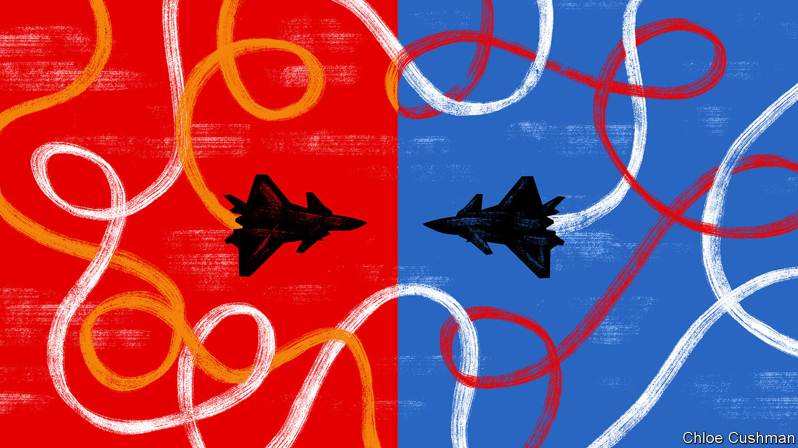

###### Chaguan

# The lessons from the Chinese spy balloon 

##### Sino-American mistrust is morphing into a new cold war 

 

> Feb 7th 2023 

CHINA AND America are drifting towards a cold war. Distrust is turning into something far more disruptive: a contest between two irreconcilable powers, each sure that the other is bent on thwarting its rival’s core ambitions and interests. The  off South Carolina is a test of whether the two countries have the wisdom and the will to stop confrontations from spiralling out of control. The results so far are mixed.

Viewed optimistically, the downing of China’s blimp is a stroke of good fortune: an instructive but low-stakes version of a crisis that could have been much worse. In recent years, Chinese fighter jets and warships have taken scary risks as they harass planes and ships belonging to America and its allies, usually when Western armed forces show the flag or collect intelligence in international skies and seas close to China’s shores. Raising the chances of a collision still higher, Chinese commanders have been sending growing swarms of Chinese aircraft to buzz the island of .

When an American missile burst the balloon, the main injury was to China’s pride. That is in happy contrast with the last known collision between the two countries’ military assets, a mid-air crash in 2001 between an American EP3 spy plane and a Chinese fighter jet that left the Chinese pilot dead and 24 American crew members in detention after an emergency landing in China.

Hopeful observers may note that Chinese propaganda has not really stoked public fury about the puncturing of the Chinese airship. The main news outlets have reported the story sparingly. Semi-official media have played it for laughs, mocking America for overreacting to what China calls an errant weather balloon. At the time of writing, China had not demanded compensation and had expressed regret, at least initially. Optimists may hope that American public and political indignation will teach the Chinese army that collisions have consequences. For years, Chinese officers have shunned talks with foreign counterparts about rules for close brushes, growling that safety lies in outsiders staying away.

There is a gloomier way to view this incident, though. In 2001 Congress merely grumbled when the administration of George W. Bush expressed regret over the Chinese pilot’s death to secure the EP3 crew’s release. In today’s Washington, the partisan furies would not be so restrained. China’s self-righteous official statements this week took no account of the political pressures on President Joe Biden, as Republicans demanded he destroy the balloon forthwith. Instead, China lodged a public protest when it was eventually downed. For good measure, it accused America of “hyping up” the story, as if a free society could cover up a house-sized enemy balloon visible from the ground. 

The tin-eared obnoxiousness of China’s messaging has costs. While the balloon was drifting across his country, Antony Blinken, the secretary of state, postponed a visit to Beijing planned for February 5th and 6th. It is said that Mr Biden and his advisers judged the political context too distracting for the candid discussions that Mr Blinken wanted with President Xi Jinping and other officials. The talks were intended to test China’s apparent desire to lower bilateral tensions, and to let Mr Xi hear for himself how Mr Biden views the sharpest thorns in the relationship. These include American backing for Taiwan, the Biden administration’s efforts to limit China’s access to advanced technologies with military uses, and China’s support for Russia’s war in Ukraine.

This was not intended as a “boy-scout” visit to suggest policy areas where the two sides could “play nicely”, says Daniel Russel, a former assistant secretary of state and Asia adviser to Barack Obama’s administration who is now at the Asia Society Policy Institute. Instead the aim was to spell out Chinese behaviours liable to ratchet up tensions, and to suggest actions that could lower them. Mr Russel sees the two countries in “uncharted” territory as they feel their way towards a new equilibrium, balancing often-incompatible goals and worldviews with deep economic integration. Mr Blinken’s trip was supposed to be a “no-kidding effort to walk Xi through US policy, rather than leave him with whatever skewed interpretation he may get from his own services”, says Mr Russel. He hopes that the visit can be rearranged soon.

Some Chinese scholars also hope the talks will be rescheduled. Da Wei, director of Tsinghua University’s Centre for International Security and Strategy, insists that China wants to stabilise relations with America. Beyond avoiding conflicts, China seeks normal trade ties and exchanges of people, says the professor. He challenges Western analysts who think China is waging a charm offensive because it regrets its previous hardline policies. Instead, in his telling, China was waiting for the Biden administration to be ready to engage, once America felt stronger domestically and surer of its allies. Mr Da sees this year as a window of opportunity for talks, before American elections in 2024. He pins cautious hopes on “reasonable” officials, business bosses and academics on each side who still seek co-operation. But he has seen few signs of the two countries managing the balloon crisis effectively. “Both in China and the US, there are still some people working for stable bilateral relations, but they are in a minority,” he worries.

The need for crisis management

A new cold war would differ from the first one. America and the Soviet Union did little business with each other. By contrast, two-way trade between China and America runs at about $2bn a day. Against that, commerce is not the path to mutual understanding that it was. For one thing, American politicians are growing warier of Chinese investments in sectors from high technology to farmland. In 2020 Chinese-owned firms employed just 120,000 workers in America, a sharp decline. Communist Party bosses call American suspicions “anti-China hysteria”. If Mr Xi wants to avoid dangerous collisions, he should answer Mr Biden’s calls for a relationship with guardrails. ■


