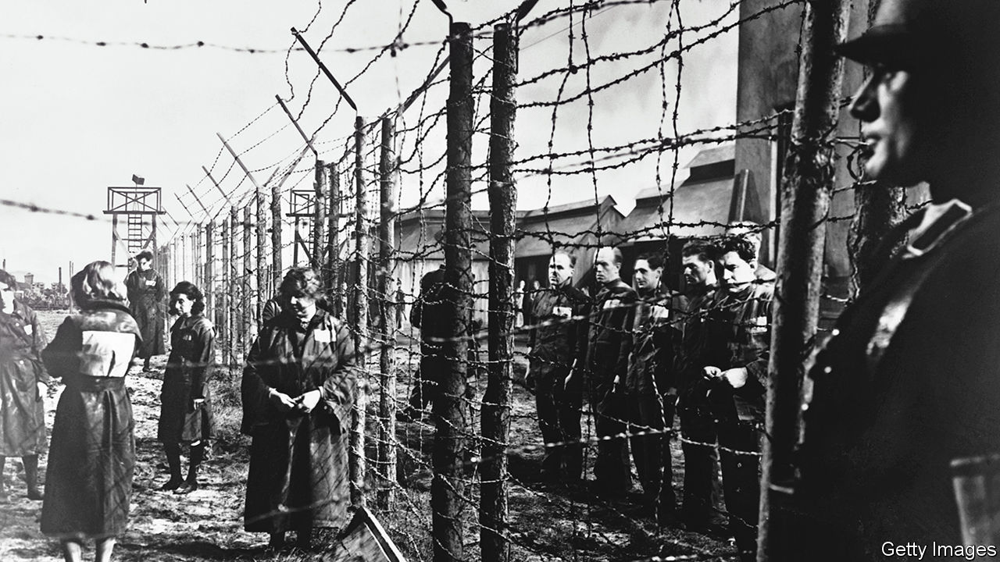

###### It took a continent

# A new history focuses on the collaborators in the Holocaust 

##### Dan Stone shows that people in various countries were willing participants in the Nazi horrors 

 

> Feb 8th 2023 

 By Dan Stone. 

One day in June 1941, in the  city of Kaunas, a local man—soon to be known as the “death-dealer”—picked up a crowbar and waited for his first victim. The city had just been captured by the Nazis and a German soldier recorded what happened next. Several dozen Jewish men were brought out one by one and beaten to death in turn. After each murder, the crowd, including women and children, clapped. They also sang the Lithuanian national anthem. 

In his illuminating study of aspects of the Holocaust and its aftermath, Dan Stone recounts the slaughter in Kaunas to demonstrate the important role played by enthusiastic locals. The director of the Holocaust Research Institute at Royal Holloway, University of London, Professor Stone is the author of numerous works on the Nazi genocide. The four key themes of his new book are “trauma, collaboration, genocidal fantasy and post-war consequences”. He writes with authority and an eye for the human story not always evident in Holocaust historiography. The first-hand testimonies he cites underscore the suffering of victims and survivors and the savagery of the perpetrators. 

Like every historian of this period, he faces the question of whether to write a broad account covering as much as possible, or to focus on a single country or episode that embodies a particular theme. He chooses the panoramic approach and his narrative traverses wartime Europe: from the now-familiar names of death camps such as  to lesser-known aspects of the Holocaust. These include the round-up of 532 Jews in Oslo by Norwegian policemen in November 1942, most of whom were gassed in Auschwitz, and the horrific fate of the Jews of Transnistria. Incarcerated in pigsties, many of them froze to death or went mad with hunger, eating twigs, leaves and human excrement. 

The book’s main strength is its comparison of different countries, their authorities and their willingness to collaborate with the Nazis or slaughter local Jews themselves. The chapter on the death marches, when inmates were moved between concentration camps, and the eventual  and its aftermath, is especially strong, perhaps because Professor Stone has already written a book on this specific area. 

But the rapid switches between locations, events and individuals can sometimes make for choppy reading. Meanwhile, the publisher’s grandiose claim that this book “upends much of what we think we know about the Holocaust” is inadvisable and overblown.

“The ubiquity of collaboration across Europe”, writes Professor Stone, “means we need to stop thinking of the Holocaust as solely a German project.” No serious historian does think that. Randolph Braham documented the responsibility of the Hungarian state and its officials for the extermination of rural  in “The Politics of Genocide”, first published in 1981. The German soldier’s account of the death-dealer of Kaunas was first published in 1958. “How the Holocaust Began”, an excellent recent documentary made by the bbc, includes footage of Latvian civilians chatting as they watch local Jews being shot into a trench.

Professor Stone usefully notes the “seemingly inverse relationship between ‘Holocaust consciousness’ and the rise of xenophobic nationalism that characterises our age”. In an initially promising chapter on Holocaust memory and how the genocide has been perceived and exploited, he mentions the Yugoslav wars of the 1990s, during which both Croatia and Serbia tried to use the Holocaust for political advantage. But then the author wanders off into a modish discussion of a Cameroonian scholar who was disinvited from a German festival because of his pro-Palestinian views, as well as the “shocking slide of America’s Republican Party into fascism”. 

This is not the language of serious scholarship. Professor Stone considers anti-Israel boycotts, but makes no mention of , where, in 1995, 8,000 men and boys were killed by Bosnian Serb forces in a clear example of a modern-day genocide. The world did nothing. That massacre illustrates the cynical adage that, for all the books, memorials, museums and remembrance days, “Never again” may simply mean that never again will Germans kill European Jews. ■


