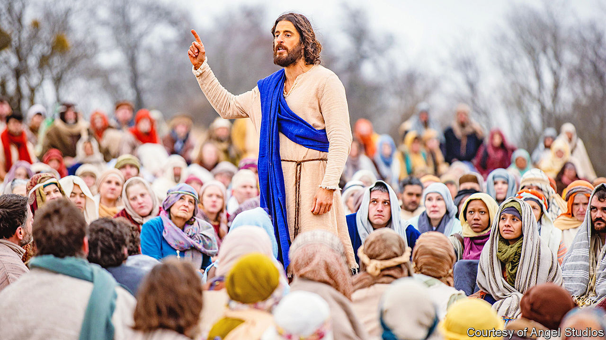

###### Man of the people

# A television show about Jesus Christ has become an unlikely hit 

##### “The Chosen”, created by an evangelical film-maker, is made with the help of devoted fans 

 

> Feb 8th 2023 

ONE SUNNY afternoon last summer, Jesus walked onto a field near Dallas, Texas, and with just a few loaves of bread and a couple of fish, fed a crowd of 5,000. In truth, the miraculous meal had been rustled up by television producers: the pita bread came from local grocery stores and the croaker, a silvery fish abundant in the Atlantic Ocean, was supplied by Asian-American supermarkets. But none of these earthly details mattered once the cameras started rolling and Jesus, played by Jonathan Roumie, lifted his eyes to heaven and blessed the meal.

The miracle of the loaves and fishes, first recorded in the Gospels, is dramatised in “The Chosen”, a tv show about  and his followers. It is produced by a fledgling studio. The director had not previously been blessed with success. The actors were unknown. Yet it has become a hit, and recently released its third season.

The show’s success is revealing. It attests to the popularity and profitability of Christian entertainment. It also highlights how film-makers of faith can circumvent Hollywood’s godless gatekeepers. 

Neal Harmon, head of Angel Studios, the distributor of the show, says almost 110m people have watched it on their free apps; many more have seen it on streaming platforms including Amazon Prime, Netflix and YouTube, where certain seasons of “The Chosen” are available. Angel Studios released the first two episodes of the new season in American cinemas in November. The double-bill made nearly $9m in its opening weekend and ranked third in the box-office charts, ahead of “Black Adam”, a superhero movie, and “Ticket to Paradise”, a rom-com starring George Clooney and Julia Roberts.

Most depictions of the life of Jesus dwell on his divinity, but “The Chosen” focuses on his ordinariness. “We have put Jesus on stained-glass windows,” says Dallas Jenkins, the show’s creator and director, yet “what makes the story of the Gospels so powerful is, in fact, his humanity.” Viewers watch Jesus cooking, playing with children or brushing his teeth. He cracks jokes, too. Asked at a wedding if he can help one of his acolytes improve his dance moves, he quips: “Some things even I cannot do.”

The disciples, meanwhile, lead unhappy lives. When they meet Jesus for the first time, they are seeking deliverance from worldly woes, not salvation after death. Simon is a debt-ridden gambler with a dodgy marriage. Mary Magdalene’s struggle with otherworldly demons has driven her to alcoholism and thoughts of suicide. Matthew, a taxman, is caught between the Roman authorities and his countrymen. 

Mr Jenkins uses creative licence when weaving characters’ stories together. Matthew, for example, is responsible for making Simon pay his debts. Thomas, another disciple, runs a wine business which Jesus saves from ruin thanks to his ability to transmogrify water. Nicodemus, a Pharisee, meets Jesus through , on whom he had tried to perform an exorcism. None of this material can be found in the Gospels, but Mr Jenkins and the show’s writers have consulted with three Bible teachers—a Catholic priest, an evangelical professor and a Messianic Jew—to determine whether their plots are plausible.

Faith is not a prerequisite for enjoying “The Chosen”, Mr Jenkins argues: non-Christian viewers “can appreciate these stories in the same way that, if you don’t believe in the Force, you can still appreciate ‘Star Wars’.” Some may find his approach too playful, or insufficiently faithful to scripture. Indeed, some evangelicals have taken to YouTube to decry scenes in which Jesus rehearses his sermons or makes light of his divinity. Mr Jenkins, himself a devout evangelical Christian, maintains that the show is reverent of the man from Nazareth. Jesus’s humanity “doesn’t detract from his divinity. In many ways, it makes it even more awe-inspiring,” he says. “The creator of the universe actually lived among us.”

The film-maker believes in miracles, and some might see a minor one in the way he made the show. After Mr Jenkins’s first major theatrical project, “The Resurrection of Gavin Stone” (2017), flopped at the box office, he was not sure if he “had a future in the business any more”. “The Chosen” revived his career and Mr Roumie’s. The actor was on the verge of quitting the industry. Now, when millions of Christians think of Jesus, they may picture his face.

“The Chosen” also saved Angel Studios’ predecessor, VidAngel. Before the show took off, the company was facing bankruptcy when several Hollywood studios sued it for copyright violations. (VidAngel allowed users to filter out disagreeable scenes of nudity or violence from films and TV shows; it reached a settlement with the studios in 2020.)

Film and television executives, a secular bunch, have long shunned religious projects. But there are ways to bring pious plots  without their say-so. Studios did not see much commercial potential in , a blood-spattered biblical drama of 2004, and Mel Gibson, the director, ended up footing the bill himself. (The film went on to gross more than $600m worldwide.) In contrast, the producers of “The Chosen” have persuaded fans of devotional drama to chip in. To make the first season, they collected $10m via crowd-funding—at the time setting a record for a media project. In the main the show is still financed in this way; its website indicates how many episodes have been bankrolled. 

The fundraising model creates a bond with fans and they get rewards for digging into their pockets, such as the opportunity to appear on the show. More than 9,000 flocked to Texas to be extras in the scene where Jesus feeds the crowd. Mr Jenkins regularly posts updates and behind-the-scenes looks for fans. 

Nearly four years after the show had its premiere, the success of “The Chosen” baffles Mr Jenkins. It doesn’t “make much sense,” he says. Then again, “neither does the story of the feeding of the 5,000.” ■


