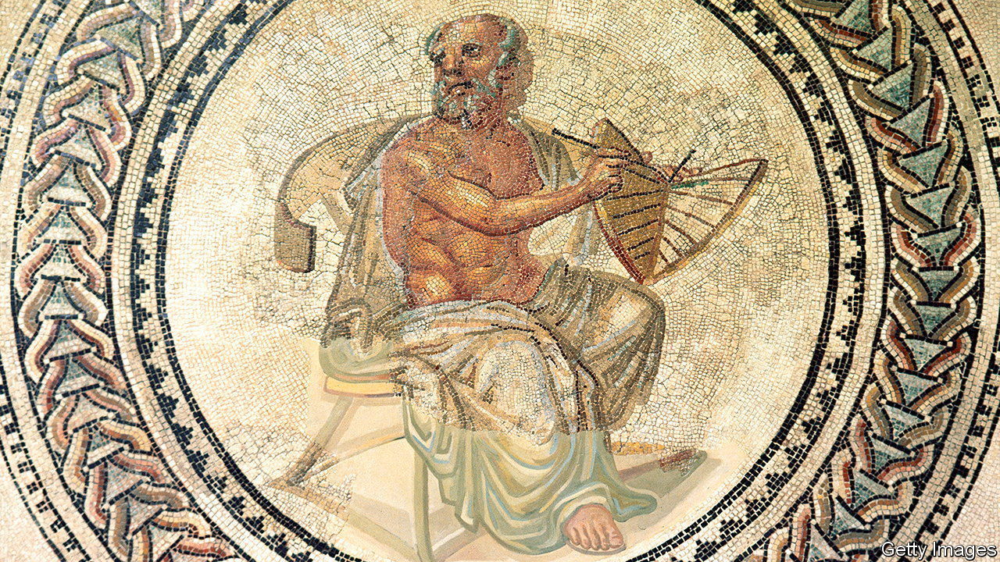

###### Great minds do not think alike

# Anaximander is a hero in the development of scientific thinking 

##### The polymath demonstrated the utility of challenging perceived wisdom, argues Carlo Rovelli 

 

> Feb 8th 2023 

By Carlo Rovelli. Translated by Marion Lignana Rosenberg. 

Of the three men usually credited with founding the disciplines of philosophy and natural science, Anaximander comes second, sandwiched between his teacher, Thales, and his student, Anaximenes. Being second, it turns out, was crucial. Though the polymath (who was born around 610BC) admired his teacher, he wasn’t afraid to challenge him. Thales sought the origin of all things in water; Anaximander preferred as his first principle the less tangible the “indefinite” or “infinite”.

A willingness to take the master down a peg or two, according to Carlo Rovelli, a , is key to the practice of science. Lacking the deference a disciple owes to a prophet, but without the bitter contempt of an apostate, “Anaximander discovered a third way,” he writes, and “modern science in its entirety is the result of the discovery of this third way.” 

Mr Rovelli’s book, first published in French in 2009 and newly translated into English, is not a straight biography, as little is known of Anaximander’s life and hardly any of his original writing survives. Instead, it focuses on his revolutionary idea that the best way to uncover nature’s secrets is to question everything. Anaximander built his own cosmology on the work of past sages, interrogating their theories and making corrections where needed. He invented  that allowed knowledge to grow from generation to generation, and enabled humanity to reap the benefits. 

The consequence of Anaximander’s irreverence was uncertainty. Mr Rovelli argues that is a price worth paying: “The reliability of science is based not on certainty but on a radical lack of certainty.” Anaximander and his followers rejected mythological explanations. They replaced revelation with observation and faith and scripture with reason. As a result, Mr Rovelli avers, they set civilisation on a new course, one in which progress is made less by accumulating facts than by knowing what it is you do not know. 

For Thales, Anaximander and Anaximenes, all citizens of Miletus, a Greek city on the western coast of Anatolia, doubt was a birthright. Positioned between the more ancient civilisations of Egypt and Mesopotamia, and possessing all the natural curiosity of a young, mercantile society, the residents of Miletus were exposed to a variety of beliefs. They could test one doctrine against another, while being beholden to none and sceptical of all. “Civilisations flourish when they mingle,” Mr Rovelli says. “They decline in isolation.”

Mr Rovelli is a champion of diversity, both cultural and ideological. Just as the citizens of Miletus profited from the wisdom of their foreign neighbours, modern societies benefit when they encourage the free exchange of ideas, he insists. Among the , this capacity to assimilate a variety of traditions led not only to the birth of science, but of democracy—a translation of Anaximander’s irreverence for established ways of thinking into the realm of politics. 

The territory Mr Rovelli covers is not unfamiliar, though he notes that these days it is less fashionable to venerate long-dead white male thinkers. Still, the author believes it is worth championing the inquisitive exploration of the universe that began with Anaximander and his colleagues. He is eager to defend this anti-traditionalist tradition against both extreme relativists, who believe there is no truth outside a particular time and culture, and absolutists who believe there is only one incontrovertible truth. 

“Our knowledge, like the Earth, floats in nothingness,” Mr Rovelli says. “Its provisional nature and the underlying void do not make life meaningless; they make it more precious.” This book offers a timely rebuttal to those who would sacrifice the vital legacy of Western science—and the progress that comes with it—on the altar of cultural sensitivity or by retreating to the safety of metaphysical revelation. ■


