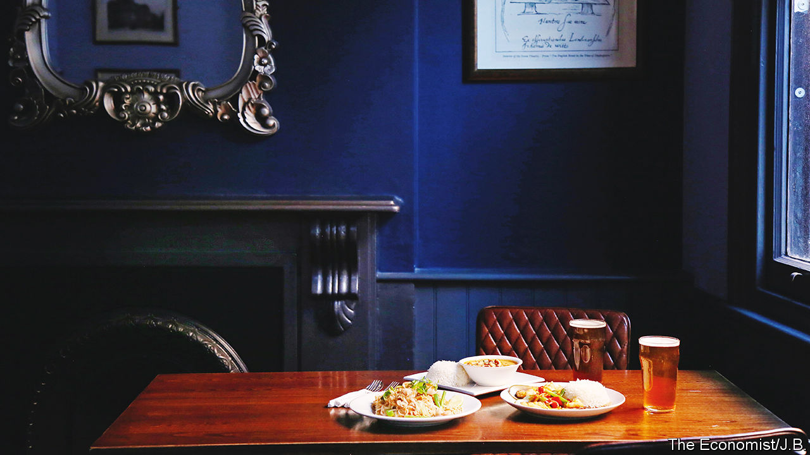

###### World in a dish

# Thai restaurateurs and British pubs have proved a perfect pairing 

##### Cooks get a stream of hungry customers; pubgoers get delicious food that pairs well with beer 

 

> Feb 8th 2023 

FROM THE outside, the Lemon Tree is an unassuming pub. Sitting on a quiet road in central London, it looks like many of the city’s Georgian boozers. On the ground floor there are dark wooden furnishings, framed etchings and a bar offering local , imported lagers and pork scratchings. The traditional setting suggests a menu of pub grub such as burgers. A visitor to Britain’s capital may be surprised by the culinary delights served upstairs.

Squeeze past the gaggles of office workers and listen out for the sound of clanging woks and sizzling oil. Follow the enticing scent of frying aromatics and fish sauce, and you’ll find a small Thai restaurant providing warming bowls of massaman curry and tall mounds of fried noodles. This is a cultural collaboration not unique to the Lemon Tree. Anglo-Thai grub was first dished out at the Churchill Arms in Kensington in 1991 and is now served in at least 30 taverns across London. 

Often Thai cooks will rent a kitchen from a pub landlord in return for a stream of hungry customers. Ask a patron to explain why this arrangement seems to work, and you might notice his eyebrow flick upward, citing a hunch that the reason lies in some landlords’ penchant for marrying Thai women. It is true that a study of Thai eateries in Britain found that more than 68% are run by women and that, according to the Home Office, wives received almost two-thirds of all settlement visas granted to Thais in the early 2000s. But the phenomenon of Thai kitchens in pubs is probably the result of commercial opportunities rather than romance.

At the beginning of the 21st century the Thai government launched a  which aimed to increase the number of Thai restaurants . (As well as celebrating the country’s delicacies, officials wanted to tempt tourists to visit.) For budding restaurateurs in Britain, setting up shop in a pub was seen as less risky than starting from scratch. Landlords usually had dining space that was not being used effectively, which made it easy for entrepreneurial cooks to make a compelling business case.

Pubs may have poky kitchens, but that does not matter with this style of cooking. Many Thai dishes are based on street food and rely on a few versatile ingredients, including chillies, coconut milk, herbs, lime and tamarind. A flexible menu does not require a vast stockroom or counter space. It helps, too, that the flavoursome cuisine pairs superbly with beer and is quick to prepare. Dishes such as , a particular British favourite, or seafood steeped in a glossy savoury sauce can be whipped up in a single wok in minutes.

Regardless of how it came to be, the popularity of Thai pub food reflects Londoners’ open-mindedness as well as their desire for continuity. If you mess around with the formula of a quintessential pub too much, you risk unsettling regulars who take comfort in tradition. But that’s not to say you cannot please them with the mouth-watering street food of Bangkok—so long as it is served with a pint of room-temperature bitter. ■


