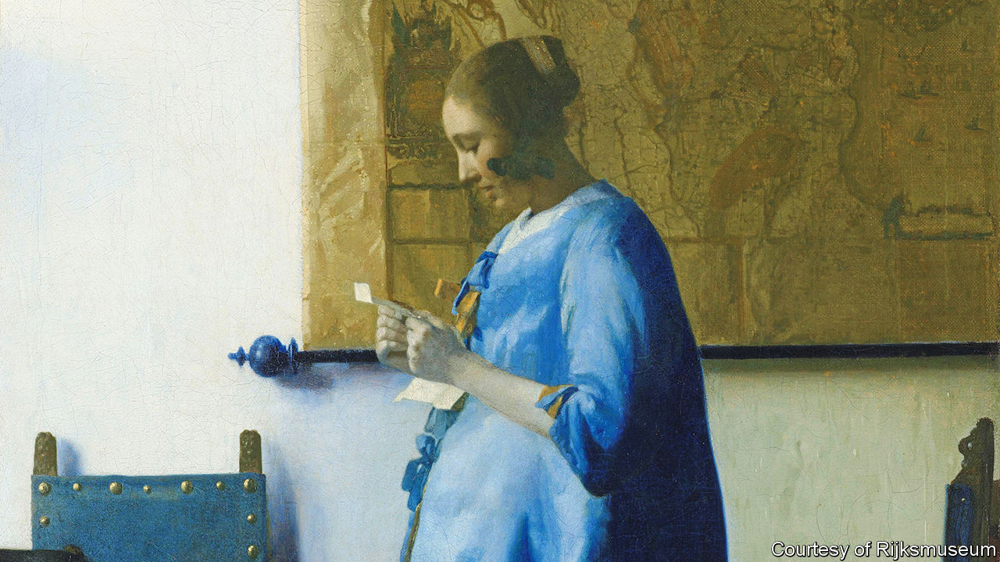

###### Back Story

# The genius of Johannes Vermeer is on display as never before 

##### A mesmerising homage to the Dutch painter opens at the Rijksmuseum 

 

> Feb 8th 2023 

A young woman in a blue night jacket reads a letter that she holds up to her chest. The morning light glints on the metal tacks in her chairs. Her lips are slightly parted, as if she is murmuring the message aloud.

The intimacy of Johannes Vermeer’s domestic scenes can seem almost voyeuristic. Some of his figures look at you as if turning towards an intruder. Yet they are also tantalisingly inscrutable, glimpsed from a distance or sealed in private reveries. In “Woman in Blue Reading a Letter”, you see the light but not the window it is pouring through. You see the letter but not the words.

The painting is among the treasures of the Rijksmuseum in Amsterdam and among the 28 by Vermeer, gathered from seven countries, in an exhibition that opens there on February 10th. That is around three-quarters of his surviving works—more than have ever been shown together before, and more than the painter himself would have seen in one go, notes Taco Dibbits, the museum’s director. It is a one-off tribute to his genius, and his particular form of it: the fierce, patient genius of perfected technique. 

In the absence of letters or diaries, Vermeer’s personality is . Still, documents and records plot the outline of his life. He was born in 1632 in Delft, where his parents ran an inn called the Flying Fox. His well-heeled Catholic mother-in-law may have disapproved of him, a lowly Protestant-born artist. He had more than a dozen children. Early on, young and ambitious, he painted big: a myth, a Bible scene, a saint. 

In around 1657 his canvases and themes shrank, and he made his leap to immortality. In troubled times, nouveau-riche Dutch collectors wanted pictures of refined interiors and everyday life. Vermeer’s contemporaries developed genres and techniques that he emulated, then soared beyond them in his use of colour and perspective and, above all, his unmatched mastery of light.

Take “The Love Letter”, in which a maid has handed a letter to her seated mistress. The woman seems perturbed, the maid puckish; perhaps she already knows the news. The viewer is positioned in the shadows beyond a drawn curtain, a recurring motif in these pictures. Eavesdropping on the conversation in “Officer and Laughing Girl”, you see the girl’s bright grin but the features of the hulking officer are obscure. When men intrude into Vermeer’s domesticity, tension courses beneath the decorum. In “The Glass of Wine”, light sparkles on the emptying glass that masks the woman’s face. The man’s hat shades his eyes. 

Vermeer’s solo figures , pour milk, make music or lace. A quiet drama hums below their repose, too. Nothing happens yet something seems to, in their heads and yours. The longing and vulnerability in the face of “Girl with a Pearl Earring” are an invitation to storytelling and memes; here she keeps company with the other close-up character studies he painted in the mid-1660s.

Through such juxtapositions the show traces the development of Vermeer’s craft and the modulations in its themes and moods. He was  with the , a device that projected an image through a pinhole and onto a screen in a darkened chamber (new research suggests he may have been introduced to it by the Jesuits of Delft). As Mr Dibbits explains, the contraption’s influence is evident in the dots of colour the artist used to simulate the effects of light, the resulting mix of sharpness and blur making his vision seem startlingly real.

In this way he turned a couple of rooms and a few objects—a lute, a glass, some pearls—into miniature breathing worlds. You need not know all the allegorical meanings of his props, nor the socioeconomic connotations of the clothes, to sense the depth under the surface. Letters written and received, the maps mounted on Vermeer’s walls—and, above all, those windows and that light—imply and withhold the promise and peril of the world outside.

He died in 1675, penniless at 43 after the outbreak of war ruined the Dutch art market and him. Little-known for the next two centuries, today he is an artistic deity. At the heart of the Rijksmuseum’s mesmerising homage is that exquisite combination of intimacy and distance. Painted more than 350 years ago, his subjects still seem hauntingly alive, but their thoughts and secrets will for ever be theirs alone. As well as any painter, in other words, Vermeer did something that painting may do best: he captured the eternal mystery of other people. ■


