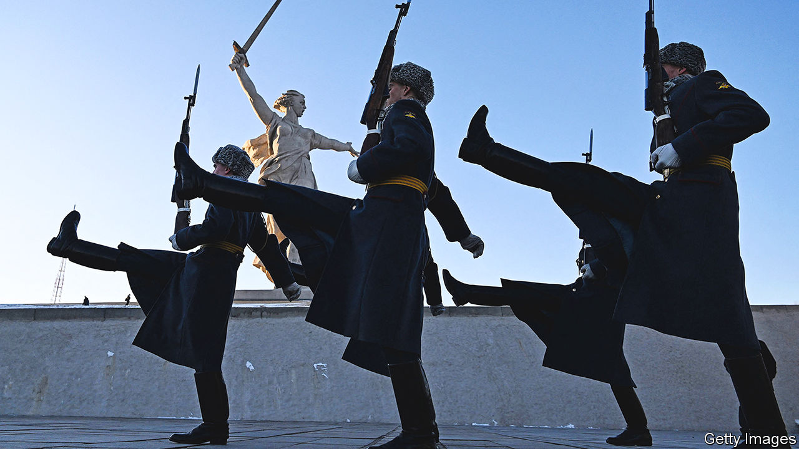
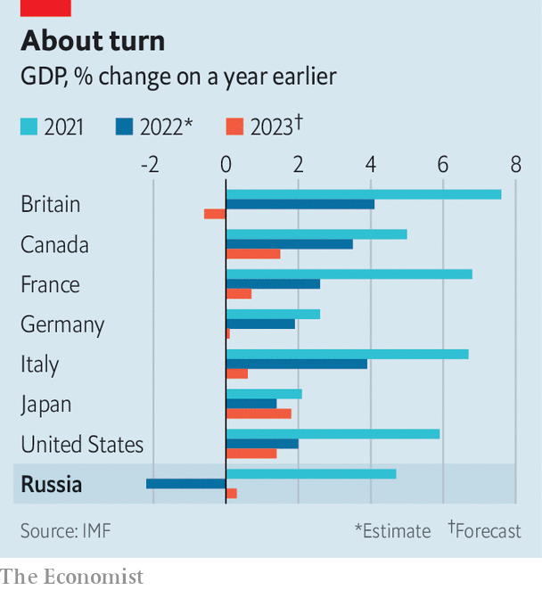

###### Ploughshares into swords

# Russia’s technocrats keep funds flowing for Vladimir Putin’s war 

##### The economy is slowly being repurposed 

 

> Feb 4th 2023 


VADIM, A CAR-PARTS dealer from a provincial Russian town, never supported the war. Indeed, he broadly backed the West’s sanctions on Russia: how else could you stop the “monsters” intent on destroying his country, as well as Ukraine, if not by hitting their pockets? But when the West’s measures hit the supply of parts he needed from his distributors, he followed business logic and sourced them from wherever he could. The search took him to Turkey. A web of intermediaries offered various schemes to deliver his goods for a handling cost of between $2 and $4 per kilogram. Today, they arrive, often in bags labelled “personal effects”, three to four weeks after ordering. Vadim asks no questions, provided the price is right. He understands that the same applies to customs officials. 

Vadim’s workaround reflects a larger story, as Russia reverts to primitive means to muddle through. Tough European and American sanctions, introduced in the wake of the invasion of Ukraine last February, were supposed to isolate the Russian economy. But with only  observing the measures, reality was always going to be more complicated. Traders in friendly countries like Turkey, Kazakhstan, India and China now facilitate the import of the restricted goods Russia needs, for a price. By September 2022 Russian imports in dollar terms exceeded their average monthly value for 2019. And these countries also take a large share of the raw-material exports Russia once sent to Europe—at a steep discount. 

This has allowed the Kremlin to . Gross domestic product (GDP)  contracted by just 2.2% last year, smashing many economists’ expectations, made in the spring, of a decline of 10% or more; nowhere near enough to cripple Vladimir Putin’s war effort. Unemployment remains low. House prices have stopped rising, but there is no sign of a crash. Consumer spending is dragging on the economy, but not by much. In 2023 the IMF even expects Russia to grow by 0.3%—more than Britain and Germany. 

 


Russia’s isolation also offers the most ruthless a once-in-a-generation opportunity to get rich quick. Before the war European and American firms held direct investments in Russia worth about $350bn. A decree issued in the wake of the invasion obliges Western companies closing down in Russia to first obtain a permit; they can then sell their assets only at government-determined prices, set at a discount of 50% or more to their market value. A corrupt system has therefore emerged. One Western industrialist who is helping several European companies quit Russia says that opportunistic Russians and even Westerners are working their government connections to snap up bargains. “We’ve returned to the 1990s,” he says, a wild time of gangster capitalism. “You can safely assume the new owners will ignore niceties like sanctions once they take over.” 

The restrictions were part of a package of extreme measures introduced by Russia’s technocrats to stabilise the economy in the months following the invasion. They have succeeded far better than their authors might have hoped. Before the invasion, many of them were clearly unhappy with the idea of an unprovoked war that risked wrecking the modernising economy they had spent their careers creating. Several—including Elvira Nabiullina, the head of Russia’s central bank; German Gref, the boss of Sberbank, Russia’s biggest; and Alexei Kudrin, a reformist former finance minister—are believed to have made representations to Mr Putin when they saw that an invasion was on the cards. 

But they quickly stepped into line once the war was under way, stopping a bank run from turning into a full-blown financial crisis and getting inflation under control. Only a handful of lower-level bureaucrats resigned from the central bank and the finance ministry. One former central-bank official says he was both impressed and appalled by his colleagues’ efforts to keep the war machine afloat. “They understood what they were doing, even while they comforted themselves by pretending the people who would replace them would be worse.” One high-level source close to the Kremlin says, “The elite are prisoners. They are clinging on. When you are there for that long, the seat is all you have.” 

Emboldened hardliners are agitating for more radical change. Some dream about removing important figures that they perceive to be pro-Western. But as long as those people keep his war effort funded, Mr Putin is unlikely to oblige. It is difficult to know how well they are doing, as many key statistics are now secret. But back-of-the-envelope calculations are possible. Russia’s 2022 budget was planned at 23.7trn roubles ($335bn). Government figures indicate that actual spending in 2022 reached at least 31trn roubles. 

According to Natalia Zubarevich, an economist at Moscow State University, only about 2.5trn roubles of the extra spend are accounted for by benefits and other transfers: pensions, cheap loans, additional child allowances. That leaves roughly 5trn roubles unaccounted for; much of it, presumably, going on armaments. There are obvious signs of the economy being mobilised for war. Defence firms are working 24 hours a day, in three shifts. Uralvagonzavod, Russia’s main tank manufacturer, has enlisted at least 300 prisoners to fulfil its new orders. And steel production fell by just 7% in 2022, far less than the 15% some expected given the decimation of the car industry, heavily affected by sanctions that have interrupted the supply of semiconductors.

The Kremlin would clearly like to militarise the economy further. In October the government established a new council designed to co-ordinate government and industry. But finding fresh sources of cash is about to become much trickier. Mr Putin’s invasion coincided with high prices for hydrocarbons. In the first five months of 2022, such revenues were two-and-a-half times higher than in the year before. But lower global oil prices, as well as the halting of gas exports to the West and an oil-price cap, have hit that income stream, if less dramatically than the West had hoped. 

The European turn away from Russian hydrocarbons has left a gap that the Kremlin is trying to offset through  to other markets, like Turkey, India and China (though there is evidence that the actual discounts are smaller than officially reported). A further price cap, on petroleum products, which came into force on February 5th, will be harder to fix, since those big markets already have their own established refineries. Russia will hope to sell more crude to compensate, and the impact will become clear only in time. At any rate, Russian hopes that it may still be able to get $70 per barrel of its oil, the price the government needs to balance the budget, may prove optimistic. 

However much the economy is cannibalised into a more primitive wartime outfit, its governing class understands there is no turning back, at least while Mr Putin is around. It heard the president declare in December that there would be “no limits” to the resources available for the armed forces. That means cuts elsewhere. Health and education spending will be reduced, suggests Ms Zubarevich. “The worse things get, the more necessary war will become,” says a former mandarin. 

The message that Russia is fighting for its survival against an encroaching West has become a powerful tool for repression. But it will mean ever-growing demands by the Kremlin on Russia’s long-suffering people. “They are already militarising people’s consciousness, but it’s a long-term process,” says the former civil servant. “Hitler took five years. They are only just getting started.” ■


