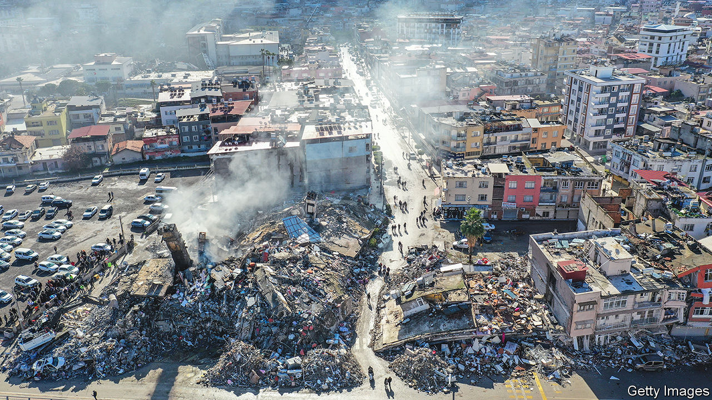
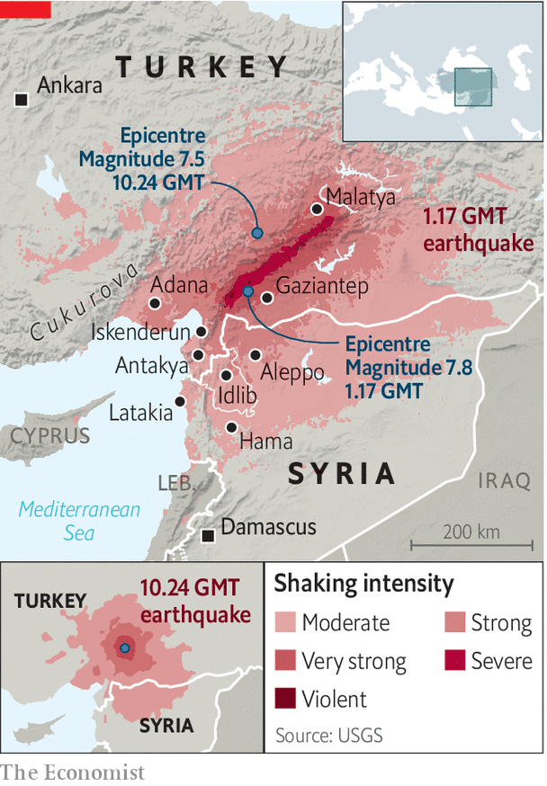
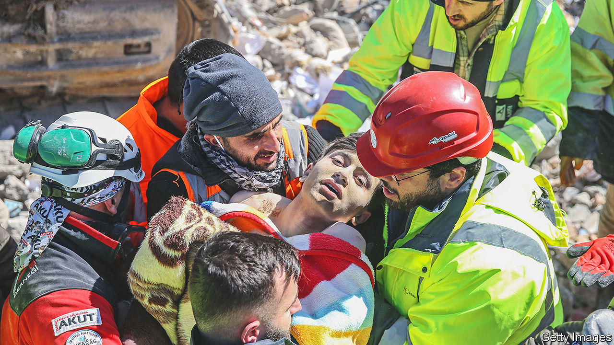

###### A crushing blow

# The earthquakes in Turkey and Syria have shaken both countries 

##### Many thousands are dead, and their governments are struggling to cope 

 

> Feb 9th 2023 

THE silence was the most unbearable part. Every quarter of an hour the bulldozers and cranes digging through the debris stopped working so that rescuers could hear the screams of people trapped underneath. There were none—only the sobs and prayers of onlooking relatives and friends. The rubble was all that remained of a 14-storey building in Adana, a city of 1.8m people in southern Turkey. A few hundred metres away the scene repeated itself. Another crowd, another apartment block reduced to a mound of concrete pancakes.

The full scale of the devastation caused by the twin 7.8 and 7.5 magnitude earthquakes that struck southern Turkey and northern Syria on February 6th remains unknown. As of early February 9th, the death toll had already reached 13,000 in Turkey alone. In Syria it had passed 3,000. Those numbers were bound to rise far higher. Across the disaster zone, hundreds of bodies were being pulled from the rubble every hour, with only a few survivors being found. Rescue teams had excavated only a fraction of the 6,000 buildings in Turkey that had collapsed.

In Iskenderun, a city on the Mediterranean, a fire consumed the port, swallowing one shipping container after another. White tents housing those displaced by the quake sprouted across the outskirts of towns. Further south, Antakya, a city of 400,000 people that is the successor to ancient Antioch, looked as if it had been carpet-bombed. In the city centre, practically every other building was destroyed. Corpses pulled from the rubble, wrapped in carpets, lined the main thoroughfare alongside the wounded. Volunteers and municipal workers distributed meals. A badly injured man stretched out on the pavement struggled to remain conscious. “Stay with me,” yelled his brother. “We still have so much to do together.” 

 


Rescue teams were overwhelmed. Outside a collapsed house, an elderly woman begged soldiers to use a bulldozer to find her son, trapped inside. The troops used their hands, explaining that their heavy equipment was being used to look for survivors. “Auntie, we have to make some hard choices,” said one. “Your son is probably dead.” Elsewhere a man fed his elderly parents, trapped inside their home, through a hole in the rubble. 

The government says it has deployed 60,000 officials, including 18,000 gendarmes and 10,000 police. Thousands more have arrived from abroad. In Iskenderun a rescue worker from Greece, one of Turkey’s historical enemies, burst into tears after saving a girl from a collapsed building. Soldiers have been redeployed from Turkish-occupied areas of Syria. Turkey’s president, Recep Tayyip Erdogan, declared a state of emergency in ten provinces, home to 13m people. 

The government says that rescue teams have reached all of the affected areas. Locals disagree. In Antakya the help has come much too late. Frustration is mounting. “We have more than 2,000 destroyed buildings, and we’ve only reached 2-3% of them,” Lutfu Savas, the city’s mayor, said on February 8th. Many wounded died before ambulances could reach them. “They don’t have enough equipment,” said a man sitting outside the rubble of his mother’s house. He had given up hope that she was alive. In parts of town, government rescue workers were nowhere to be seen. 

In Syria the earthquake hit a region already devastated by more than a decade of civil war. Deaths are roughly split between Idlib, a rebel-held province in the north-west, and areas controlled by Bashar al-Assad’s regime. Most people in Idlib are displaced from other areas in Syria, and live in tents or makeshift homes. The White Helmets, a civil-defence group in the province, were sadly well-prepared: they have spent years digging people out after Syrian and Russian air strikes. But they have perhaps 3,000 volunteers in a region of more than 4m people. A spokesman for the group says they struggle to provide treatment. Russia and Syria have made a practice of bombing hospitals, leaving the province with little medical infrastructure.

 


The Turkish army, which has small bases across Idlib, has sent rescue teams. Turkey is Idlib’s lifeline: some 2.7m people rely on international aid trucked across the border without the consent of the Assad regime, under a UN Security Council resolution that restricts activity to one border crossing. The earthquake has rendered it unusable. The closest airport, near Antakya, is shut because of runway damage. Roads to the border are impassable. On February 7th the UN announced that cross-border aid had been halted, though officials hope it will resume within days.

The situation is no better in regime-held territory. The toll seems worst in Aleppo, Syria’s second city, but there is widespread damage in Hama to the south and Latakia on the coast. The regime has not done well with previous crises: it struggled to handle wildfires in western Syria in 2020, and could barely cope with the pandemic. It will have trouble moving supplies, as fuel is scarce owing to a shortage of hard currency.

Mr Assad has few friends. His regime has urged the West to lift sanctions imposed during the civil war, which have exemptions for humanitarian aid but in practice could still delay relief. The bigger obstacle, though, is the regime’s habit of spurning offers of help or stealing foreign aid. A few countries have offered support. Russia, which has a military presence in Syria, said its soldiers would help clear rubble. The United Arab Emirates sent humanitarian aid via cargo plane. Algeria, Egypt and Iran have also promised to help. But few of these countries are willing and able to send substantial amounts.

For Turkey, the destruction revives memories of 1999, when a massive quake in the outskirts of Istanbul killed some 18,000 people. That disaster revealed a deeply flawed urban development model, corrupt building practices and a lack of preparedness. Botched search-and-rescue operations exposed the myth of an omnipotent Turkish state, which Turks had been taught to believe in for generations. 

Under Mr Erdogan and his Justice and Development Party, in power since 2002, things have improved somewhat. A government scheme has strengthened more than 3m housing units. Disaster response has been faster. Yet apartment blocks built in defiance of regulations still crowd cities, notably in Istanbul, which sits atop one of the world’s most active earthquake zones. An amnesty on unregistered construction work, passed by Mr Erdogan’s government in 2018 to win over voters ahead of general elections, made things worse. 

Falling down on the job

Most of the buildings destroyed seem to predate the 2000s, but many are newer. In Antakya an apartment complex from 2010 keeled over with as many as 800 people inside. A tower block that collapsed in Malatya, a city near the second quake’s epicentre, had just been completed last year. Had building codes been respected, says Mustafa Erdik, a professor at Bogazici University in Istanbul, “you would have had damage, but not such pancake collapses.”

If the state is falling short, civil society is not. Volunteers and donations are pouring in from every corner of Turkey. Gold miners from Canakkale, firefighters from Istanbul and farmers from Cukurova are clearing rubble. Shop and restaurant owners are handing out food. Scores of hotels are opening their doors to the homeless.

His government’s spotty emergency response and cosy relationship with construction tycoons may come to haunt Mr Erdogan. He faces elections expected on May 14th. The disaster will compound Turkey’s economic woes: the country is already coping with slowing growth and 58% inflation. The regions struck by the earthquake account for nearly 10% of GDP. Selva Demiralp, an economist at Koc University, says Turkey could lose two percentage points of GDP in tourism revenue alone. Turkey’s main stock index fell 15% in the three days after the quake. Some stocks surged, however. They were those of cement companies. ■

