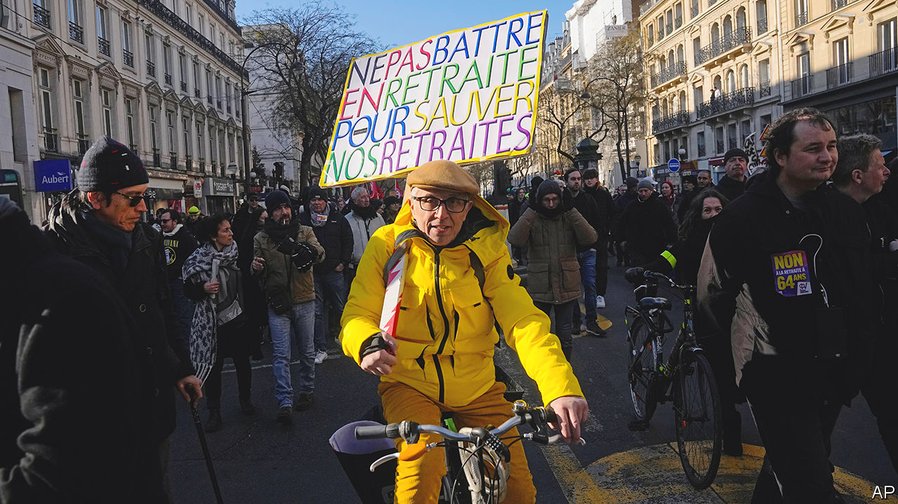

###### Jobs and protest

# Why France is arguing about work, and the right to be lazy 

##### Emmanuel Macron’s pension reform is about much more than pensions 

 

> Feb 6th 2023 

“MACRON, TAKE your retirement, not ours!” read one placard at a recent protest march. “Metro, work, grave”, read another, on a more existential note. On February 7th yet more demonstrators took to the streets to protest against President Emmanuel Macron’s plan to  from 62 years to 64. The turnout was not as high as at two previous strike days in January. But all trade unions back further strikes. Most opposition parties, and a majority of the French, are also resolutely .

The legislation, which went to parliament on February 6th, has not only divided the country but prompted a dialogue of the deaf. The government says the reform is “indispensable” if the pension regime is to balance its books, and France is to preserve its generous pensions, at a time when people are living nearly a decade longer than they did in 1980. Opponents accuse the government of brutally dismantling the hard-won rights of a modern welfare state.

So far Mr Macron’s centrist government has failed to convince the French that raising the retirement age is either a necessary or a fair way to plug an annual pension deficit that will reach €14bn ($15bn) by 2030. Critics from the opposition left-wing alliance, NUPES, say that it would be fairer to tax “super-profits”, or the rich. A 2% tax on the assets of French billionaires, suggested a report from Oxfam France, would wipe out the pension deficit overnight. The right-of-centre Republicans, who in a previous life increased the pension age from 60 to its present 62, now have the nerve to insist that Mr Macron’s version is unjust.

By focusing narrowly on the retirement age, though, the government is also failing to explain that this is not just an accounting matter. It fits into a broader attempt by Mr Macron to put work at the heart of his second-term project. “Pension reform”, says Marc Ferracci, a labour economist and a member of parliament for Mr Macron’s centrist party, “is central to the campaign objective of bringing about full employment, and raising the employment rate of older workers.” Full employment would mean curbing joblessness from 7% today to around 5%, a level not seen since 1979. At 56%, the share of 55- to 64-year-olds in work in France has increased by five points on Mr Macron’s watch, but remains well below that of 72% in Germany.

Saving the silver

To this end, the government wants to introduce a “senior index”, to monitor the share of older workers on the payroll, and discourage firms from easing out the grey-haired, which they often do. For the young, it is expanding the number of apprenticeships, which reached 980,000 in 2022, the highest level ever recorded. In parallel, the government has tightened the rules on unemployment benefits that apply during periods of economic growth and labour shortages. Many firms in France currently report having trouble filling vacancies.

Such a project makes sense for France. Yet, since the pandemic, many countries have been rethinking the nature of employment. And, in the French mind, progress towards a better society is measured by the easing of the burden of work. In 1880 Paul Lafargue, a socialist thinker, published “Le Droit à la Paresse” (“The Right to be Lazy”), arguing for a three-hour working day and denouncing the “madness of the love of work”. Two decades ago “Bonjour Paresse” (“Hello Laziness”), a guide to doing nothing at work, became a bestseller.

The rolling back of working time, originally designed to protect workers from abuse, has become part of the country’s post-war story. In 1982 François Mitterrand cut the retirement age from 65 years to 60. Two decades later France introduced the 35-hour working week. The share of the French who consider work “very important” dropped from 60% in 1990 to just 24% in 2021. The pandemic has accelerated this shift, says Romain Bendavid, in a paper for the Fondation Jean-Jaurès, a think-tank. By 2022 only 40% of the French said they would prefer to earn more and have less free time, down from 63% in 2008. 

Insofar as French politicians are talking about all this, it is largely to trade insults and slogans. Sandrine Rousseau, a Green leader from the NUPES coalition, argues bluntly for the “right to laziness”, and wants to bring in a 32-hour working week. Gérald Darmanin, Mr Macron’s interior minister, dismisses NUPES as a group of “people who don’t like work” and think they can live in a “society without effort”.

Not so lazy

In reality, French society is more complex than this war of words suggests. Thanks to looser rules, French workers actually on average these days put in a longer week (37 hours) than Germans (35 hours), and are nearly as productive per hour worked. Even within NUPES, some politicians, including Fabien Roussel, the leader of the Communist Party, embrace the value of work. The French may say that work is no longer central to their lives; but a new study by the Institut Montaigne, a think-tank, shows that three-quarters also say they are broadly happy at work, a figure that has been stable for several years.

France is not having that debate, however, and 64% are still against the pension reform. Mr Macron, says a source close to him, is determined to hold firm. If he can’t find the votes in parliament, where he no longer commands a majority, the reform could be pushed through using a special constitutional provision, though at the risk of provoking fresh legislative elections. Either way, unless Mr Macron can persuade the French of its merits, he could end up with a successful reform to his name, but a bitterly resentful country. ■

