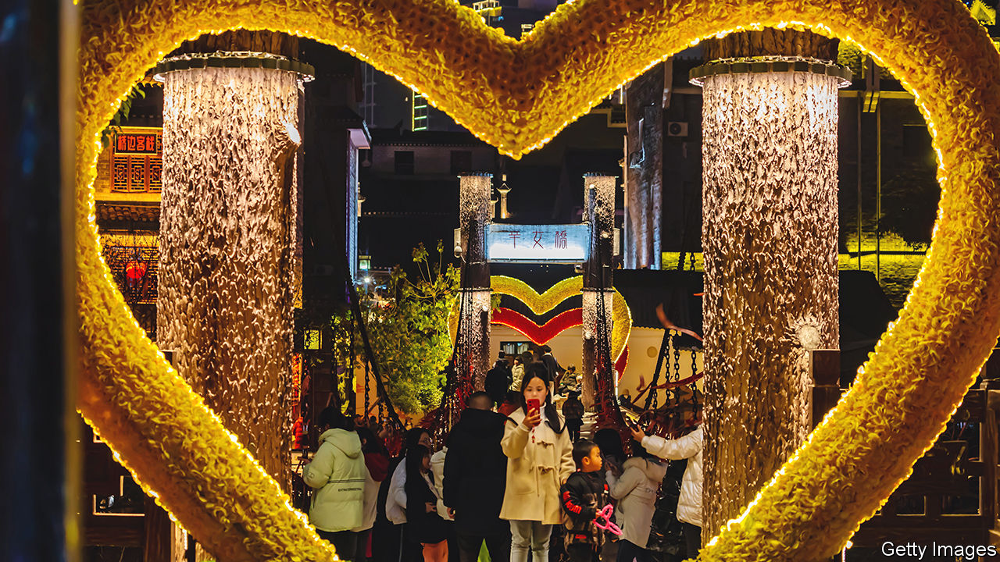
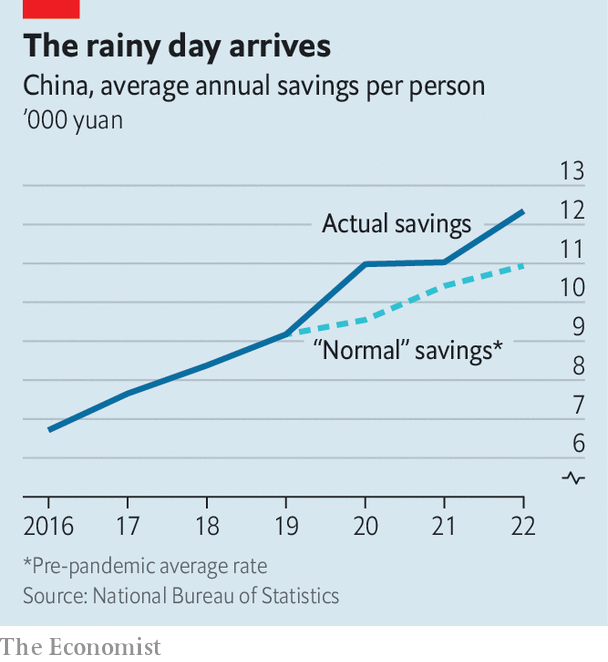
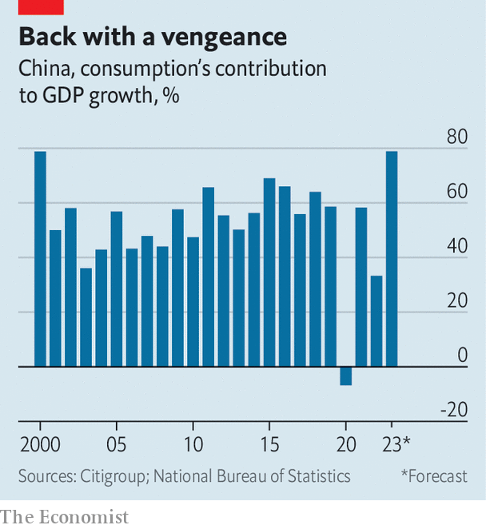

###### What pandemic?

# China’s ultra-fast economic recovery 

##### The country’s reopening will boost global growth, perhaps uncomfortably 

 

> Feb 5th 2023 

During China’s recent , tourists flocked to the sprawling Taihao mausoleum in Henan province. Many enjoyed slapping a statue of Qin Hui, a scheming official in the Song dynasty who is notorious for having framed a military hero. One visitor got a little carried away, striking the statue with the lid of an incense burner. Feelings are running high after Qin’s villainy featured in a new film, “Full River Red”, which topped the box-office charts during the holiday.

This enthusiastic moviegoing, sightseeing and statue-slapping is evidence of a surprisingly rapid consumer revival in the world’s second-biggest economy. The mausoleum says it received 300,000 people in the festive period, the most to have visited in three years. Box-office revenues were not only better than last year, they were also higher than in the year before covid-19 struck. China’s population, subject until recently , is now massing at the screens.

The recovery is arriving earlier than expected because the virus spread faster. Since China hastily abandoned its zero-covid regime, infections appear to have passed remarkably quickly. State epidemiologists estimate that at least 80% of the population has already caught the disease. According to official figures, hospital inpatient numbers peaked on January 5th. A second wave of infections was expected after holiday travel spread the disease from cities to villages. But the virus beat the festive rush. The much-feared second wave appears to have merged with the first, reckons Airfinity, a life-sciences data firm. 

Although the death toll from all these infections is unknown, the economic aftermath is becoming clearer. As people have caught and recovered from the virus, China’s service economy is returning to life. An index of activity outside the manufacturing sector, based on monthly surveys of purchasing managers, jumped from 41.6 in December to 54.4 in January, the second-biggest leap on record. Xiaoqing Pi and Helen Qiao of Bank of America note that activity in the service sectors “battered by the pandemic”, such as retail, accommodation and dining, has risen sharply.

On Meituan, an e-commerce platform, some restaurants have amassed waiting lists 1,000 tables long. People used to queuing for pcr tests now wait to pray at popular temples. In Hangzhou, the capital of Zhejiang province, people gathered outside the Linshun temple at 4am to light incense for the God of Wealth. Others who reached the top of the spectacular Tianmen mountain in Hunan province, famous for its vertiginous glass walkways, were forced to to wait until 9pm to catch a cable car back down, according to the , a state newspaper.

 


Can this frenetic pace be sustained? Optimists point out Chinese households are unusually liquid. Their bank deposits now exceed 120trn yuan ($18trn), over 100% of last year’s gdp, and 13trn yuan more than might have been expected given pre-pandemic trends, according to Citigroup, a bank. These deposits could provide ammunition for a bout of “revenge spending”.

Yet the ammunition may be set aside for other purposes. Much is composed of money that nervous households kept in the bank rather than using to buy property or ploughing into a mutual fund. They are unlikely now to lavish it on goods and services. More likely, reckons Citigroup, is a bout of “revenge risk-taking”, as households gain confidence to buy assets that are less safe but potentially more rewarding than a bank deposit. This would lift financial markets and give a much-needed boost to property. 

Perhaps a more accurate way to assess the forthcoming spending boom is therefore to look at the gap between household income and consumer spending. In the three years before the pandemic, households saved 30% of their disposable income. During the pandemic they saved 33%. The cumulative result of this extra saving is about 4.9trn yuan. If consumers added that to their spending this year it would increase their consumption by 14% (before adjusting for inflation).

 


The exact size of the spree will ultimately depend on broader economic conditions. Property prices have fallen and the job market is weak. Youth unemployment is still above 16%. But China’s labour market has bounced back quickly after previous covid setbacks, and jobless youngsters count for only about 1% of the urban labour force. With luck, a bit of extra spending will result in higher sales and stronger hiring, in turn motivating additional spending. All this means consumption could account for the lion’s share of China’s growth this year: almost 80%, according to Citigroup, if government spending on services is included. This would be the highest share for more than two decades.

China’s splurge will make a welcome contribution to global growth. According to the imf’s forecasts, released on January 30th, the country’s economy will grow by 5.2% this year, accounting for two-fifths of the expansion in the world economy. Together, America and the euro area will contribute less than a fifth.

A recent study by economists at America’s Federal Reserve makes a basic point with its title: “What Happens in China Does Not Stay in China”. Their estimates suggest a policy-induced expansion in China’s gdp of 1% adds about 0.25% to the rest of the world’s gdp after a year or two. The authors do not examine spillovers from China’s reopening. But their results give some indication of the possible consequences. If China’s reopening lifts the domestic growth rate from 3% to 5-6% this year, the spillover effects may be 0.5-0.75% of the rest of the world’s gdp, or about $400bn-600bn at an annualised rate. 

An uptick in global growth would not be an unalloyed good, however. Central banks are still attempting to quash inflation. If higher Chinese demand adds to price pressures, policymakers may feel obliged to slow their economies by raising interest rates or delaying cuts. Lael Brainard, vice-chairwoman of the Fed, has noted that China’s abandonment of zero-covid has uncertain implications for global demand and inflation, especially in commodities. Christine Lagarde, head of the European Central Bank, has warned the reversal will increase “inflationary pressure”, because China will consume more energy. According to Goldman Sachs, another bank, reopening could add $15-21 to a barrel of Brent crude oil, now trading at around $85.

After the Asian financial crisis in 1997, the Chinese economy helped to stabilise the region. After the global financial crisis a decade later, China’s growth helped to stabilise the world. This year it will once again make the single biggest contribution to global growth. But whereas in the past China’s contribution came from investment spending, now consumption will take the lead. Chinese consumers, who traditionally punch below their weight, are about to hit a lot harder. ■


