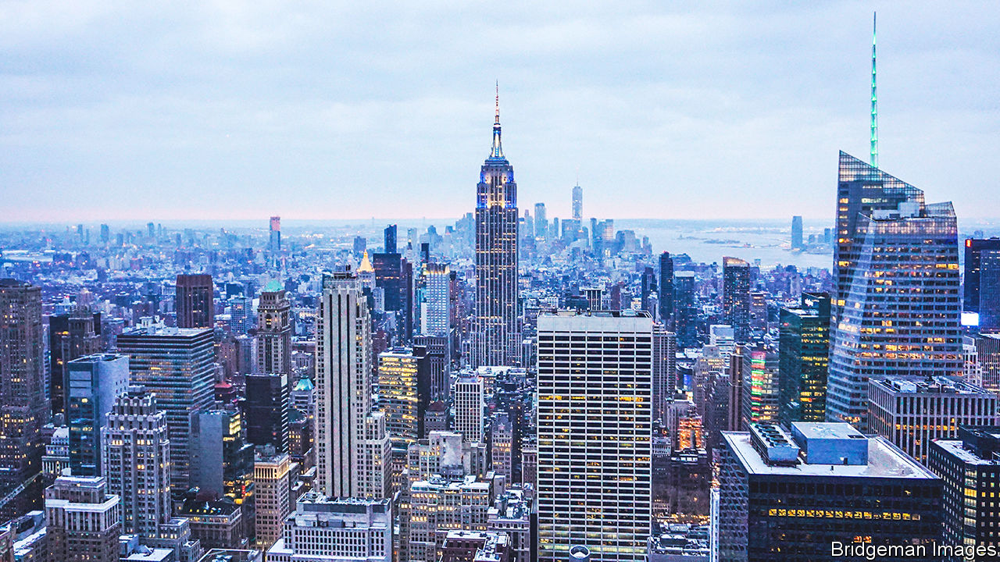

###### New lease of life

# City centres: from offices to family homes 

##### Lessons from the transformation of Lower Manhattan 

 

> Feb 9th 2023 

Lower Manhattan’s skyline has long symbolised the fortunes of corporate America. A skyscraper boom in the roaring 1920s heralded the rise of the modern office, crammed with swivel chairs and desks. As corporate giants emerged and Wall Street firms flourished, office-space requirements exploded in the 1970s, fuelling a wave of new tower blocks such as the World Trade Centre. Now, as hybrid work slashes demand for physical workplaces, a different type of boom—driven by luxury flats, not offices—is gathering steam. 

At 25 Water Street, in New York’s financial district, America’s biggest ever office-to-residential conversion is under way. The building, located near the New York Stock Exchange, will transform an office skyscraper, covering 1.1m square feet (102,193 square metres), into 1,300 apartments ranging from studios to four-bedroom homes. The revamped building will include a basketball court, a spa, and indoor and outdoor pools. It will also feature a rooftop terrace, an entertaining lounge and co-working spaces. 

The building is part of a broader trend—one prompted by a glut of newly empty office buildings. The amount of space required for white-collar workers was already in decline before the covid-19 pandemic, but the vast increase in working-from-home has left even more buildings vacant. In the third quarter of 2022, office vacancies in America soared past 17%, the highest in nearly three decades, according to cbre, a property firm. Some 8.4% of offices in London sit unoccupied, well above the long-term average of around 5%. 

cbre estimates that nearly 20m square feet of office conversions will hit America’s property market this year; a small fraction of total supply, but nearly five times as much as in 2016, when the firm started to collect figures. In the intervening years, a third of all office conversions have been into homes (other favourites include hotels and, increasingly, life-science labs). Although much of the recent development has taken place in America’s big east-coast cities, offices are becoming homes across the rich world. 

Spanners in the works

Yet the pace of conversions would be higher were it not for a range of challenges. Some are practical. Flats require natural light and windows in each room—the large floor plans of modern office blocks often leave them stuck with poorly lit and badly ventilated spaces. Bathrooms in office buildings tend to be clustered in just one area, making plumbing a nightmare. Other challenges are related to red tape. Zoning laws restrict housing in many office districts. In some cases, height and density rules or affordable-housing requirements raise costs. Moody’s Analytics, a consultancy, reckons that less than 3% of the 1,100 office buildings it tracks in New York meet the various criteria.

Meanwhile, developers planning to convert offices must buy out or relocate existing tenants. As such, the financial case for conversions is often unsatisfactory. Only office buildings that trade at a steep discount are likely to make profitable transformations. In some cases, converting an old office tower can cost more than building a brand new block of flats. 

Some policymakers are trying to make the process smoother. With office vacancies threatening landlords’ bottom-lines, commercial-property-tax revenues, and the businesses of nearby shops and restaurants, cities are relaxing zoning rules and experimenting with tax breaks. Eric Adams, New York’s mayor, has predicted such incentives will lead to 20,000 new apartments in his city by 2033. London plans to use space in its Square Mile to create 1,500 new homes by 2030. Calgary, where one in three offices sits vacant, is home to one of the more ambitious plans. In 2021 the Canadian city launched a funding scheme for developers willing to try their hand at conversions. Officials have since pledged more than C$153m ($115m) in grants.

For now, conversions are a growing but relatively niche pursuit. Yet plummeting property values, increasingly empty office cubicles and growing political support suggest things will accelerate. Moody’s Analytics expects office-vacancy rates in America to peak at about 19% in 2023 and to stay high for at least five years. Even with a healthy economy, demand for office space looks unlikely to return to pre-pandemic levels. Gallup, a research firm, estimates that Americans with jobs that can be done remotely will spend 37% fewer days in the office than they did before covid struck. 

The future may, in fact, look something rather like lower Manhattan. Although 25 Water Street is new, office conversions in this part of town are an older phenomenon. After the stockmarket crash of 1987, which left nearly one in three offices in New York vacant, tax incentives were used to entice developers to convert ageing office buildings into homes. The September 11th attacks sped up the process, as businesses moved to other parts of town. Today around 83,000 people live in Lower Manhattan, up from fewer than 700 in 1970. 

The result is a family-friendly enclave, and a neighbourhood which offers a blueprint for struggling office hubs elsewhere. Children on swings in playgrounds and residents walking their dogs have altered the fabric of the former nine-to-five financial centre. A nearby boathouse provides free kayak trips on the Hudson river during the summer. In the colder months, ice skaters whizz around an outdoor rink in Brookfield Place, a shopping mall near the waterfront. Even as financial firms have relocated, a more creative collection of tenants, including Condé Nast and GroupM, two media giants, have moved in. The death of office blocks does not have to mean the death of city centres. ■


