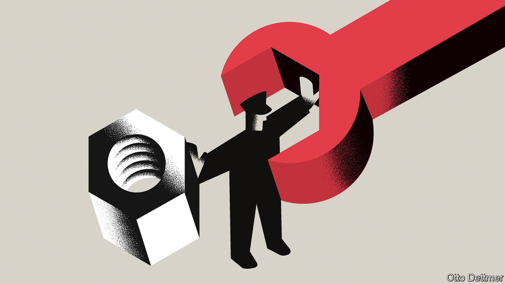

###### Free exchange

# Google, Microsoft and the threat from overmighty trustbusters 

##### From DNA sequencing to video games, little escapes the attention of regulators 

 

> Feb 9th 2023 

There are mergers to worry about and mergers to welcome. In the first category are tie-ups between biggish firms in the same line of business. In these “horizontal” mergers, a competitor is taken out of the market, removing a constraint on prices. In such cases, competition authorities will investigate the merger and may block it. Other mergers have historically been considered less troublesome. If a firm buys another in an adjacent line of business (a conglomerate merger) or if a supplier buys a customer (a vertical merger), the effects on competition have been seen as benign. 

But that has changed in recent years. More and more non-horizontal mergers are being challenged by antitrust authorities. In September America’s Federal Trade Commission (ftc) lost its challenge in court to a tie-up between Illumina, which provides “next-generation” dna-sequencing tools, and Grail, a developer of early cancer-detection tests, which rely on Illumina’s technology. The ftc is appealing the judgment. In October Britain’s Competition and Markets Authority (cma) forced Facebook to undo its purchase of Giphy, a supplier of gifs to social-media platforms. On February 8th, the cma issued an initial finding that the acquisition by Microsoft, maker of the Xbox games console, of Activision Blizzard, a game studio, would reduce competition in the industry. 

Vigorous antitrust policy is often motivated by anxiety about big tech. Facebook, Google and Microsoft became swiftly dominant in their markets because of the power of networks: the more people used their products, the better they became and the more attractive they were to other customers. Although it is difficult to find fault with such organic growth on competition grounds, there is a conviction in trustbuster circles that big tech should not have been allowed to buy other businesses along the way. The recent regulatory activism is therefore fuelled by regret about the past. Yet it carries its own risks. In many circumstances mergers are, in fact, a boon to consumers. The danger now is that the pendulum will swing towards over-enforcement. 

To understand how regulators got to this point, it is worth returning to the 1970s. A group of antitrust thinkers orbiting the University of Chicago cast doubt on the idea that vertical mergers could be harmful by employing the theory of “one monopoly profit”. This theory says that a monopolist cannot extend its market power up or down the vertical chain of production. To grasp it, imagine an airport operator that leases space to two coffee shops. The operator owns a monopoly resource: the property around a captive market of passengers who require their morning caffeine. To maximise profits, it will set the rents high enough to allow the shops no more than a competitive return. Yet were the operator to buy one of the coffee retailers, the profit-maximising rent would not change (hence one monopoly profit). 

Looked at this way, vertical mergers cannot harm consumers. They may even help them. A related theory posits that a vertical merger in an industry where there is some market power at each stage of production will lead to lower prices, because one of the non-competitive markups will be eliminated. In such circumstances, one monopoly profit means you don’t get gouged twice. 

Trustbusters these days are less focused on pricing. They are more concerned that a vertically integrated firm will use its muscle in one part of the chain to freeze out rivals in another part. In the Illumina case, the concern is that rivals of Grail will be denied the dna-sequencing tools they need to develop competing cancer tests. In the Microsoft case, the fear is that Sony, maker of PlayStation, the rival console to Xbox, will be denied games made by Activision, to the detriment of competition. To make the charge stick, trustbusters must demonstrate that such restrictions would be profitable, which they are unlikely to be in the short term, since they mean at least initially selling fewer products. Regulators thus have to make predictions about how a market might evolve. This is the economic equivalent of long-range weather forecasting. 

Which brings the story back to big tech. The winner-takes-all aspect of networks tends to eliminate competitors to the big tech giants. There is not much competition policy can do about such dominance. In theory, countless startups are vying to knock big tech firms from their perch, which ought to act as check on their business conduct. But so-called “shoot-out” acquisitions—purchases of startups that might become a rival to big tech firms—tend to neuter any threat from this corner. For many trustbusters, Facebook’s acquisition in 2012 of a fledgling Instagram was in this category. There are also regrets that Google’s acquisition in 2008 of DoubleClick, an ad server, helped to strengthen its hold on digital advertising, a market now the subject of a big antitrust probe. 

In praise of big business

Doubtless there were times when more vigilance was warranted. But it is easy to forget that the Chicago revolution was a response to overmighty trustbusters, who believed big was always bad and small businesses, however awful, should be shielded from competition. In America the courts are a check on over-enforcement. There are decades of jurisprudence, shaped by the Chicago School, which says non-horizontal mergers are benign. Nevertheless, the prospect of a court battle is enough to put off some firms. Last year Nvidia, a chipmaker, abandoned its proposed merger with arm, a chip designer, in the face of antitrust scrutiny. 

It is telling that the cma has taken the lead in blocking mergers involving tech giants, such as Facebook and Microsoft. Britain’s trustbusters may now be among the most feared. Freed from the eu’s competition policy, the cma revamped its guidelines in 2020 to give more weight to how post-merger markets might evolve. In Britain and Europe competition cases are pursued in an administrative system, not in a court, as in America. All of which gives the cma considerable powers. A rare example of a Brexit dividend? Trustbusters might say so. Not everyone would agree. ■


