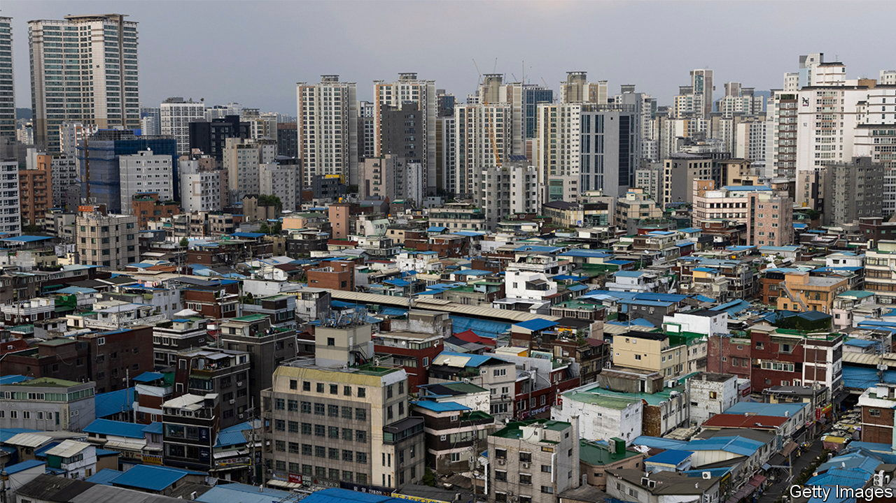
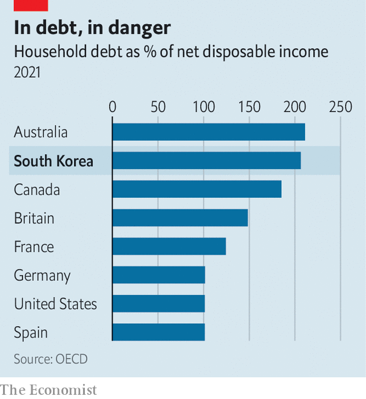

###### Home truths

# South Korea’s housing crunch offers a warning for other countries 

##### A bizarre rental system is not helping 

 

> Feb 9th 2023 

“Buying the house in 2021 might be one of the biggest regrets of my life,” says Kim Myung-soo, a 33-year-old whose home in Jamsil, eastern Seoul, has fallen in value by about $400,000. His wife is 33 weeks pregnant and Mr Kim does not know how he will repay the mortgage. He had planned to wait for prices to rise before selling the property to pay off the loan. 

Mr Kim is not alone in his worries. Across the rich world, property markets look precarious. Few are in as bad shape as South Korea’s. House prices fell by 2% in December alone, the biggest monthly drop since official figures began in 2003. The slump has been particularly brutal for apartments in Seoul: prices are down by 24% since their peak in October 2021. 

South Korea’s market offers a glimpse of what may lie ahead elsewhere. The Bank of Korea (bok) began raising interest rates in August 2021, seven months before the Federal Reserve and almost a year ahead of the European Central Bank. The benchmark rate now sits at 3.5%, a 14-year high, after officials raised it once again in January.

The broader economy is feeling the pinch. Private consumption fell by 0.4% in the fourth quarter of 2022. And exports, which dropped by 17% year-on-year in January, have hardly cushioned the blow. They were hit by a collapse in semiconductor orders at the end of a pandemic-era boom in electronics sales. This sluggishness will only add to the drag on house prices.

 


There are other sources of stress, too. Household debt reached 206% of disposable income in 2021, well above even the 148% in mortgage-loving Britain. Some 60% of South Korean housing loans are floating-rate, in contrast with America, where most lending is on fixed terms. As a result, household finances are squeezed more quickly when rates rise. The danger is that buyers like Mr Kim turn into forced sellers—something he says he will try to avoid at all costs—meaning a slide in house prices becomes a collapse. 

This risk is enhanced by the country’s bizarre rental system, known as . Many tenants pay huge lump sums to landlords, often 60-80% of the value of a property, which are returned after two years. In the interim the landlord can invest the cash as they wish. The system is a relic of South Korea’s rapid industrialisation, when mortgages were harder to attain.

In a downturn, some landlords are forced to make firesales to reimburse departing tenants, having invested in risky assets, including more housing, and lost the money. Stories about sudden defaults and vanishing “villa kings”, owners of dozens of rental properties, proliferate. 

South Korea also demonstrates how high household debt and asset prices can constrain monetary policy. Opinion is split about whether housing-market frailty, and the hit to household incomes, will stop the bok raising rates further. Oxford Economics, a research firm, thinks the bok will keep going. Nomura, a bank, expects it to reverse course in May, and cut the benchmark rate to 2% by the end of the year. 

Most countries are not as exposed as South Korea. But some, including Australia, Canada, the Netherlands, Norway and Sweden, share the same mix of high household debt and frothy property prices. All began raising rates after South Korea, and have further to go before the pressure feeds through. They are in for a rocky ride. ■


