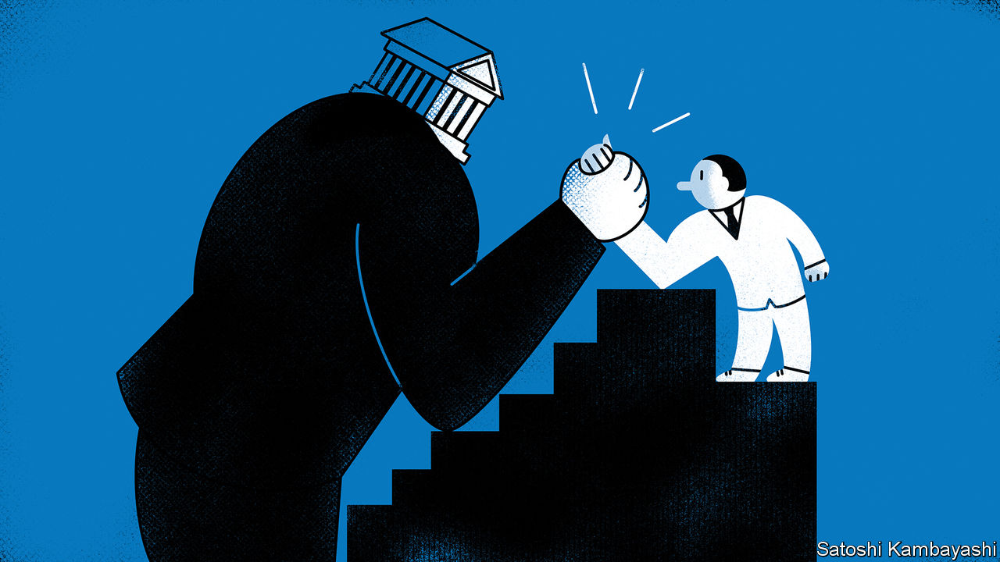

###### Buttonwood

# Surging stocks undermine a hallowed investing rule 

##### Sometimes it is a good idea to fight the Fed 

 

> Feb 7th 2023 

If you are one of the many buyers of American stocks or Treasury bonds in the past four months, or indeed a buyer of most financial assets over the period, then this column has a message for you: congratulations. Not only have you achieved pretty healthy returns—the s&amp;p 500 index of big American firms is up by 15%—but you have done so while violating one of Wall Street’s cardinal rules.

The phrase “don’t fight the Fed” is associated with Martin Zweig, an American investor renowned for predicting a crash in 1987. Zweig’s logic was simple. Falling interest rates are good for stockmarkets; rising ones are not. But the phrase’s scope has expanded over time. Zweig’s dictum is now used to suggest that betting against the institutions which print money and employ thousands of economists is always unwise.

Most of the time, it is. Over the past four months, however, the Federal Reserve has  three times and markets have surged. On February 7th, a few days after the publication of blowout labour-market data, Jerome Powell, the Fed’s chairman, warned that the fight against inflation would last longer than investors were anticipating. His warning had little effect. Investors elsewhere are also shrugging off central bankers’ words. The Bank of Japan (boj) had long promised to stand by its “yield-curve-control” policies, but traders betting that it would relax them triumphed in December, when officials unexpectedly raised their cap on the yield of ten-year government bonds . 

There is good reason to pick a scrap with a central bank now and again. Assessing the record since 1954, analysts at Truist Advisory Services, a wealth-management firm, find the s&amp;p 500 has in fact performed fine, even well, on numerous occasions when the Fed has raised rates. Indeed, on average the index rises by 9% on an annualised basis between the bank’s first and last interest-rate rise. 

Traders defer to the Fed’s analysis in large part because they presume it is based on superior information. An influential piece of research, published in 2000 by Christina and David Romer, two economists, seemed to confirm that the central bank’s forecasts are more accurate than those of its commercial rivals. But subsequent studies have produced different results. One, published in 2021 by researchers at the Barcelona Graduate School of Economics and the Federal Reserve Bank of San Francisco, suggests that the superiority of the Fed’s forecasting has waned since the mid-2000s. Meanwhile, forecasts from other central banks have been bad enough to inspire gentle mockery. Every year since 2011 the Swedish Riksbank has forecast a climb in rates, only to cut them. The resulting pattern, which shows forecasts rising upwards over and over, like spikes, has been compared to a hedgehog.

Moreover, a little central-bank fighting can be good for the broader financial system. Unless a central bank wants to control market interest rates directly, by buying enormous amounts of assets, policymakers must sometimes conduct what are known as open-mouth operations. What central bankers think about economic conditions and how they might affect rates are expressed in speeches and written guidance, which suggest optimism or pessimism on subjects from the economy’s long-term-growth potential to financial stability. Done well, this sort of communication can remove the need for rate changes.

To refine their guidance, though, central bankers need people to take positions in financial markets, which they can react against. After all, as another Wall Street credo notes: disagreement is what makes a market. Buyers need sellers, and the information about what investors expect in aggregate is revealed through market prices. The process of back-and-forth between officials and markets is preferable to the corner into which the boj has been pushed, where vast purchases must be used to defend the bank’s credibility.

Traders are still regularly turned into mincemeat when they take on central banks. Betting against the Fed is one thing when policymakers say they will be led by the data, as they do now, and quite another when they come out all guns blazing. Betting on a sudden rise in Japanese bond yields worked well for several adventurous funds in December, but the trade is known as “the widow-maker” for a reason. In moderation, however, some tension between markets and central banks is valuable, for investors and officials alike. Even financial rules are made to be broken. 


