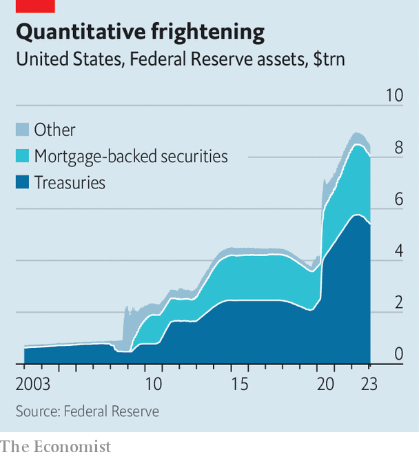

###### Quantitative frightening

# The Federal Reserve’s $2.5trn question 

##### Upon which the future of monetary policy rests 

 

> Feb 9th 2023 

Can a central bank make $2.5trn of cash vanish without anyone much noticing? That is the improbable, even audacious, mission the Federal Reserve has begun, trying to shrink its vast balance-sheet while minimising disturbances to the economy. The process—known as “quantitative tightening” (qt)—got under way in mid-2022. The Fed has already shed nearly $500bn in assets, a good first step. But recent ripples in the banking system hint at turbulence ahead. Some analysts and investors think these strains will ultimately force the Fed to call off qt well ahead of schedule. Others suspect that the central bank still has time, and tools, on its side.

It may sound like a technical and arcane debate. It is most certainly complex. But it also gets to the heart of modern monetary policy. The Fed, like other central banks, has come to rely on quantitative easing (qe)—purchasing assets, especially government bonds, on a giant scale—to calm financial markets and boost the economy during severe downturns. For qe to work in the future, qt must work now: expanding balance-sheets in bad times is only sustainable if they shrink in good times, otherwise they will ratchet ever higher.

Since the global financial crisis of 2007-9 the Fed has resorted to qe on four occasions, yielding a body of research about how it works. In contrast, the Fed has employed qt just once, from late 2017 to 2019, stopping early after the money market started to buckle. There is thus a lot of uncertainty about its consequences.

 


One superficially appealing way to think about qt is as qe in reverse. Just as qe involves creating central-bank reserves to buy bonds, so qt involves removing reserves as the central bank pares back its holdings. And just as qe helps to hold down long-term rates, so qt raises them. Researchers estimate that shrinking the Fed’s balance-sheet by about $2.5trn over a few years has roughly the same impact as raising rates by half a percentage point.

Many think this has already happened, with the market lifting long-term rates when the Fed laid out its qt plans last year. Christopher Waller, a Fed governor, has argued that since investors have priced in the announced reductions, the Fed is now simply fulfilling expectations: “The balance-sheet is just kind of running in the background.” Fed officials have said qt should be about as exciting as watching paint dry.

The trouble with the analogy is that whereas paint gets drier and drier, qt gets more and more treacherous. This is also a crucial way in which it differs from qe. When the economy is in good shape, central banks can gradually step away from qe. In the case of qt, the danger is that it takes market turmoil for the Fed to realise it has gone too far, as in 2019. Initially qt drains money from a commercial-banking system that is awash in liquidity; as it continues, however, liquidity gets steadily tighter, and funding costs for banks may soar without much warning.

A preview of the possible stresses has played out in the past few weeks. Some banks, having recently lost deposits, have turned to the federal-funds market to borrow reserves from other lenders in order to meet regulatory requirements. Daily borrowing in the fed-funds market in January averaged $106bn, the most in data going back to 2016. So far the squeeze has been confined to smaller banks, a hopeful sign that the financial system is returning to its pre-pandemic state, in which big banks lend to their punier peers. Nevertheless, it raises the question of whether and when other banks will hit funding shortages.

The idea that a crunch is far away is supported by a look at the Fed’s liabilities. About $3trn are banks’ reserves (in effect deposits at the central bank). Another $2trn is money from firms which enter into exchanges with the Fed for Treasury securities (such overnight reverse-repurchase agreements, or reverse-repos, allow them to get a small return on their excess cash). Mr Waller has said that qt ought to run smoothly until bank reserves hit about 10% of gdp, when the Fed will slow its balance-sheet reductions to try to find the right size for the financial system. If reserves and reverse repos are interchangeable, as Mr Waller suggests, then reserves now amount to 19% of gdp, leaving plenty of room. Thus qt could roll on for another couple of years, taking a big bite out of the Fed’s balance-sheet in the process.

But problems may arise well before then. First, banks probably need more reserves than they did before covid-19 because their assets have expanded faster than the rest of the economy. Second, and crucially, reverse repos and reserves may in fact not be interchangeable. Much of the demand for reverse repos comes from money-market funds, which function as an alternative to bank deposits for firms seeking slightly higher returns. If that demand persists, the weight of qt will instead fall more heavily on bank reserves. In this scenario, reserves may run short before the end of this year, think strategists at T. Rowe Price, an investment firm. The Fed’s balance-sheet would be stuck at around $8trn, almost double its pre-pandemic level. This would fuel concerns about its ability to embark on qe in future.

Oddly, the debt-ceiling mess may conceal any ructions for the next few months. With the Treasury unable to borrow until Congress raises the debt limit, it is running down its cash holdings at the Fed. As money leaves the Treasury’s account, much ends up in the banking system, which in turn helps banks to replenish reserves. 

But when Congress does get around to raising America’s debt ceiling, the Treasury will need to ramp up its borrowing. For banks this may mean a rapid loss of reserves. The Fed has created a lending facility to relieve such squeezes. There is, though, no telling how it will perform in the wild, adding yet more uncertainty to the course of qt. The market may be placid for now. It is unlikely to stay that way. ■


