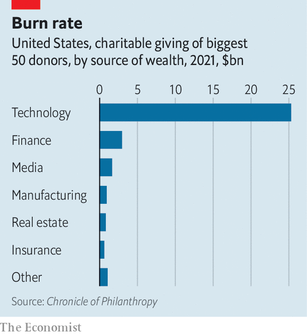

###### Move fast and fix things

# How a tide of tech money is transforming charity 

##### The new philanthropists are young, impatient and in a hurry 

 

> Feb 9th 2023 

When Andrew White first sold a chunk of his business in 2021, he knew he wanted to give some of the proceeds away. Indeed, if all goes according to plan, he hopes eventually to give over $20m to charity. But Mr White was still busy running FundApps, a compliance-monitoring service for investors. That left little time to read up on development economics or scour charity rankings. 

The model that big-name philanthropists have followed for generations—setting up a private foundation and hiring a team to run it—was out of the question. “Creating another organisation to manage your money is just wasting it,” says Mr White. After all, he says, “these people are very good at what they do, so why don’t you trust them to do it?” In the end, Mr White gave the money to Founders Pledge, a British charity with more than 1,700 members in 39 countries. He told Founders Pledge he would like the cash to go to education and poverty relief in poor countries, then left its researchers to sort out the details. 

Mr White is part of a new class of philanthropists very different from those that went before. They are often young, impatient with process and detail, and keen to make a difference in a hurry. Most made their money in the software and computing industry that has, since the turn of the century, been the world’s great engine of wealth creation. Along with their money comes their industry’s worldview. “I was reading , not the ,” says Scott Harrison, the founder of charity: water, which aims to give clean water to everyone on the planet. 

No one has more money to give away than the tech tycoons. , a magazine which tracks such things, reckons that 26 of the 100 richest people in the world in 2022 made their money leading technology firms of various sorts, including seven of the top ten. (The recent drop in tech valuations has dented the sector’s dominance, but not ended it.) 

 


They are even more dominant when it comes to giving that money away. The  (which Mr Harrison said he did not read) estimates that, of the $33.4bn given away by America’s 50 biggest donors in 2021, around three-quarters came from people who made their money in tech (see chart). Bain &amp; Company, a consultancy, reckons tech magnates hold about 8% of the total wealth of India’s super-rich, but account for about 35% of the charitable giving. 

That tide of money carries with it the culture and worldview of the industry that created it. Tech has spent the past two decades disrupting everything from shopping to television. Charitable giving, it seems, is next.

To see just how different the newcomers are, compare them with their best-known forebears. The grandfathers of modern philanthropy are American industrialists like Andrew Carnegie, Henry Ford and John D. Rockefeller. Such men gave the bulk of their money late in their lives. They created foundations that would outlive them, employed highly qualified advisers, and were prepared to dish out funds for decades to achieve their goals. 

Move fast and fix things

That model was tweaked at the turn of the millennium. Businessmen and venture capitalists began thinking about charitable donations like hard-nosed investments. Recipients were ranked by which offered the most charitable bang for each buck. The impact of every dollar was measured, and, if a project failed to deliver its expected “social return”, funding was cut. The standard-bearer for that approach was the Bill and Melinda Gates Foundation, started by the founder of Microsoft and his then wife in 2000. It has spent its money, among other things, on malaria prevention, improving access to clean water, and pushing to complete the worldwide eradication of polio.

To the newer generation of philanthropists, raised in a business culture that prizes getting to market and scaling quickly over cautious planning, all this appears unbearably stodgy. Nickhil Jakatdar is a serial entrepreneur from India who now lives in California, and who gives away between $300,000 and $500,000 each year. In 2021 he approached the Gates Foundation seeking funding for a not-for-profit medical firm. The foundation’s generosity was impressive, Mr Jakatdar says. But he found the paper-pushing so off-putting that he did not apply. “The Gates Foundation taught me what I don’t want to be,” he says. 

Mackenzie Scott, the ex-wife of Jeff Bezos, the founder of Amazon, became a role model for the new approach when she dished out over $14bn in a little over three years, starting in 2019. Ms Scott did not dispense with analytics entirely. Instead, she front-loaded them. She appointed consulting firms to crunch the numbers and pick worthy recipients, which included Habitat for Humanity International, whose volunteers have built homes in Haiti and Bangladesh, and the Desmond Tutu Health Foundation, which is based in Cape Town. The gifts were mostly given without conditions, with the charities trusted to make the best use of the money. Ms Scott has called her approach “seeding by ceding”. 

Jack Dorsey, a co-founder of Twitter, runs his charitable efforts on similar lines. In 2020 Mr Dorsey pledged to give away $1bn of shares to his philanthropic venture #StartSmall. He takes grant applications from anyone via a short online form. Every donation is made public. (#StartSmall’s list of donations includes climate-resilience projects in the Caribbean and humanitarian aid in Ukraine.) “I’m seeing much more of the attitude of: just give people the money already,” says Stephanie Ellis-Smith, the boss of Phila Engaged Giving, an advisory firm. “What are we playing around with, ticking this box and that box?” 

This sense of urgency is bolstered by peer pressure and competition. Silicon Valley is brimming with “giving circles” and educational programmes that get would-be donors together. Public declarations are popular, and evangelists are not shy about recruitment. David Goldberg, the chief executive of Founders Pledge, says he physically walks entrepreneurs into the corner of the room at parties, registration papers in hand. 

The vehicles through which young tech titans dispose of their wealth are changing, too. America’s charitable foundations have over $1trn in assets. But there is a growing fashion for donor-advised funds (DAFs), a sort of savings account for charitable giving that offers a quick and simple way of getting wealth out of the door. The National Philanthropic Trust reckons the value of assets in DAFs rose by nearly 170% in the five years to 2021, to $234bn. One of the biggest providers is the Silicon Valley Community Foundation, which has about $14bn at its disposal. Donors include Brian Acton, a founder of WhatsApp, and Sergey Brin, who co-founded Google.

Technically, donors to a DAF give up control over their money (though their wishes are usually respected). But they can get advice on giving and help with paperwork from the group that runs it. Unlike big foundations, there is no need for DAF donors to hire a large staff or submit detailed reports to the taxman. American foundations must dispose of at least 5% of their assets every year. No such rules apply to DAFs. Donors can get deductions on their tax bills, too. Untraded shares given to a foundation are valued based on what they cost—which, for a founder, is often very little. When given to a DAF, they are valued at the time of the donation. 

Another option is the limited liability corporation (LLC). Corporations do not provide the tax benefits of foundations or DAFs. But they give donors freedom. Spending on charitable projects can be combined with for-profit ones, and even political advocacy. Pierre Omidyar, eBay’s founder, and Laurene Powell Jobs, the widow of Steve Jobs, a former Apple boss, both use LLCs for their do-goodery. The range of projects that can be funded is on full display at Ms Jobs’s group, the Emerson Collective. The philanthropic arm funds projects such as art installations along America’s border with Mexico. Meanwhile, the venture-capital arm has made investments in the, a magazine, and Stripe, a payments-processor. 

Benjamin Soskis at the Urban Institute, an American think-tank, says that the popularity of LLCs reflects another widespread Silicon Valley belief, that it is not only charity that can do good in the world. Industrialists like Carnegie and Rockefeller worried that the public viewed the firms that built their fortunes negatively. But entrepreneurs today frame the making of money as being just as worthy as giving it away. Social-media platforms are said to connect people, for example, while online marketplaces democratise shopping. 

Some corporate do-goodery can seem strikingly grandiose. Elon Musk, Tesla’s boss, sees part of the firm’s job as forcing the rest of the car industry to switch to electric vehicles sooner than it otherwise would have (a mission it has, by now, mostly accomplished). Although Mr Bezos remains on Amazon’s board, he also owns Blue Origin, a rocketry firm that hopes one day to help humans live in space to relieve environmental pressure on Earth. Mr Brin has invested in Calico, an anti-ageing firm that hopes to extend lifespans. “There is a blurring between entrepreneurship and philanthropy,” says Mr Soskis.

Think different

As the preferences of donors change, so must the fundraising tactics of recipients. It helps if charities have grand ambitions too. Brent Hoberman runs Founders’ Forum Group in London, which offers legal advice, networking and more for entrepreneurs. He recalls advising the Tessa Jowell Foundation, a British charity focused on brain cancer, on how best to market itself. To draw donations from tech moguls, he said, it would be better for the foundation to market itself as a “moonshot” project that aimed to cure cancer of all kinds. And there is no harm in asking for big donations, either. “Sometimes it is easier to get these guys to give away $100m than $1m.”

It helps to be au fait with tech culture, too. With $700m in donations charity: water, Mr Harrison’s venture, is a Silicon Valley darling. Mr Harrison thinks it was the first non-profit group to reach 1m followers on Twitter. Adding whizzy, high-tech elements works as well. Mr Harrison offers donors satellite images of the wells they have paid for. And once one tech donation arrives, others often follow. Michael Birch, the founder of Bebo, a social network, was an early donor. He introduced Mr Harrison to Daniel Ek, the boss of Spotify, and Reid Hoffman, a founder of LinkedIn.

More modest charitable ventures, and those without connections, can find it harder to attract donations. Elise Cutini runs Pivotal, an organisation that supports children in foster care in California. Pivotal helps about 500 young people every year, but, as Ms Cutini puts it, that is not seen as “sexy” by the Silicon Valley crowd. One way to get on the radar, she says, is to appoint tech types to the board, which helps spread the word. “Once you get into that circle a bit, people talk,” she adds. “They talk at their cocktail parties.” ■

