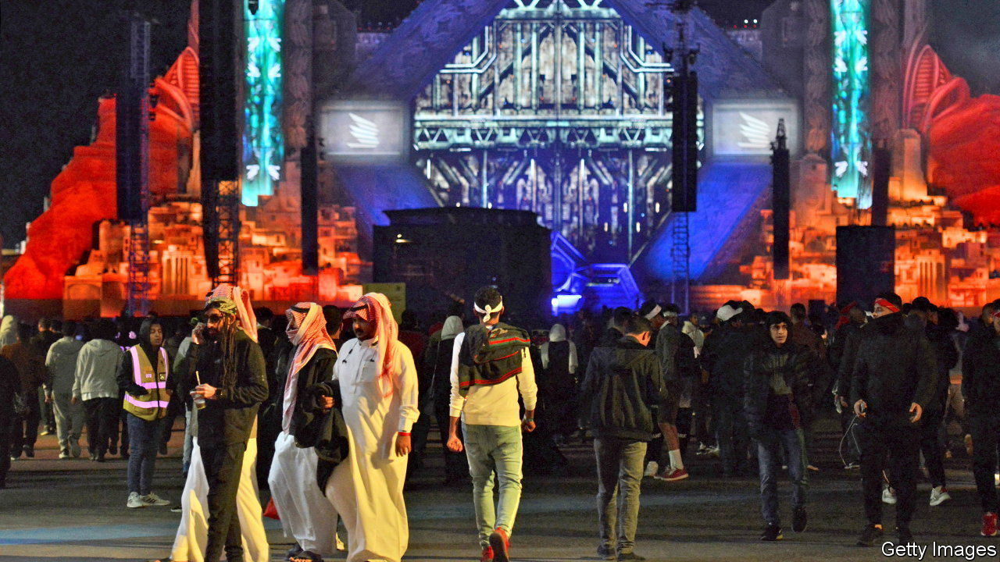

###### A new social contract in the Gulf

# Arab petrostates must prepare their citizens for a post-oil future 

##### Better schools and a political voice would be a start 

 

> Feb 9th 2023 

Fancy going to a rave in Saudi Arabia? The countries of the Gulf face a daunting transition away from fossil fuels in the coming decades. But another transition is happening in parallel that is just as striking: a shift from state-led economies and  towards somewhat more . That prospect is thrilling. Millions of people will enjoy new freedoms and opportunities. But it is also disconcerting, because it brings the risk of social instability if autocratic governments fail to adapt. Whether the Gulf countries succeed in redrawing their social contracts matters not only to their people, but also to the world, because of their clout in oil and gas and their role in exporting cultural values across the Muslim world.

Ever since Gulf governments took control of oil and gas production from Western firms in the 1970s, the social contract has been clear. Rulers used petrodollars to pamper their subjects with everything from cushy public-sector jobs to water subsidies and bonuses for newlyweds. Foreigners were encouraged to move to the Gulf to do the jobs citizens either could not or would not do. There was no path for these migrants to become citizens, whether they were labourers sweating on construction sites or bankers in air-conditioned offices. And everyone—locals and expats—had to accept restrictive royal rule.

That contract will eventually become obsolete. One reason is climate change. The United Arab Emirates (uae) and Saudi Arabia, which together pump 14m barrels of oil per day, know that demand for fossil fuels will fade. That gives them a window of 10-20 years to transform their economies. The war in Ukraine has led to a spike in energy prices that could mean the Gulf states earn $3.5trn from energy exports over the next five years, creating a kitty with which to invest. And the geopolitical context has changed, too. American support is less assured, while closer links are being forged with other states, from India to Israel.

Some of the changes are astounding. In Saudi Arabia, women who were barred from driving now motor to work. In 2017 17% of Saudi women either had a job or were looking for one; today the figure is 37%. Restaurants were once prohibited from playing music. Now there is talk of loosening the alcohol ban. As Saudi Arabia has liberalised, the uae has responded with reforms, anxious to maintain its dominance as a business hub. Neighbouring Oman and gas-rich Qatar are more closed but are paying close attention—Qatar just hosted the football World Cup.

The euphoria may help dull the pain of economic reforms. Benefits are being cut. The UAE has ditched fuel subsidies. Saudi Arabia may follow. Since 2018 four of the six countries of the Gulf Cooperation Council have brought in a value-added tax. Income tax, once unimaginable, is now a possibility. In June the uae will introduce a corporate tax. As government sinecures become less common the citizens of the Gulf are having to compete for private-sector jobs. Their governments are keen to attract more foreigners. The UAE, where expats make up nearly 90% of a 10m-strong population, wants to lure 3m-5m more. 

All this creates a sense of insecurity as well as freedom. Gulf citizens will need the tools to succeed in a new era. Education is a good place to start. Schoolchildren in Qatar, Saudi Arabia and the UAE lag far behind their rich-country counterparts. Dropout rates are high because students—boys in particular—assume they can rely on a government job. A better education would prepare them to compete for one in the private sector.

Another challenge is the relationship between the state and individuals. More rights have already been recognised, at least on paper. In the uae new laws decriminalise premarital sex and allow unmarried couples to live together. Punishments for sexual harassment and rape have been toughened. The uae and Saudi Arabia are strengthening property rights for foreigners. The path to permanent residency, and perhaps even citizenship, will probably become easier. Foreigners who put down roots may one day demand rights. 

Techno-cratic 

So far, greater social freedoms have been accompanied by more political repression and centralisation, particularly in Saudi Arabia, under its de facto ruler, Muhammad bin Salman. Yet a taste of freedom in their daily lives may spur people to seek more say in politics, too. At the very least governments will have to heed the grumbles when economic change creates losers, as it will. No Gulf country is likely to become a democracy any time soon. But if they are to wean their economies off hydrocarbons without provoking unrest, governments must become more responsive to ordinary citizens. Otherwise the music may stop. ■

