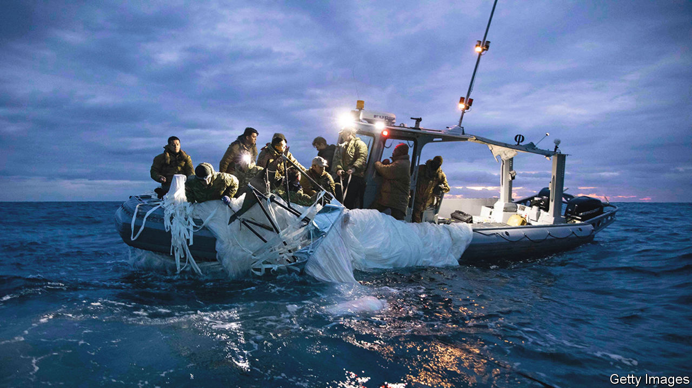

###### China and America

# Cold-war lessons from China’s spy balloon 

##### To avoid perilous misunderstanding, the two sides should talk more 

 

> Feb 9th 2023 

There was something almost comic about the immense , carrying equipment the size of a small passenger plane, that drifted over America for days until  on February 4th by an American fighter jet. As cold-war-type moments go, it was light relief compared with, say, the Cuban missile crisis of 1962 or the crash-landing in 2001 of an American spyplane after a Chinese fighter collided with it. But this was no joke. America said the balloon was spying. For ordinary Americans, the threat from China was suddenly visible, overhead. In his state-of-the-union speech on February 7th, President Joe Biden warned: “make no mistake about it…if China threatens our sovereignty, we will act to protect our country. And we did.”

American spooks play down what the balloon—or weather-observation craft, as China’s government insists—discovered as it floated near military sites, including a base in Montana with Minuteman III intercontinental ballistic missiles. But they say that was because they tracked it closely and ensured no sensitive activities or communications took place within its range. Examination of its debris may reveal more about the operation, which America says is part of a vast aerial surveillance project based on Hainan island in southern China, which has targeted countries on five continents. 

The episode illustrates why  is so hard to manage. America’s hyperpartisan politics were on full display as Republicans and Democrats competed to sound more hawkish, in an escalatory pattern that will probably feature heavily in the presidential campaign in 2024. The balloon may also reveal the blurred boundary between civilian and military activity, if debris recovered off the coast of South Carolina shows that American components are helping China to spy. The economic links between the two countries, from semiconductors to TikTok, are so broad that a vast array of activity now falls under suspicion.

The odds of more incidents like this are high. China may retaliate, for example by seizing an American ocean-survey drone—as it did in 2016 in the South China Sea, where the two countries’ warships and fighters operate in close proximity. Chinese fury with America following a visit to Taiwan in August by Nancy Pelosi, then the speaker of America’s House of Representatives, has resulted in ever more dangerous sabre-rattling by China’s armed forces around the island, which China claims. There is an almost continual risk of small encounters that could spark a bigger conflict.

It is therefore crucial that cool heads prevail. The 20th century offers some lessons. In 1972 America and the Soviet Union managed to reach agreement on avoiding dangerous military encounters. In 1955 President Dwight Eisenhower proposed that Soviet spyplanes be allowed to fly over America, and vice versa, so that the two countries could be more assured of each other’s intentions. The Russians baulked at the idea. It was only after the Soviet Union collapsed that it was taken up: 34 countries, including Russia and America, joined the Open Skies treaty that took effect in 2002. It allowed participants to surveil each other from the air after giving notice and a flight path (although Russia and America have recently pulled out of the deal). 

Today far too few mechanisms for avoiding escalation exist. China’s now-abandoned zero-covid policy meant it avoided face-to-face discussions for years. As president Mr Biden has met Xi Jinping, China’s leader, only once, during a G20 meeting in November in Bali. As an American official said then: “It is critical to build a floor for the relationship and ensure that there are rules of the road that bound our competition.” But after the balloon was shot down, China refused to hold a phone call between its defence chief and America’s. For its part, America has called off a visit to Beijing by the secretary of state, Antony Blinken. The trip had been planned for February 5th and 6th and was to have included a meeting with Mr Xi. It needs to be rescheduled as soon as possible. Mr Blinken would be the first American cabinet secretary to visit Beijing since Mr Biden became president in 2021. 

From cold war to hot air 

New diplomatic and military accords to prevent accidents can be reached only if America and China talk more. America would like to discuss nuclear weapons, but China refuses. It believes that the less the rest of the world knows about its capabilities, the safer it will be. But as its global ambitions grow, China is becoming hungrier for intelligence and more daring in pursuit of it, continually raising the probability of clashes and accidents that could quickly spiral out of control. Some Americans and Chinese may have been intrigued or amused by the giant, drifting balloon. The bigger picture is alarming. ■

