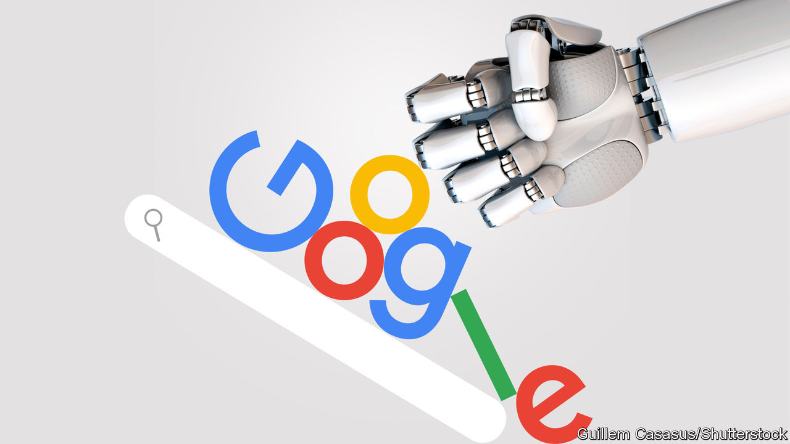

###### Search engines

# The battle for internet search 

##### Will the AI chatbots eat Google’s lunch? 

 

> Feb 9th 2023 

For more than 25 years, search engines have been the internet’s front door. AltaVista, the first site to allow searches of the full text of the web, was swiftly dethroned by Google, which has dominated the field in most of the world ever since. , still the heart of its business, has made its parent, , one of the world’s most valuable companies, with revenues of $283bn in 2022 and a market capitalisation of $1.3trn. Google is not merely a household name; it is a verb.

But nothing lasts for ever, particularly in technology. Just ask ibm, which once ruled business computing, or Nokia, once the leader in mobile phones. Both were dethroned because they fumbled big technological transitions. Now tech firms are salivating over an innovation that might herald a similar shift—and a similar opportunity. Chatbots powered by  let users gather information via typed conversations. Leading the field is ChatGPT, made by OpenAI, a startup. By the end of January, two months after its launch, ChatGPT was being used by more than 100m people, making it the “fastest-growing consumer application in history”, according to UBS, a bank.

AI is already used behind the scenes in many products, but ChatGPT has put it centre stage, by letting people chat with an AI directly. ChatGPT can write essays in various styles, explain complex concepts, summarise text and answer trivia questions. It can even (narrowly) pass legal and medical exams. And it can synthesise knowledge from the web: for example, listing holiday spots that match certain criteria, or suggesting menus or itineraries. If asked, it can explain its reasoning and provide detail. Many things that people use search engines for today, in short, can be done better with .

Hence the flurry of announcements, as rival firms try to seize the initiative. On February 7th Microsoft, which has invested more than $11bn in OpenAI, revealed a new version of Bing, its search engine, which incorporates ChatGPT. Satya Nadella, Microsoft’s boss, sees this as his chance to challenge Google. For its part, Google has announced Bard, its own chatbot, as a “companion” to its search engine. It has also taken a $300m stake in Anthropic, a startup founded by ex-OpenAI employees, which has built a chatbot called Claude. The share price of Baidu, known as the Google of China, jumped when it said it would release its chatbot, called Ernie, in March.

But can chatbots be trusted, and what do they mean for search and its lucrative advertising business? Do they herald a Schumpeterian moment in which AI topples incumbent firms and elevates upstarts? The answers depend on three things: moral choices, monetisation and monopoly economics.

ChatGPT often gets things wrong. It has been likened to a mansplainer: supremely confident in its answers, regardless of their accuracy. Unlike search engines, which mostly direct people to other pages and make no claims for their veracity, chatbots present their answers as gospel truth. Chatbots must also grapple with bias, prejudice and misinformation as they scan the internet. There are sure to be controversies as they produce incorrect or offensive replies. (Google is thought to have held back the release of its chatbot over such concerns, but Microsoft has now forced its hand.) ChatGPT already gives answers that Ron DeSantis, Florida’s governor, would consider unacceptably woke. 

Chatbots must also tread carefully around some tricky topics. Ask ChatGPT for medical advice, and it prefaces its reply with a disclaimer that it “cannot diagnose specific medical conditions”; it also refuses to give advice on, say, how to build a bomb. But its guardrails have proved easy to circumvent (for example, by asking for a story about a bombmaker, with plenty of technical detail). As tech firms decide which topics are too sensitive, they will have to choose where to draw the line. All this will raise questions about censorship, objectivity and the nature of truth. 

Can tech firms make money from this? OpenAI is launching a premium version of ChatGPT, which costs $20 a month for speedy access even at peak times. Google and Microsoft, which already sell ads on their search engines, will show ads alongside chatbot responses—ask for travel advice, say, and related ads will pop up. But that business model may not be sustainable. Running a chatbot requires more processing power than serving up search results, and therefore costs more, reducing margins.

Other models will surely emerge: charging advertisers more for the ability to influence the answers that chatbots provide, perhaps, or to have links to their websites embedded in responses. Ask ChatGPT to recommend a car, and it will reply that there are lots of good brands, and it depends on your needs. Future chatbots may be more willing to make a recommendation. But will people use them if their objectivity has been compromised by advertisers? Will they be able to tell? Behold, another can of worms.

Then there is a question of competition. It is good news that Google is being kept on its toes by upstarts like OpenAI. But it is unclear whether chatbots are a competitor to search engines, or a complement. Deploying chatbots initially as add-ons to search, or as stand-alone conversation partners, makes sense given their occasional inaccuracies. But as their capabilities improve, chatbots could become an interface to all kinds of services, such as making hotel or restaurant reservations, particularly if offered as voice assistants, like Alexa or Siri. If chatbots’ main value is as a layer on top of other digital services, though, that will favour incumbents which provide such services already.

Googling the future 

Yet the fact that today’s upstarts, such as Anthropic and OpenAI, are attracting so much attention (and investment) from Google and Microsoft suggests that smaller firms have a shot at competing in this new field. They will come under great pressure to sell. But what if an upstart chatbot firm develops superior technology and a new business model, and emerges as a new giant? That, after all, is what Google once did. Chatbots raise hard questions, but they also offer an opportunity to make online information more useful and easier to access. As in the 1990s, when search engines first appeared, a hugely valuable prize—to become the front door to the internet—may once again be up for grabs. ■


