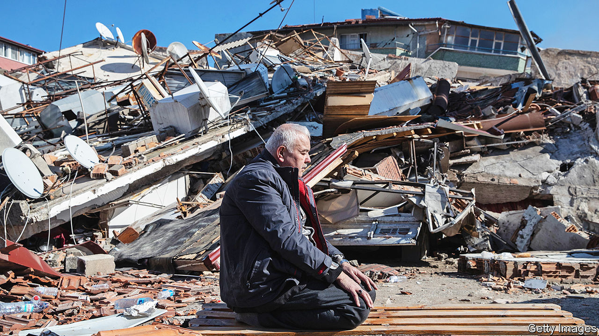

###### Seismic shock

# The devastating earthquakes in Turkey and Syria might upend politics, too 

##### President Recep Tayyip Erdogan faces a tough election in May 

 

> Feb 8th 2023 

NOBODY KNOWS how many people lie trapped . When two powerful  hit southern Turkey and northern Syria on February 6th, thousands of buildings collapsed, burying families as they slept. Rescuers are racing to dig them out before they succumb to injury, thirst or the biting cold. By February 9th estimates of the death toll stood at more than 16,000; the true figure may be . The World Health Organisation says it could be 20,000, which would make it even worse than the quake that struck Izmit, 100km (60 miles) east of Istanbul, in 1999, killing some 18,000. Buckled roads, complex terrain and the vast size of the affected area, spreading out along the East Anatolian fault for some 450km, are making the relief effort  to manage.

The quake-struck parts of Syria were previously battered by a decade of war. Syria’s despot, Bashar al-Assad, is so wary of outsiders and heedless of human life that he may impede access for foreign relief agencies. Even in parts of Syria outside his control, entry relies on roads from Turkey that are now badly damaged. Turkey is naturally concentrating on its own people. Donors must try, against the odds, to ensure that Syria is not abandoned. So far, however, the response has been much too slow.

Even as the relief effort goes on, attention will turn to politics. President Recep Tayyip Erdogan, who has ruled Turkey for two decades, faces an election in May that was already going to be tough for him, thanks to a floundering economy and an inflation rate driven to over 50% by his foolish monetary policies. Voters will note his response to the earthquake, and ask why his government did not do more to prepare for such a disaster after the tremor of 1999. He knows it: government prosecutors have already launched investigations into two journalists for criticising the state’s response.

There is a grim irony at work. Mr Erdogan came to power after an election in 2002. His new party, Justice and Development (AK), upended an establishment that had ineffectually governed Turkey since the restoration of democracy in 1983. The then government’s weak response to the earthquake of 1999, followed by its mishandling of a financial crash in 2001, contributed to a sense that a clear-out was needed, and AK ended up with two-thirds of the seats in parliament. Now Mr Erdogan faces a similar set of circumstances; an economic crisis and a humanitarian one. Voters will judge him on his record in handling both.

The collapse of so many buildings in Turkey—nearly 6,000, according to the government—will invite scrutiny. Evidence will emerge that the advice of earthquake experts was ignored, and building codes were flouted while corrupt or incompetent supervisors looked the other way. One hallmark of the economic boom that made Mr Erdogan popular for his first decade in power was a surge in construction, though most of the buildings that collapsed were built before he came to office. He has had two decades to prepare for a big earthquake; it is hardly a secret that Turkey sits on one of the world’s most active fault lines. 

Mr Erdogan’s poll ratings, and his party’s, have been nearing record lows. Last month he brought forward the presidential and parliamentary elections from June to May, presumably to wrong-foot the opposition, which has still failed to unify around a single candidate for the top job. After the quake, the president declared a state of emergency in ten southern provinces, to last for three months, until almost the eve of the poll. No doubt there are commendable practical reasons for this. But it might also make it easier for Mr Erdogan to shut down criticism or opposition activity; indeed, access to Twitter was briefly restricted after people used it to lambast the government’s response to the quakes. He might now postpone the elections. Turkey was already entering a difficult period. Plate tectonics has just made it more dangerous. ■

