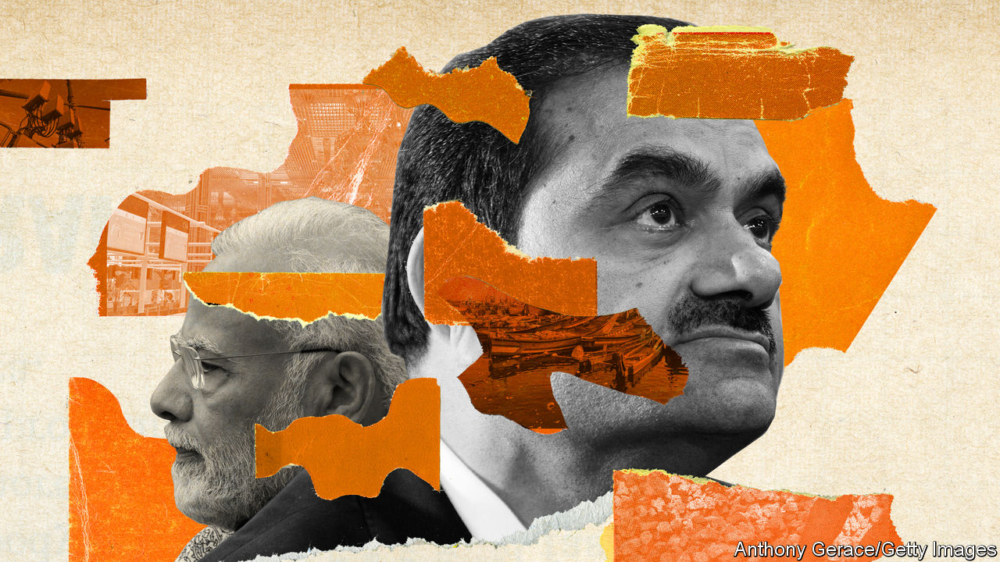

###### Adani’s agony

# The humbling of Gautam Adani is a test for Indian capitalism 

##### The biggest tycoons need the sternest scrutiny 

 

> Feb 9th 2023 

It took a little over seven days for a corporate titan to be cut down to size. Only weeks ago  was the world’s third-richest man and the self-proclaimed Rockefeller of India. Then a short-seller , investors took fright and $100bn in market value evaporated. Tens of billions have been wiped off the tycoon’s personal wealth. Today the company is racing to show it can meet its debt payments. 

The humbling in the markets  Mr Adani’s pharaonic ambitions. It is also a political embarrassment for Narendra Modi, the prime minister of India and a close associate of Mr Adani. And it confronts Indian capitalism with its  in years. 

Mr Adani’s  touches hundreds of millions of Indians’ daily lives. It runs some of India’s biggest ports, stores a third of its grain, operates a fifth of its power-transmission lines and makes a fifth of its cement. It was among India’s top ten biggest non-financial firms, by assets, and had been projected to grow rapidly.

The prospects for that growth are now uncertain. In a report published on January 24th Hindenburg Research, an American short-seller, alleged that opaque entities based in Mauritius linked to the Adani family were manipulating the group’s stock price. Although Adani denied the claims, it did not convince investors. Share prices plunged and financing plans were disrupted. Yields on bonds issued by the company have risen; those of the group’s renewables arm trade at an eye-watering 19%.

For Mr Modi, big businesses are important planks in his plan to boost capital investment in India’s infrastructure. But Mr Adani is unusual. His ties with Mr Modi were formed decades ago in Gujarat, the state where the politician was chief minister from 2001 to 2014, and where the tycoon got his start. When Mr Modi became prime minister, he flew to Delhi in Mr Adani’s plane. Between then and the release of the Hindenburg report, Mr Adani’s personal fortune mushroomed from around $7bn to $120bn.

The government may now be tempted to offer support to Mr Adani, implicitly or explicitly. But that would be a mistake. India has many of the conditions in place for a sustained growth spurt. If it is to achieve its potential, however, close, impartial scrutiny of big business will be vital. 

Anyone who has spent time in India knows its desperate need for roads, bridges and power. In the years before the global financial crisis of 2007-09, a credit boom fuelled vast investments in infrastructure. But costs overran, red tape led to delays and financing costs soared. Too few projects were finished. Banks were left saddled with bad loans and growth sputtered. 

Hence the allure for Mr Modi of a muscular industrial policy. He wants to make India a global manufacturing powerhouse. That cannot happen without good roads and reliable electricity. So big businesses have been cajoled to invest in infrastructure and to help develop local supply chains. Together Adani, Reliance Industries, Tata and jsw, some of India’s biggest firms, plan to invest more than $250bn over the next five to eight years in infrastructure and emerging industries. Subsidies are also being handed out to foreign firms that expand production in India, including Samsung and Foxconn. 

The strategy of picking winners was always fraught with risk, however, and Mr Adani’s woes offer a warning of what can go wrong. A policy of expediting licences can also slip into favouritism. Another danger is that the winner you pick might not fulfil his promises. Adani Group says it has enough cash to complete all of its projects that are under construction. But its model of frenetic, debt-fuelled expansion is now surely less tenable. 

The bigger the tycoon, the bigger the stakes become. Mr Adani alone is responsible for 7% of the capital investment by India’s 500 largest non-financial firms. He is the dominant operator of the country’s strategically important ports. His firm has promised to invest more than $50bn in such things as a new airport in Mumbai and steel mills in Gujarat. Should those investments struggle, projects will lie half-finished yet again.

So far Mr Modi has been silent about Adani’s tribulations. The prime minister is popular enough that, despite a handful of protests organised by the opposition Congress party, the immediate political fallout from the drama will be limited. Ministers have sought to reassure investors by saying that the country’s macroeconomic fundamentals remain sound. But they will have to go further to show that India remains a reliable place to do business. If it is to grow rapidly, India will need vast amounts of capital from abroad, partly because it runs a current-account deficit. Foreign multinationals have become warier of entering countries where the governance is not up to scratch. 

The government could start by reining in its favouritism and stepping up scrutiny of big businesses. If a tiny firm of short-sellers in New York can ask hard questions, why didn’t the regulators? Hindenburg alleges that the Securities and Exchange Board of India, the country’s markets watchdog, began an investigation into Adani in 2021 that has since gone quiet. The regulator should declare the status of any ongoing probes into Adani. And it should demand transparency from investment firms based in Mauritius, which are often at the heart of Indian stockmarket scandals. Adani has issued a 413-page report rebutting Hindenburg’s claims.

Licence Raj to Silence Raj

The Modi years have in many ways eroded India’s checks and balances. His government has steadily undermined the independence of the courts and the police. The media are mostly too cowed to investigate the mighty as they once did. Few Indian newspapers would have touched a story about Mr Adani had an American firm not asked the tough questions first. Mr Adani himself recently bought ndtv, a news channel that was once critical of the government but is now supine. 

For India to prosper, its institutions will in the long run be just as important as its infrastructure. Indians benefit from clean power and level roads, to be sure; but they also need clean governance and a level playing field. ■


