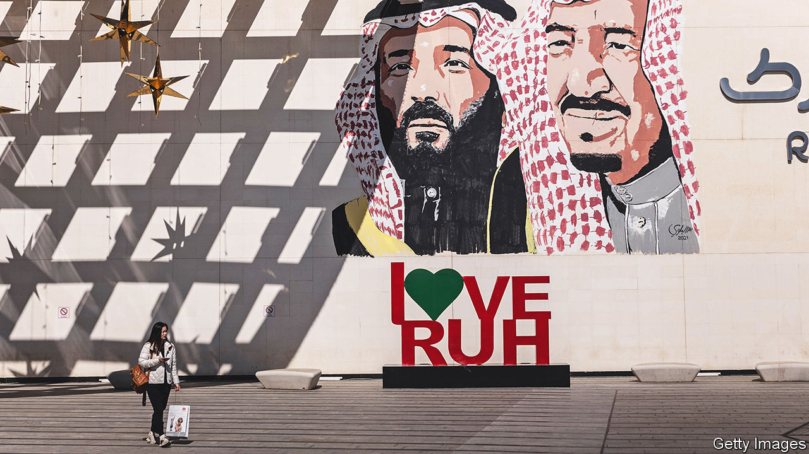
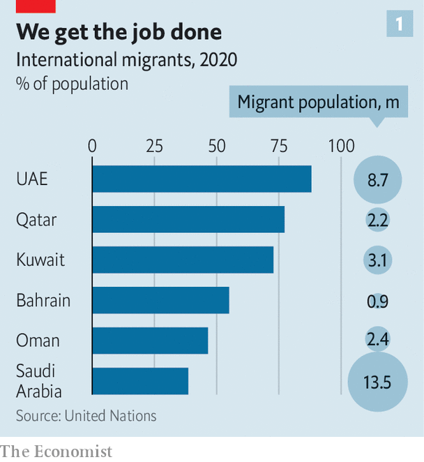
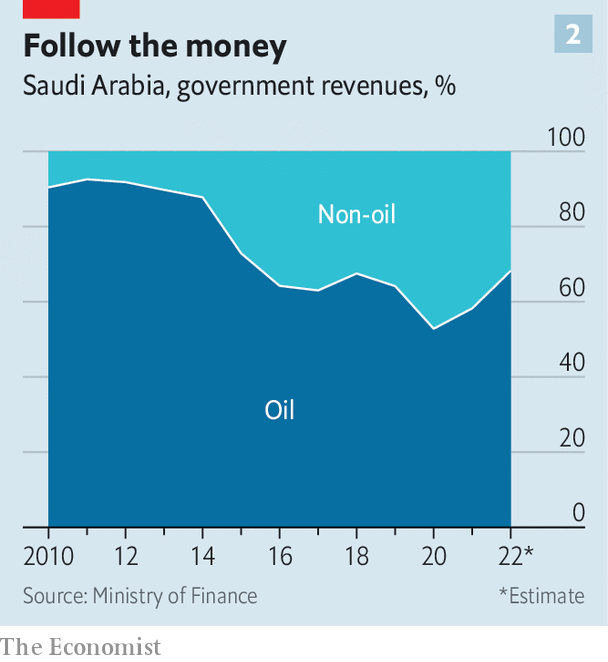
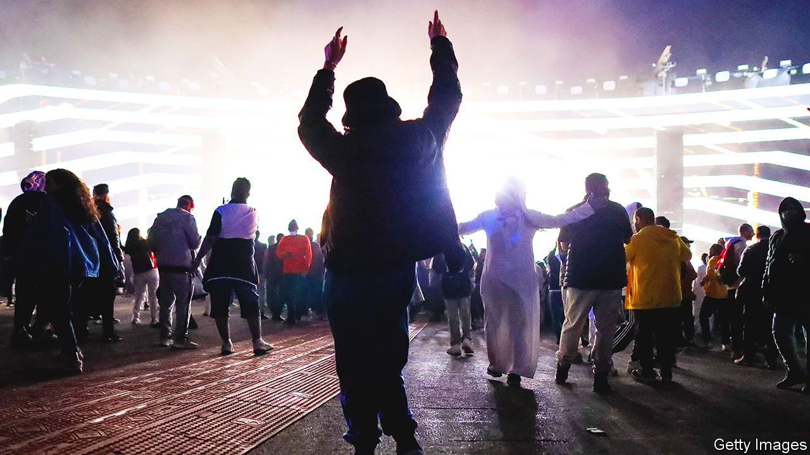

###### Reinventing the Gulf

# After decades of empty talk, reforms in Gulf states are real—but risky 

##### The push to be more diverse and competitive risks alienating citizens 

 

> Feb 9th 2023 

Latin is rare in Riyadh, but the phrase (“bread and circuses”) was the best way one Saudi writer knew to express his misgivings about the state of his country. , the writer explained, had put his own spin on an ancient idea. The crown prince was taking away the bread, . Meanwhile he had made the circuses themselves a civic duty: go forth and have fun to help build a new Saudi Arabia.

It seemed to be working. The prince was popular, particularly among young people. Yet the writer sensed a contradiction. The kingdom was throwing billions of dollars at diversions, from a dubious new golf tour to a colossal contract for Cristiano Ronaldo, a Portuguese footballer, even as it insisted it could no longer lavish benefits on citizens. But how long could Saudis live on circuses alone?

For decades the six members of the Gulf Co-operation Council (GCC), a club of petro-monarchies, maintained similar social contracts. Oil and gas revenues topped up their treasuries. Citizens reaped benefits in the form of subsidies, handouts and cushy public-sector jobs. Foreigners came and worked only as long as they were useful. The two groups lived mostly separate lives.

No longer. The past few years have been a time of rapid change in the GCC. Saudi Arabia is shaking off many of its social restrictions and opening up to the world. There is talk across the Gulf of pushing citizens out of make-work sinecures and into the private sector. Policies that were unthinkable, from subsidy cuts and new taxes to cohabitation and civil marriage, are being implemented with little fuss.

The GCC is not a monolith. In Kuwait it feels as if nothing has changed for a generation (to the chagrin of many citizens). With an ocean of natural gas and a tiny population, Qatar is in no hurry to shrink the public-wage bill. But Saudi Arabia and the United Arab Emirates (UAE) have moved fastest. Together they account for more than 75% of the GCC’s population and 70% of its $2trn GDP. Their experience will have an outsized impact on the region.

Rulers in both countries reckon this is their moment to have it all. They have serious (if, so far, inconclusive) plans to diversify their economies and prepare for the post-oil era. They want to be global players in diplomacy and business. And they want to keep their citizens happy.

 


These goals are laudable. They are also in conflict. Diversification means pushing citizens into a private sector for which some are ill-prepared. It also means benefit cuts that punch holes in the paternalistic social contract. To compensate, rulers are pushing new forms of nationalism—even as they pursue plans that require importing crowds of foreigners to a region where around half the population are already migrants (see chart 1).

These are hopeful but confusing times in the Gulf. Economies and societies are opening, but political life is closing. “It’s not healthy for the country not to have a debate,” grumbles one royal. But privately some  (Gulf citizens), young ones in particular, fret that the rush to be diverse and competitive will leave them behind.

The most visible changes are in Saudi Arabia, governed for decades under an austere brand of Islam. Prince Muhammad, the crown prince and de facto ruler since 2017, has loosened its grip. Women were permitted to drive in 2018. Cinemas, banned since the 1980s, reopened the same year. The kingdom now hosts concerts and raves. Alcohol is still illegal but that may soon change, at least in select areas meant to draw rich foreign tourists.

Such changes serve a few purposes. They have made many Saudis enthusiastic supporters of Prince Muhammad. Few miss the , the once-feared religious police who harassed people for missing prayer times or wearing make-up. They are also lucrative. For decades Saudis had to travel to more libertine Gulf cities like Dubai, or further afield, to let their hair down. Keeping them (and their money) at home is good for the Saudi economy.

This old world is a new world

The social revolution also makes the kingdom more appealing to foreigners. Prince Muhammad has told multinationals to move their regional offices to the kingdom by 2024 or risk losing government contracts. Some bosses still fret about everything from the business climate to the lack of international schools. But the changes have made the move an easier sell.

All of this poses a challenge for the UAE, long the preferred business hub in the Gulf. Consultants fly over to Riyadh for meetings during the week, then back to Dubai for weekend fun. Worried about losing its competitive edge, the UAE has rushed through its own social changes.

Over the past three years it has overhauled family laws that were long governed by (Islamic law)Abu Dhabi, the capital, started conducting civil marriages for non-Muslims in 2021. The other six emirates followed suit this February. Since 2020 unmarried couples have been allowed to live together, previously a crime (if rarely punished). Looser alcohol laws make it easier for Muslims to indulge.

Last year the UAE even changed the calendar, abandoning its Friday-and-Saturday weekend (which allowed observant Muslims to attend Friday prayers) in favour of a Saturday-and-Sunday one, better aligned with the rest of the world.

Since 2018 four of the six GCC members have introduced a value-added tax.The UAE will start collecting a 9% corporate tax in June. Income tax is still a taboo subject, but few expect it will remain so. The Gulf’s social contract meant zero taxes for citizens and expats. That is no longer the case.

Life is getting more expensive in other ways, too. The UAE got rid of fuel subsidies in 2015. Petrol is still cheap by global standards, but it is 30% more expensive than in Saudi Arabia and almost 150% costlier than in Kuwait. Most Gulf states have raised power and water prices that were once well below market rates. Oman, which had not changed its electricity tariff for 33 years, did away with a discounted rate for citizens: they now pay the same as expats.

 


Such changes have had a real impact. The 2012 Saudi budget projected that non-oil sources would contribute less than 8% of total revenue. A decade later, even with sky-high oil prices, that figure was up to 31% (see chart 2). For citizens, higher taxes and lower subsidies have made life more difficult. 

Foreigners feel pinched, too—yet they are still flocking to the Gulf. The UAE is experiencing a boom as everyone from rich Russians to cryptocurrency entrepreneurs rushes to set up shop in Dubai. It has low inflation, a stable currency and plentiful sunshine. A “golden visa” scheme introduced in 2019 grants long-term residency to skilled professionals and rich investors without the need for a local sponsor. In 2021 the country announced that it would offer citizenship to select foreigners.


Abdulkhaleq Abdulla, an Emirati political scientist, calls this the “Gulf moment”. While the rest of the Arab world seems to be in terminal decline, the GCC is prosperous and well-governed. Citizens might grumble about parochial issues, but there is little demand for political change. “The reservoir of trust here is just full,” he says. “And it doesn’t come out of nowhere, it comes out of a solid, 50-year record of good governance. It doesn’t have to be democratic. They deliver.”

The question, as Gulf states try to transform their economies and societies, is whether they can preserve that trust. One concern, usually voiced by Westerners, is that openness will prompt a conservative backlash. Self-serving Gulf diplomats stoke these fears. Apologists for Prince Muhammad justify his crackdowns by invoking the spectre of religious conservatism.

Such concerns are probably overblown. A younger generation of  is more open-minded than their parents. Once an organised force, Islamists wield less power in today’s Gulf. To see what they actually worry about, look to fast food.

Last year Subway posted an advert for sandwich-makers. It promised a five-day work week, comprehensive health insurance and opportunities for training and promotion. Anywhere else, the campaign would have been innocuous.

In the UAE, it caused an uproar. The advert was aimed at citizens: it featured photos of a young man and woman in traditional Emirati dress and framed the hiring push as “support [for] the state’s efforts” to boost Emirati employment. Social-media users called it insulting. Subway retracted it. The attorney-general opened an investigation into the “contentious” campaign.

The UAE does not release reliable figures on unemployment. But unofficial estimates suggest that around 11% of young people are jobless. In Saudi Arabia, 17% of citizens aged 15 to 24 cannot find work. Bahrain’s youth-unemployment rate has almost doubled over the past decade, reaching 10% in 2021. Some of the increase can be explained by the pandemic. But it also reflects a unique issue in the GCC: young people are stuck between a public sector that no longer wishes to hire them, and a private sector that is not ready to.

Ain’t got no money

Like the other Gulf countries, the UAE is trying to strong-arm companies into hiring more citizens. Each firm is required to have Emiratis in 2% of its local positions (that figure will rise each year until it hits 10% at the end of 2026). As of January 1st those that fall short will be fined 6,000 dirhams a month for each Emirati they fail to hire. Hiring citizens to make sandwiches would have helped Subway meet its quota.

Emiratis do not all shun such work: Coop, a supermarket chain, has locals working the tills. But the Subway ad rankled. “It felt like, look, you guys are hungry, like a dog who is chasing the private sector,” says Dr Abdulla. “Is that what we deserve? In this land of plenty? That has 9m people from all over finding jobs?”

On social media Emiratis grumble about foreigners taking all the good jobs. Expats accuse locals of being spoiled and lazy. Such arguments would have been rare in decades past: the two groups had little reason to interact. Today they are being pushed into competition, and some locals are discovering they are unprepared.

In tests of science, maths and reading, 15-year-olds in the uae score well below the average for the OECD, a club of mostly rich countries. In the latest exams run by the Programme for International Student Assessment, in 2018, the UAE ranked 47th out of 77 countries. Its neighbours are not doing any better. Qatar and Saudi Arabia ranked 59th and 70th, respectively. 

The UAE would have ranked lower still without expat pupils, who outperformed their native-born peers. Boys do particularly badly: the 57-point gap in their reading scores, compared with girls, is the second-highest in the world. Researchers point to many problems with Gulf education. Teachers, often hired from abroad, are of mixed quality. Schools emphasise rote memorisation over critical thinking. Many children are raised by nannies who speak neither Arabic nor English fluently. And the promise of a public-sector job, regardless of ability, offered little motivation to work hard in school.

The UAE introduced mandatory military service for men in 2014. Conscripts with a secondary-school diploma serve for 11 months; those without spend three years in the army. In theory, the longer term of service for dropouts is meant to give them skills that prepare them for civilian jobs. But many who have left the army have found the job search difficult.

Compulsory service has another aim: it fosters a sense of nationalism. So does the war in Yemen, which since 2015 has seen a Saudi-led coalition battling the Houthis, a Shia rebel group. Emiratis have done the toughest fighting. In 2016 the UAE unveiled Wahat al-Karama (“Oasis of Dignity”), a monument to the country’s war dead. “There is this implicit kind of message that says, you know, be prepared to make these sacrifices yourself,” says one Emirati.

Similar changes are taking place across the Gulf. For decades, Saudi identity was rooted in its religious role: the birthplace of Islam and the home of its holiest sites. Prince Muhammad wants to change that. The kingdom’s national day, in September, is now a time for patriotic celebrations.

His government is investing billions to develop Al-Ula, an oasis that boasts spectacular Nabataean ruins. Conservative clerics hated it: it was a monument to (“ignorance”), a term for the pre-Islamic era on the Arabian peninsula. Now the Saudi state is building hotels, organising festivals and urging both locals and foreigners to visit the site. Pagan history is suddenly to be celebrated, not shunned.

Nationalism bolsters support for rulers at a time of rapid change. But it can also have a dark side. Citizens report one another for critical comments on social media. Accusations of treason are common. Even government officials are nervous.

This kind of hyper-nationalism is not good for governance. It could also, paradoxically, weaken the state: the more citizens talk about political issues, the more they might want to be involved in politics.

A different concern looms in the UAE, where just 1m of its 10m people are citizens. One young man, musing about his army service, wonders how long 10% of a population can be asked to protect the other 90%. Another points out, more in disbelief than anger, that some of the government’s recent reforms benefit only foreigners. Civil marriage is only open to expats. Newly minted citizens can keep a second passport, while the native-born cannot. It is not yet clear whether naturalised citizens will be required to perform army service or learn Arabic.

 


Emirati officials have long wondered how to reduce the demographic imbalance while sustaining a $500bn economy which relies on foreign labour. The government set up committees to answer the conundrum. “You know what our conclusion was? We can’t do it,” says a participant.

Again, official data is unreliable, but the fertility rate for citizens is probably around 3.5. That is high for a rich country and signals a growing population. But it will not grow fast enough to keep pace with the country’s plans. In January Dubai said that it hopes to double the size of its economy over the next decade. Even if newborns could be put to work, there would not be enough Emiratis to achieve that. 

A new life for them

Unlike in the UAE, Saudi nationals have piled into the service sector over the past seven years: more are working as baristas, sales clerks and hotel receptionists. That is partly because public-sector hiring has slowed. But a stint working in a hotel or mall is also a good way to meet people at a time when public life is expanding.

For many, though, a stint is all it should be, partly because these jobs do not pay well. The kingdom has no minimum wage, but it requires private firms to pay citizens at least 4,000 rials ($1,066) a month in order to count them toward their Saudisation quota. Higher fees for work permits are narrowing the pay gap, but migrants are still cheaper (over 80% earn less than 4,000 rials). And the government cannot increase quotas for—or the salaries of—Saudis without crushing the private sector.

Two hours north of Riyadh, however, there is little sign of Prince Muhammad’s reforms. Thousands of Saudis converge each year on an expanse of barren high desert for the kingdom’s annual camel festival. Visitors can buy everything from bridles and saddles to honey and dates. Bankers and lawyers ply their trade: even dromedary deals need loans and contracts. The centrepiece is an amphitheatre with a dirt track that hosts camel races and a camel beauty pageant. On a blustery December day, the crowd was all young Saudi men. There were neither tourists nor women (the lack of a women’s bathroom suggested none was expected). Tickets were free.

Mahmoud, a jobless 20-something, tossed his headdress in the air and screamed for joy when the hometown favourite won the afternoon’s beauty pageant. Then he headed for the exit. He had little else to do. His father worked for the agriculture ministry, but those kinds of civil-service jobs are harder to come by these days, and there are not many other options for secondary-school dropouts in rural areas. Asked about the cultural changes sweeping the kingdom, he offered a shrug: the concerts and amusement parks in Riyadh were too expensive to visit.

The stereotype, outside the GCC, is that its citizens are all  who drive luxury cars and summer in Europe. In reality there are plenty of Mahmouds. Even if Gulf rulers get their ambitious plans right, and a rising tide lifts all boats, the coming years will be nerve-racking for many . ■

