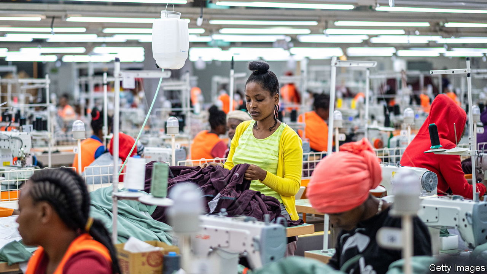
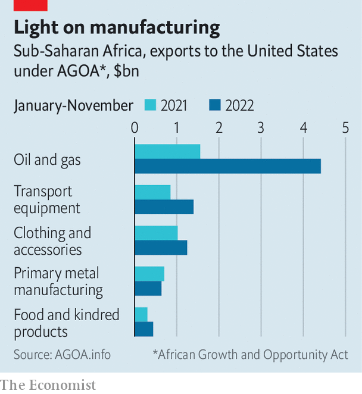

###### Trade mission

# Taking stock of America’s flagship trade programme for Africa 

##### AGOA has created jobs, but has not lived up to expectations 

 

> Feb 9th 2023 

Pankaj bedi strides through his factory on the edge of Nairobi, past clattering sewing machines, bustling workers and boxes of jeans. None of this would be here, he says, were it not for the African Growth and Opportunity Act (AGOA). The landmark trade policy was introduced by Bill Clinton in 2000, granting duty-free access for more than 6,000 products from sub-Saharan Africa. Two years later, Mr Bedi opened United Aryan, his clothing business in Kenya. He now employs 14,000 people.

Lately Mr Bedi’s financiers have all been asking the same question: what will happen in 2025, when AGOA is set to expire? It will be extended, he assures them, as it has been before. The trouble is that Congress has a habit of waiting until the last minute. Already, he has put on hold plans to grow cotton and make his own fabric. If an extension is not enacted this year, then orders from American buyers could start to dip, at the cost of African jobs.

Headwinds to trade

Further dawdling would reinforce a sense of drift, even as the Biden administration is trying to deepen economic ties in Africa to and Russia. America’s imports from sub-Saharan Africa have fallen since 2008, mainly because it has bought less African oil. Non-fuel imports including garments, nuts and South African cars rose rapidly in the early years of AGOA, but have grown only modestly since. The 35 AGOA beneficiaries collectively account for about 1% of American imports, less than they did before the act was passed. As a trade partner for Africa, America has been overtaken by China.

The reasons lie mostly outside AGOA itself. It is just one of several schemes whereby rich countries grant trade preferences to poorer ones to give them a leg-up on the development ladder. But in a world where most tariffs have fallen, preferences matter less. Of America’s top 30 imports from AGOA-eligible countries, 20 would enter tariff-free anyway, according to the UN. Those include precious metals, diamonds, cocoa, vanilla and coffee.

The important exception is clothing, which ordinarily attracts tariffs as high as 32%. Here AGOA gives African exporters an edge. Manufacturers in the poorest African countries are exempt from tariffs even if they use fabric made elsewhere. In Lesotho, Madagascar, Kenya and Ethiopia, hundreds of thousands of workers stitch materials shipped from Asia into clothes for American consumers.

Optimists hope that  in Africa, as it has in Asia and elsewhere. But in most African countries the cost of machines, power and labour is still too high to compete on an even footing with the likes of Bangladesh, which benefits from economies of scale and has huge clusters of clothing and textile firms swapping knowledge and skilled workers. “We are able to survive only because of AGOA,” says the boss of one Kenyan manufacturer. 

Uncertainty does not help. Trade preferences are not typically set down in a treaty. This means they can be withdrawn at short notice, as happened to Rwanda in 2018 after it irked American businesses by banning imports of second-hand clothes. And last year America kicked Ethiopia out of AGOA because of its human-rights abuses. A factory manager at an industrial park in the Ethiopian town of Hawassa says that business there is “totally dry”, with firms leaving and workers idle. 

 


Then there is the uncertainty over AGOA’s renewal. In 2015 it was extended for 10 years to provide a bit more comfort. But investment will slow well before it is due to expire. Jean-Claude Mazingue, the chief operations officer at SOCOTA, which makes clothes and textiles in Madagascar, says investors in the country have the funds and knowledge to build a spinning mill to make yarn. “Why do we procrastinate a bit?” he asks. “It’s because we don’t know what’s going to happen with AGOA.”

That message is slowly seeping through to Washington, where AGOA enjoys bipartisan backing and the support of the executive branch. Katherine Tai, the US Trade Representative, has spoken of the need to “build on the accomplishments of AGOA”. The US International Trade Commission, a federal agency, has been conducting hearings on the programme and will submit its findings next month. Still, a swift extension is not guaranteed. Adrian Smith, the Republican chair of the trade subcommittee in the House of Representatives, says he is “concerned” that without greater urgency AGOA could go the way of other trade preference schemes that have lapsed.

New deals

There is also talk about how to deepen the trading relationship by signing two-way agreements. “Preferences by themselves aren’t really what drives investment on the continent,” says Constance Hamilton, the assistant trade representative for Africa.  about a trade and investment partnership that would cover issues such as standards, regulations and workers’ rights, though not tariffs, for now. Eventually, says Ms Hamilton, the kind of deal being discussed with Kenya could provide the “off-ramp” for other countries that want to move beyond preferences to a wider partnership. 

Many in Africa dream of the continent negotiating as a single bloc. Some 44 countries have ratified a plan to create a continental free-trade area. But implementation is behind schedule and it will be a long time before they are ready to speak as one in trade negotiations, says Eckart Naumann of the Trade Law Centre, a South African think-tank.

Whatever comes next, the lesson of AGOA is that market access alone is not enough. “The pattern is clear: where there has been investment, you have seen exports,” says David Luke of the London School of Economics. Only half of AGOA beneficiaries have strategies to take advantage of it. America could help through initiatives such as Prosper Africa, set up by the Trump administration to promote trade and investment. Florie Liser of the Corporate Council on Africa, an American business association, suggests the government should give tax breaks to firms that invest in manufacturing in Africa.

In December President Joe Biden welcomed leaders to Washington for the first US-Africa summit in eight years, in a sign that America is trying to reinvigorate its relationship with the continent. Twelve thousand kilometres away, at his factory in Nairobi, Mr Bedi thinks it is also high time that African governments and businesses seized the moment. His own success shows AGOA’s potential benefits. But for Africa as a whole, “it has been the biggest missed opportunity,” he sighs. ■

